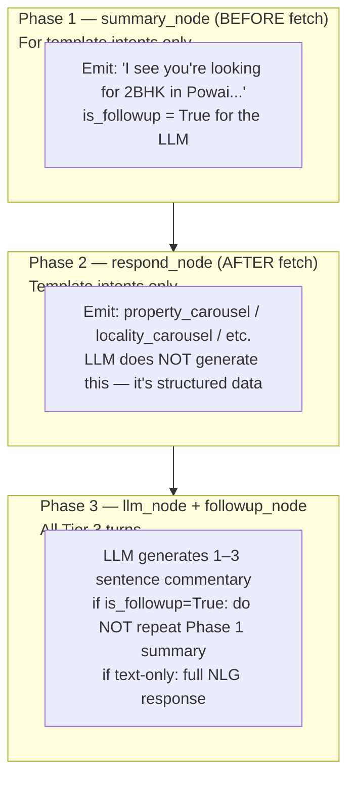
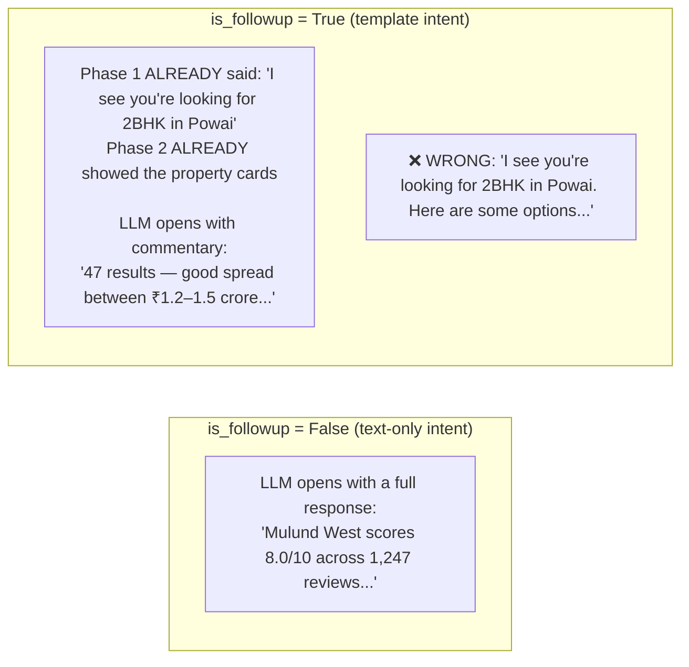

# Bot Conversation Design — Use Cases, Tools, and Response Architecture

## SSE Response Model (Every Turn)

Every bot turn is delivered as Server-Sent Events over the pipeline. For template intents there are three sequential phases; for text-only intents there is one.

The following diagram shows the 3-phase SSE model from the LLM's perspective.



```
┌─────────────────────────────────────────────────────────────────┐
│  Phase 1 — summary  (summary_node)                              │
│  Deterministic pre-fetch acknowledgment                         │
│  e.g. "I see you're looking for 2BHK rentals in Andheri"        │
│  • Fires BEFORE data fetch — user sees acknowledgment in ~300ms │
│  • Template intents only. Skipped if any entity confidence <0.70│
│  • Sets BotState.summary_emitted = True                         │
├─────────────────────────────────────────────────────────────────┤
│  Phase 2 — templates  (respond_node)                            │
│  Structured card events after fetch_data completes              │
│  Each emitted as a chat_event with a templateId                 │
│  (property_carousel, locality_carousel, etc.)                   │
│  • Sets BotState.template_count                                 │
├─────────────────────────────────────────────────────────────────┤
│  Phase 3 — followup  (followup_node)                            │
│  LLM-generated text commentary after templates                  │
│  • Streamed as message_delta chunks                             │
│  • Ends with chat_event { sourceMessageState: COMPLETED }       │
│  • LLMContext.is_followup = True when summary was already emitted│
└─────────────────────────────────────────────────────────────────┘
```

For **text-only intents** (no template), only Phase 3 fires, with `sequenceNumber: 0`.

### Why this model

3–4 s latency is acceptable for the full result but not for feeling responsive. Phase 1 (`summary_node`) emits a deterministic acknowledgment from structured state — it does not require the LLM and appears before any data fetch. This gives the user visual confirmation within ~300 ms.

The LLM (Phase 3, `followup_node`) produces conversational commentary on data that has already been fetched and rendered. It should **not** repeat the Phase 1 acknowledgment. `LLMContext.is_followup` is `True` when `summary_emitted` is set, signalling the LLM that the opening acknowledgment has already been shown.

### Prompt guidance for the followup LLM

The following diagram shows the behavioural difference between `is_followup = True` and `is_followup = False`.



The LLM in Phase 3 receives `is_followup: True` when a summary was already emitted. In this case:
- Do **not** open with a restatement of what the user asked.
- Do **not** begin with "Looking for...", "I see you're...", or any re-acknowledgment.
- Start directly with commentary, insight, or the next question.
- Be concise. Templates carry the data; the text adds context, nuance, or a follow-up question.

---

## Template Catalog

All template IDs and their payloads:

| template_id | When used | Rendered by FE as |
|---|---|---|
| `property_carousel` | Property search results, saved/contacted properties | Horizontally scrollable property cards with Learn more + Contact CTAs. "View all" card appended when `user_intent ∈ {"SRP","shortlist"}` and `!is_last_page`. |
| `locality_carousel` | Nearby/similar/trending localities | Scrollable locality cards with Rating, YoY Growth %, Show properties + Learn more CTAs. Card is clickable → locality URL. |
| `image_gallery` | Property images | Full-screen image carousel |
| `floor_plans` | Floor plan images + dimensions | Zoomable 3D plan viewer. Always paired with LLM-generated markdown text analysis (room dimensions, layout feel). Dual output — see Use Case 3. |
| `payment_plan` | Builder payment schedule | Table with milestone/% columns |
| `amenities` | Full amenities list | Icon grid |
| `download_brochure` | Project brochure download | Card with cover photo, project name, price range, "View brochure" CTA. Data: `{ id, type, title, name, short_address[], cover_photo_url, brochure_name, brochure_pdf_url, brochure_images[] }` |
| `shortlist_property` | Auth-gate for shortlisting | Similar to `login` modal (transient — renders only when latest message). BE sends this when user tries to shortlist and is not logged in. User logs in → FE automatically calls shortlist API → shows "Property has been shortlisted ✓" toast. On already-logged-in, FE shows toast directly without a BE template. After API success, FE sends hidden `user_action { action: "shortlisted_property" }`. |
| `contact_seller` | Seller contact flow | Seller/property card with connect button (transient). Data shape mirrors property object: `{ id, type, title, name?, short_address[], formatted_min_price?, formatted_max_price?, inventory_configs[], ... }`. After FE action, sends shown `user_action { action: "contacted_seller" }`. |
| `login` | Auth-gated feature other than shortlist | Bottom sheet: phone OTP + "Continue with WhatsApp" |
| `share_location` | Near-me queries | In-chat card with geolocation CTA (transient). Data: `{}` (empty — all 3 button states are FE-only UX). FE sends back `user_action` with one of: `action: "location_shared" + coordinates: [lat, lng]`, `action: "location_denied"`, `action: "location_not_available"`. FE auto-sends `location_shared` without showing template if permission already granted. |
| `nested_qna` | Entity disambiguation (one or more ambiguous names) | Structured Q&A card (transient — hides text composer while active). Multiple questions, each with options. FE submits via `user_action { action: "nested_qna_selection", selections: [...] }`. |
| `price_trends` | Price trend data | Structured text block (mobile) or chart panel (desktop): avg price, YoY growth, quarterly breakdown, available property count |
| `transaction_history` | Recent transactions | Table: sales + mortgage breakdown, area stats, recent activity, market insights |
| `reviews` | Locality or project reviews | Rating + category breakdown + key insights (strengths / areas to consider) + review cards |

**Transient templates** (render only when they are the latest bot message — no stale CTA duplication in history):
`share_location`, `shortlist_property`, `contact_seller`, `nested_qna`

**User actions from FE** (reference):
| action | messageType | isVisible | responseRequired | Trigger |
|---|---|---|---|---|
| `shortlisted_property` | user_action | false | false | After shortlist API success |
| `contacted_seller` | user_action | true | false | After contact action |
| `learn_more_about_property` | user_action | true | true | Learn more card tap |
| `learn_more_about_locality` | user_action | true | true | Locality learn more tap |
| `brochure_downloaded` | user_action | false | false | After brochure download |
| `nested_qna_selection` | user_action | true | true | nested_qna submission |
| `location_shared` | user_action (sender: system) | — | true | Location permission granted |
| `location_denied` | user_action (sender: system) | — | true | User explicitly denied location |
| `location_not_available` | user_action (sender: system) | — | true | Permission may be granted but no position fix |

**Feedback row (👍 👎 share):** Rendered by FE below every bot message. Feedback events are pushed to Google Analytics by FE. BE only needs to provide `message_id` (already present on every completed turn) so FE can tag GA events. No additional SSE event or BE endpoint needed.

---

## Session State: Active Entity Tracking

The `conv:state` Redis hash carries active entities at all times. Built by Bot Orchestrator, injected into system prompt section 3.

```
conv:state:{conversation_id} fields (additions to base design):

active_property_id       string     currently selected property
active_project_id        string     project of selected property, or directly selected
active_locality_id       string     currently focused locality
active_builder_id        string     currently focused builder
active_transaction_type  string     "rent" | "buy"
active_city              string
last_carousel_ids        string     JSON array, ordered list of prop_ids in last carousel
last_carousel_srset_id   string     search result set ID for pagination
last_carousel_page       int        current page number
last_locality_carousel   string     JSON array of locality_ids in last carousel
```

**Injected into system prompt (section 3) example:**
```
CURRENT SESSION CONTEXT:
- Transaction type: rent
- City: Gurgaon
- Active property: prop_123 (DLF Privana South, 3BHK, Sector 77, ₹55k/mo)
- Active project: proj_456 (DLF Privana South)
- Active locality: loc_789 (Sector 77, Gurgaon)
- Active builder: bld_101 (DLF)
- Last property carousel (in order): [prop_123, prop_234, prop_345, prop_456, prop_567]
- Active filters: { bhk:[3], price_max:60000 }
- Last carousel page: 1 (total found: 47)
```

---

## Entity Resolution System

The search API does not accept names — it takes system entity IDs. Names must be resolved to entities first.

> **Note:** `resolveEntity` is `llm_visible: false`. The LLM cannot call it. Entity resolution runs in `resolve_entities_node` BEFORE the LLM is called. The LLM receives pre-resolved entity names and IDs in the `[SESSION]` block (section 3 of the system prompt) and should use those IDs directly — it never calls `resolveEntity`. Full tool schemas are defined in `solid-architecture.md` (TOOL_REGISTRY).

### Entity resolution outcome in LLM context

When `resolve_entities_node` completes before the LLM turn, the resolved data is available in the `[SESSION]` block:
- Unambiguous resolutions: entity ID and canonical name are set in `conv:state` and visible to the LLM.
- Ambiguous entities that required user selection via `nested_qna`: resolved IDs are stored after the user responds; the LLM sees the final resolved state.
- Unresolvable entities: the session entry is absent; the LLM should ask the user conversationally ("I couldn't find a locality called X — could you check the spelling or try a nearby landmark?").

### `nested_qna` template

Emitted by `clarify_node` (when the SLM signals `clarification_needed`) or `resolve_entities_node` (when disambiguation is required) — never by the LLM. If the LLM receives context where an entity is ambiguous, it should ask conversationally in plain text rather than sending a template. Each ambiguous name becomes one question in `selections[]`. FE hides the text composer while this template is the latest message.

```json
{
  "templateId": "nested_qna",
  "data": {
    "selections": [
      {
        "questionId": "sub_intent_1",
        "title": "Which Sector 32 are you referring to?",
        "type": "locality_single_select",
        "options": [
          { "id": "uuid1", "title": "Sector 32", "attributes": ["Locality", "Gurgaon"] },
          { "id": "uuid2", "title": "Sector 32", "attributes": ["Locality", "Faridabad"] }
        ]
      },
      {
        "questionId": "sub_intent_2",
        "title": "Which DLF Privana did you mean?",
        "type": "locality_single_select",
        "options": [
          { "id": "proj_456", "title": "DLF Privana South", "attributes": ["Project", "Sector 77, Gurgaon"] },
          { "id": "proj_457", "title": "DLF Privana West", "attributes": ["Project", "Sector 76, Gurgaon"] }
        ]
      }
    ]
  }
}
```

Option `attributes: string[]` is the preferred format (FE renders `attributes.join(" | ")`). Deprecated: `type` + `city` fields — still supported for backward compatibility.

FE submits via `user_action`:
```json
{
  "messageType": "user_action",
  "responseRequired": true,
  "isVisible": true,
  "content": {
    "data": {
      "action": "nested_qna_selection",
      "replyToMessageId": "msg_b_030",
      "selections": [
        { "questionId": "sub_intent_1", "selection": "uuid1" },
        { "questionId": "sub_intent_2", "text": "DLF Privana South Gurgaon" },
        { "questionId": "sub_intent_3", "skipped": true }
      ]
    },
    "derivedLabel": "Q. Which Sector 32?\nA. Sector 32, Gurgaon\n\nQ. Which DLF Privana?\nA. DLF Privana South"
  }
}
```

Each selection entry has exactly one of: `selection` (entity ID from options), `text` (free-text answer), or `skipped: true`.

Bot orchestrator receives this, stores resolved entity IDs in `conv:state`, proceeds with the original flow.

### Reference Resolution (Anaphora)

References like "this", "first property", "the DLF one" are resolved by the LLM from session context:

| User says | Resolves to |
|---|---|
| "this property" | `active_property_id` from session |
| "this project" | `active_project_id` |
| "this locality" | `active_locality_id` |
| "first property" / "property 1" | `last_carousel_ids[0]` |
| "third property" | `last_carousel_ids[2]` |
| "first locality" | `last_locality_carousel[0]` |
| "the DLF one" | match against builder name in `last_carousel_ids` metadata |
| "this locality" (on project page) | locality of `active_project_id` |

If the reference is ambiguous and session state doesn't have enough context → ask: "Which property are you referring to?"

---

## Tool Inventory Reference

The LLM can only call the four tools listed below. All other tools (`searchProperties`, `getPropertyDetail`, `getFloorPlans`, `getRatingsReviews`, etc.) are `llm_visible: false` — they are called by `fetch_data_node` before the LLM runs, and their results are delivered to the LLM as inline template data in context, not as tool call results. The full registry (including all pre-fetch tools) is in `solid-architecture.md` (TOOL_REGISTRY).

| Tool | Tier | When used |
|---|---|---|
| `getNearbyLandmarks` | Residual | `property_detail` / `property_about` intents only — surfaces points of interest near the active property |
| `calculateEMI` | B | Available for non-calculator Tier 3 intents (e.g. user asks about EMI mid-conversation) |
| `calculateAffordability` | B | Available for non-calculator Tier 3 intents |
| `convertUnit` | B | Unit conversion (area, currency per sqft → absolute) when needed in the LLM turn |

---

## Use Case 1: Property Search

### Inputs accepted (any combination)

**Required — at least one of:**
- `locality` — one or more (e.g. "Sector 32 and Sector 50 in Gurgaon")
- `landmark` — single only (e.g. "near Huda City Centre metro")
- `builder_id` — single only (e.g. "DLF properties")
- `project_id` — single only (e.g. "DLF Privana")
- `lat_lng` — from location permission flow

**Required always:**
- `city`

**Optional filters:**

| Filter | Type | Notes |
|---|---|---|
| `apartment_type` | string[] | "1bhk", "2bhk", "3bhk", "4bhk", "5bhk+", "studio" |
| `property_type` | string[] | "apartment", "villa", "independent_house", "plot", "duplex", "penthouse", "pg" |
| `price_min` / `price_max` | number | Absolute INR. See price conversion tool. |
| `area_min_sqft` / `area_max_sqft` | number | Always in sqft. See unit conversion tool. |
| `listed_by` | string[] | "owner", "broker", "builder" |
| `sale_type` | string[] | "resale", "new_booking" — buy only |
| `is_project` | boolean | Show only project-listed properties |
| `construction_status` | string[] | "under_construction", "ready_to_move" — buy only |
| `age_of_property_max` | number | In years |
| `is_verified` | boolean | Housing-verified only |
| `is_rera_compliant` | boolean | |
| `amenities` | string[] | "pool", "gated", "lift", "power_backup", "gym", "parking", "gas_pipeline" |
| `facing` | string[] | "north", "south", "east", "west", "north_east", "north_west", "south_east", "south_west" |
| `furnishing` | string[] | "furnished", "semi_furnished", "unfurnished" — rent primarily |

### Phase flow for property search

This is a **Tier 3a** intent. The pipeline runs:
1. `summary_node` emits: "I see you're looking for [BHK] [transaction_type] in [locality/city]" — before fetch.
2. `fetch_data` calls `searchProperties` with resolved entity IDs.
3. `respond_node` emits `property_carousel` template event(s).
4. `followup_node` (LLM) adds commentary: highlights, filter tips, follow-up suggestions.

The followup LLM receives `is_followup: True`. It should start with commentary on the results, not re-acknowledge what the user asked.

**Example — good followup text (Phase 3):**
```
Found 47 properties. Furnished options are popular in this area — 
you might want to filter to furnished only to narrow these down.
```

**Example — bad followup text (Phase 3, duplicates Phase 1):**
```
Looking for 3BHK rentals in Andheri... I found 47 properties for you.
```

### Zero results

When `searchProperties` returns 0: immediately call `getPropertyCountByRelaxingFilters` with 3–4 combinations. Present relaxation options as followup chips. Do not make up reasons why there are no results.

Bot uses this to say: "No results with your filters. Removing the furnished requirement gives 12 options, or removing the price limit gives 34." Followup chips: `[Remove furnished | Relax budget | Show all 67]`.

---

## Use Case 2: Property Selection

Three entry points — all converge to the same state.

### Entry A: Text intent
```
User: "show me more about DLF Privana"
      "tell me about the 3rd property"
      "I want details on prop in Sector 77"
```

Bot Orchestrator resolves the reference → `fetch_data_node` calls `getPropertyDetail(property_id)` → `respond_node` emits `property_detail` card → Bot Orchestrator sets `active_property_id` in Redis. The LLM sees the property data inline in context and adds followup commentary.

### Entry B: Card quick action (structured message)
```json
{
  "type": "user_message",
  "payload": {
    "intent": "property_detail",
    "property_id": "prop_123",
    "display_text": "Tell me more about this property"
  }
}
```
No entity resolution needed. Bot Orchestrator sets `active_property_id` directly. `fetch_data_node` calls `getPropertyDetail` — the LLM sees the result in context, not as a tool call.

### Entry C: Opened chat from property detail page
The web/app sends a pre-seeded session frame on chat session init:
```json
{
  "type": "session_seed",
  "payload": {
    "active_property_id": "prop_123",
    "active_project_id": "proj_456",
    "active_locality_id": "loc_789",
    "source_page": "property_detail"
  }
}
```
Bot Orchestrator writes these to `conv:state` before the user says anything. Bot greets with property context already loaded.

---

## Use Case 3: Property Detail Actions

Once `active_property_id` is set, these intents are available. All data-fetching tools are called by `fetch_data_node` before the LLM — the LLM sees results inline in context:

| User intent | Pre-fetch tool (fetch_data_node) | Response template |
|---|---|---|
| "show floor plans" | `getFloorPlans(property_id)` | `floor_plans` |
| "show images / photos" | `getPropertyImages(property_id)` | `image_gallery` |
| "show amenities" | `getPropertyAmenities(property_id)` | `amenities` |
| "payment plan / schedule" | `getPaymentPlan(project_id)` | `payment_plan` |
| "contact seller / owner" | `initiateContact(property_id)` | `contact_seller` |
| "save / shortlist" | `shortlistProperty(property_id)` | `shortlist_property` |
| "show similar properties" | `getSimilarProperties(property_id)` | `property_carousel` |
| "show nearby properties" | `searchProperties(lat_lng from property)` | `property_carousel` |

When `shortlistProperty` returns `login_required`, bot sends `login` template. FE shows auth sheet. On login success, FE sends:
```json
{ "type": "user_message", "payload": { "intent": "auth_complete", "user_id": "usr_abc" } }
```
Bot Orchestrator updates session with `user_id`, retries the shortlist tool call, confirms to user.

---

## Use Case 4: Reviews

User can ask for reviews of:
- "this locality" → `active_locality_id` (from session context)
- "Sector 32 Gurgaon" → resolved to locality_id by `resolve_entities_node` before the LLM
- "this project" → `active_project_id` (from session context)
- "DLF Privana" → resolved to project_id by `resolve_entities_node` before the LLM
- "the locality of this project" → derive locality_id from active_project_id

**Pipeline flow for "show me reviews of this locality":**
```
1. Check active_locality_id in session context → loc_789 (Sector 32, Gurgaon)
2. Phase 1 summary_node emits: "Looking at reviews for Sector 32, Gurgaon"
3. fetch_data_node: getRatingsReviews({ locality_id: "loc_789" })
4. respond_node emits: template reviews
5. followup_node LLM adds: text summarising key themes (data already in context)
6. Followup chips: ["See project reviews", "Compare with nearby locality", "Price trends here"]
```

---

## Use Case 5: Locality Comparison, Nearby, Price Trends, Transactions

When user says "compare this locality to nearby localities":
1. Resolve "this locality" → `active_locality_id`
2. "nearby localities" is vague — call `getNearbyLocalities` first → get top 2–3
3. Ask user: "Would you like to compare Sector 32 with Sector 50 or Sector 56?"
4. User picks → `compareLocalities`

`compareLocalities` returns markdown: a comparison table with sections for Overview, Pricing, Connectivity, Amenities, and Verdict.

`getNearbyLocalities` accepts either `locality_id` (when locality is known) OR `lat/lng` (for near-me queries). Do not call `reverseGeocode` before `getNearbyLocalities` — pass lat/lng directly.

---

## Use Case 6: Similar Localities, Trending, Hotspots

All return `locality_carousel` template.

```typescript
// Similar to current locality
getSimilarLocalities({ locality_id, transaction_type, limit?: number })

// Trending in city
getTrendingLocalities({ city, transaction_type, ranked_by?: "search_volume"|"appreciation"|"supply" })

// Investment hotspots
getInvestmentHotspots({ city, budget_max?: number })
```

---

## Use Case 7: Shortlist and Contact Seller

Both are auth-gated and trigger session state transitions.

### Shortlist
Covered in Use Case 3. Template: `shortlist_property`. Login gate if unauthenticated.

### Contact Seller
Triggers a `contact_seller` handoff signal to the unified gateway (see `solid-architecture.md` Part 11 — Integration Contracts). Only call `initiateContact` after explicit user confirmation ("yes, connect me", "contact seller", tapping Contact button). Never call proactively.

---

## Use Case 8: Saved and Contacted Properties (Auth-Gated)

```typescript
getUserSavedProperties({ user_id: string, page?: number }) → property_carousel
getUserContactedProperties({ user_id: string, page?: number }) → property_carousel
```

**If not logged in:** Return `{ template: "login", reason: "saved_properties" }`.
After login success frame → retry → return `property_carousel`.

**Flow:**
```
User: "show my saved properties"
Bot Orchestrator: check session.user_id
  → null: emit template: login
  → set: call getUserSavedProperties → property_carousel
```

---

## Use Case 9: Intent Switching

### Detecting a switch

The LLM detects intent switches from signals in the user message:
- "actually looking to buy" → switch rent → buy
- "let me switch to rental" → switch buy → rent
- "show me in Delhi instead" → city change
- "forget sector 32, try Sector 50" → locality change

### Clarify before acting on ambiguous or impossible signals

**Before applying any filter or switching any intent, check whether the signal is valid in the current context.** If it isn't, or if it could be interpreted two valid ways, ask — never assume.

```
Price signal "under 30K" in buy context:
  ₹30K is impossible as a total buy price (too low).
  Could mean:
    A) Switch to rent with ₹30K/month budget
    B) Stay in buy with ₹30K/sqft price (total ~₹2.4–3.6Cr for 2BHK)
  → DO NOT SEARCH. Ask as plain text:
    "₹30K is very low for a property purchase — did you mean ₹30K/month rent,
     or ₹30K per sq.ft (around ₹2.4–3.6Cr total)?"

Price signal "under 2Cr" in rent context:
  ₹2Cr/month is impossibly high for rent. Could be a buy intent.
  → Ask as plain text: "₹2Cr sounds more like a purchase budget. Were you thinking of buying?"

Price signal "under 80L" in buy context:
  Valid buy price → proceed without asking.

Price signal "under 25K" in rent context:
  Valid rent budget → proceed without asking.
```

**Rule: Only one valid interpretation → proceed. Two valid interpretations → clarify. Impossible in current context → clarify.**

Do not fire a search, do not change conv:state until the user confirms.

### Text clarification — when to ask vs when the pipeline handles it

Disambiguation and clarification by `nested_qna` template are handled by the pipeline (`resolve_entities_node` / `clarify_node`) before the LLM runs. The LLM never sends a `nested_qna` template. If the LLM receives an ambiguous turn (e.g. entity was not resolved upstream), it should ask conversationally in plain text.

Clarifications from the LLM should be as lightweight as possible. Default to plain text.

**Use plain text when:**
- The question has 2–3 options that can be described in a short label
- The user can answer with a word or short phrase ("rent", "per sqft", "yes", "no", "buy")
- The bot can unambiguously parse the user's typed answer
- Examples: price ambiguity, transaction type clarification, "did you mean X or Y?", unresolved entity

```
"did you mean rent or ₹30K/sqft?"            → plain text  (2 options, word answer)
"which city?"                                 → plain text  (open, user types city name)
"which Sector 32 — Gurgaon or Faridabad?"    → plain text  (2 short options, user types distinguishing word)
"I couldn't find Sector 21 — did you mean Sector 22 in Gurgaon?"  → plain text
```

### Filter carry-forward rules

```
On transaction_type switch (rent ↔ buy):
  CARRY:    apartment_type_id, property_type*, amenities, facing,
            is_verified, is_rera_compliant, area range, city, locality
  DROP:     price_min/price_max (scale incompatible — always ask new budget)
            sale_type, construction_status**, age_of_property (buy-only concepts)
  ASK:      "What's your budget for [new type]?" (unless price signal given in the same message)

*property_type carry exceptions:
  "plot" does not apply to rent → drop
  "pg" does not apply to buy → drop

**construction_status does not apply to rent → drop

On city change:
  CARRY:    transaction_type, apartment_type_id, property_type, amenities, area range
  DROP:     price range (prices vary significantly by city — ask new budget)
            locality_ids, landmark_id (city-specific entities)
  RESET:    active_locality_id, active_property_id, active_project_id

On locality change within same city:
  CARRY:    all filters, transaction_type
  REPLACE:  locality_ids
  RESET:    active_property_id, active_project_id (belonged to old locality)
```

### BHK filter: additive vs replacement

"Show me 3BHK" mid-conversation can mean widening the search OR switching — the phrasing determines which.

```
Additive keywords (as well, also, too, and X, include X, along with):
  → APPEND to apartment_type_id: [2] + 3BHK = [2, 3]
  → Keep all other active filters unchanged
  → One combined search, mixed BHK carousel

Replacement keywords (instead, only, just, switch to, change to):
  → REPLACE apartment_type_id: [3]
  → Keep all other active filters unchanged

Bare "show me 3BHK" (no qualifier):
  → Default to REPLACE

Examples:
  "show me 3BHK as well"     → apartment_type_id: [2, 3]  (additive)
  "show me 3BHK also"        → apartment_type_id: [2, 3]  (additive)
  "show me 2BHK and 3BHK"   → apartment_type_id: [2, 3]  (explicit set)
  "show me 3BHK instead"     → apartment_type_id: [3]     (replace)
  "show me only 3BHK"        → apartment_type_id: [3]     (replace)
  "show me 3BHK"             → apartment_type_id: [3]     (replace, bare)
```

**Prompt guidance for intent switching:**
```
When you detect an intent switch, always:
1. Phase 1 (summary_node) will have already emitted the acknowledgment.
   In Phase 3 (followup), explicitly state what you're carrying forward and what you're dropping.
2. Ask for any required information that doesn't carry (usually budget).
3. Do NOT automatically carry price filters across transaction types — always ask.
4. Do NOT fire a search if the price signal is impossible or ambiguous in the current context — ask first.
5. For BHK changes: check for additive keywords before deciding replace vs append.
```

**Example — good followup (Phase 3) after a transaction type switch:**
```
Switching to rental search in Gurgaon.

Keeping your 3BHK preference and gym + parking requirements.
Since rental and sale prices work differently, what's your monthly rental budget?
```

**Example — ambiguous price clarification:**
```
₹30K is too low to be a property price. Did you mean:
- ₹30K/month rent budget — I'll switch to rentals, or
- ₹30K per sq.ft (total ~₹2.4–3.6Cr for a 2BHK)?
```

**Example — additive BHK:**
```
Widening to 2BHK and 3BHK. Keeping all your other filters — here's the combined list.
```

---

## Use Case 10: Pagination

User says "show more", "next page", "see more properties".

`fetch_data_node` reads `last_carousel_srset_id` and `last_carousel_page` from session context and calls `paginateSearch({ srset_id: "srset_abc123", page: 2 })`. The LLM sees the new results inline in context.

Bot Orchestrator updates `last_carousel_page` to 2. Appends new `property_ids` to `last_carousel_ids` (positions 11–20 now accessible by reference "11th property" etc.).

---

## Use Case 11: Project Comparison

User says:
- "compare DLF Privana with Godrej Interio"
- "compare this project with DLF Privana"
- "compare the first property with the third"

### Flow for "compare first with third":
```
1. Resolve "first" → last_carousel_ids[0] = prop_123
2. Resolve "third" → last_carousel_ids[2] = prop_345
3. Get project_ids for both (may differ if from different projects)
4. Parallel: getProjectDetail(proj_456), getProjectDetail(proj_789)
5. Render as markdown comparison
```

`compareProjects` returns `content_type: markdown`. If given `property_ids` instead of `project_ids`, it derives the project from each property.

**Markdown comparison structure:**
```markdown
## DLF Privana South vs Godrej Interio

| | DLF Privana South | Godrej Interio |
|---|---|---|
| Location | Sector 77, Gurgaon | Sector 88A, Gurgaon |
| BHK Options | 3-4 BHK | 2-3 BHK |
| Price Range | ₹3.5–5Cr | ₹1.8–3.2Cr |
| Possession | Dec 2026 | Mar 2025 (ready) |
| RERA | ✓ Registered | ✓ Registered |
| Builder Rating | 4.3/5 | 4.1/5 |

### Amenities
...

### Verdict
DLF Privana South suits buyers looking for larger configurations and willing to wait for possession. 
Godrej Interio is ready-to-move and more affordable for the 2BHK segment.
```

**Followups:**
```
["Search DLF Privana | Search Godrej Interio | Compare localities | Show floor plans for DLF"]
```

---

## Use Case 12: Near-Me Flow

### Step 1: Request location

Bot sends template `share_location` with empty data and waits. Does NOT call any tool yet.

If location permission was already granted in the browser, FE auto-sends `location_shared` without even rendering the template card.

### Step 2a: Permission granted

FE sends a `user_action` with `sender.type: "system"`:
```json
{
  "messageType": "user_action",
  "responseRequired": true,
  "content": {
    "data": {
      "action": "location_shared",
      "coordinates": [28.4595, 77.0266]
    }
  }
}
```

Bot Orchestrator extracts `[lat, lng]` from `coordinates`, stores in `conv:state`. Bot proceeds with the tool chain for the specific query type (see below).

### Step 2b: Permission explicitly denied
Bot: "No problem. Which area or locality are you looking in?" — falls back to text locality input.

### Step 2c: Location not available
Same bot response as `location_denied` — ask for area by text.

### Step 2d: User ignores
No response after 30s → treat as soft denial. Bot: "If you'd prefer, just tell me the area you're interested in."

---

### Near-Me Resolution Chains

Not all "near me" queries go through the same tool chain. The split depends on whether the target tool accepts **lat/lng directly** or requires **city_id** or **locality_id**.

```
User query                         Tool chain
─────────────────────────────────────────────────────────────────────
"show properties near me"          lat/lng ──► searchProperties(lat, lng)
                                             (no geocode needed)

"show localities near me"          lat/lng ──► getNearbyLocalities(lat, lng)
                                             (accepts lat/lng directly)

"trending localities near me"      lat/lng ──► reverseGeocode(lat, lng)
                                             → city_id
                                             ──► getTrendingLocalities(city_id)

"investment hotspots near me"      lat/lng ──► reverseGeocode(lat, lng)
                                             → city_id
                                             ──► getInvestmentHotspots(city_id)

"similar localities near me"       lat/lng ──► reverseGeocode(lat, lng)
                                             → locality_id (if resolved)
                                             ──► getSimilarLocalities(locality_id)
                                             fallback if locality_id null:
                                             ──► getNearbyLocalities(lat, lng)

"price trends near me"             lat/lng ──► reverseGeocode(lat, lng)
                                             → locality_id
                                             ──► getLocalityPriceTrends(locality_id)

"reviews near me"                  lat/lng ──► reverseGeocode(lat, lng)
                                             → locality_id
                                             ──► getRatingsReviews(locality_id)
```

**Rule:** `reverseGeocode` is called **only** when the next tool needs `city_id` or `locality_id`. Tools that accept lat/lng directly (`searchProperties`, `getNearbyLocalities`) skip it entirely — one fewer round-trip.

**When `locality_id` is null after reverse geocode** (coordinates fall between locality boundaries):
- City-level tools (`getTrendingLocalities`, `getInvestmentHotspots`) still proceed — `city_id` is always returned.
- Locality-level tools fall back to `getNearbyLocalities(lat, lng)` as a proxy for "what's nearby."
- Bot acknowledges: "I couldn't pinpoint your exact locality, but here are options in [city_name] near you."

---

## System Prompt Rules Summary (All Use Cases)

```
ENTITY RESOLUTION RULES:
- Entity resolution (resolveEntity) runs in resolve_entities_node BEFORE the LLM. The LLM sees resolved IDs
  in the [SESSION] block and uses them directly — it never calls resolveEntity.
- "this", "here", "the project" → resolve from session context (provided above).
- Carousel positions ("first", "second", "3rd") → resolve from last_carousel_ids in session context.
- If session context lacks required entity → ask the user conversationally in plain text.

PRICE SANITY THRESHOLDS (India real estate):
- Valid buy total price:    ₹10L – ₹50Cr+
- Valid rent/month:         ₹3K – ₹5L
- Valid price/sqft (buy):   ₹2K – ₹50K+
Before applying any price filter, check if the number makes sense in the current transaction_type:
- If impossible (e.g. "30K" in buy context — can't be total price): DO NOT search. Ask which interpretation.
- If ambiguous between two valid readings (rent budget vs sqft price): DO NOT search. Present both options.
- If unambiguous (e.g. "80L" in buy, "25K" in rent): proceed.
When clarifying: explain why it's ambiguous in one sentence, present exactly 2 concrete options with what each means.

BHK FILTER SEMANTICS:
- Additive keywords (as well, also, too, and X, include X): APPEND to apartment_type_id array.
- Replacement keywords (instead, only, just, switch to): REPLACE apartment_type_id.
- Bare "show me 3BHK" with no qualifier: REPLACE.
- On APPEND: one combined search is run by the pipeline with the full array, carry all other filters unchanged.

FILTER MANAGEMENT:
- Track filters across turns. Filters persist unless user explicitly changes them or intent switches.
- On transaction_type switch: always drop price filters, ask for new budget. Drop construction_status, sale_type, age for rent. Drop "plot" type for rent, "pg" type for buy.
- On city change: drop price range (city prices differ), drop locality/landmark entities. Keep BHK, property_type, amenities, area range.
- On locality change within city: replace locality_ids only, carry all other filters.
- Filter changes (applyFilter, paginateSearch, searchProperties) are executed by the pipeline — signal the intent clearly in your response text so the orchestrator can dispatch correctly.

PAGINATION:
- "show more", "next", "more properties" → pipeline calls paginateSearch with existing srset_id.
- Current page is tracked in last_carousel_page in session context — reference it to tell the user what page they're on.

ZERO RESULTS:
- When search returns 0 results (visible in context): pipeline has already called getPropertyCountByRelaxingFilters.
  Present the relaxation options as followup chips. Do NOT make up reasons why there are no results.

NEAR-ME RESOLUTION:
- searchProperties and getNearbyLocalities accept lat/lng directly (no geocode step needed).
- getTrendingLocalities and getInvestmentHotspots require city_id — pipeline calls reverseGeocode first.
- All other locality-level tools require locality_id — pipeline calls reverseGeocode first.
- lat/lng is stored in session after location_shared — do not send share_location template again in the same session.

FOLLOWUP PHASE (Phase 3) TONE:
- is_followup is True when summary_node already emitted the acknowledgment.
  Do NOT restate what the user asked. Start with commentary, insight, or a follow-up question.
- Be concise. Templates carry the data; the text adds context or a next step.
- Use markdown for: comparisons, price trends, reviews summaries, transaction data.
- Use text for: conversational commentary, clarifications, error messages.

CLARIFICATION STYLE:
- Always use plain text for clarifications. The LLM never sends nested_qna — that is handled by the pipeline.
- Plain text: price ambiguity, transaction type, binary choices, single-entity confirmation ("did you mean X?"),
  unresolved entities. User answers with a word or short phrase. You parse the response.

TEMPLATES vs TEXT:
- Templates are emitted by respond_node, not by the LLM. The LLM adds text commentary (Phase 3).
- Use markdown for: comparisons, price trends, reviews summaries, transaction data.
- Use text for: conversational answers, clarifications, error messages.
- A reply can mix text + template (text before the template, followup chips after).
```

---

## Conversational Tone Guidelines

### What makes a good bot response

- **Specific, not generic.** "Found 12 furnished 2BHKs in Powai under ₹60k" is better than "Here are some results for you."
- **Acknowledge context changes.** When the user changes a filter, city, or intent, the followup text should note what changed and what carried over.
- **One follow-up question at a time.** Don't end messages with 3 questions. Pick the most useful one.
- **Chips are for the obvious next steps.** Don't put rare actions in chips; put the 2–4 things the user is most likely to want next.
- **Short on mobile.** Followup text should be 1–3 sentences for most search intents. Longer for comparisons and analysis.

### What makes a bad bot response

- Repeating the Phase 1 acknowledgment in Phase 3 text.
- Making up reasons for zero results ("There might not be properties with these criteria because...").
- Asking for clarification when the intent is unambiguous.
- Applying a filter change without stating what changed.

### Handling edge cases

**Out-of-scope queries** (cricket scores, recipes, general knowledge):
```
"I'm focused on helping with property search and research on Housing.com. 
For [topic], you'd be better served by a general search. 
Is there anything about properties I can help with?"
```

**Multi-intent messages** ("show 2BHK AND compare Sector 32 with Sector 50"):
- Execute the primary intent first (whichever is most actionable with available context).
- Acknowledge the secondary intent: "I'll show you the 2BHK results — tap 'Compare localities' below to compare Sector 32 and Sector 50 next."
- Do not attempt both in a single response if it would produce an overloaded UI.

**Ambiguous intent** ("show me properties" with no location or filters):
- Check session context first. If `active_locality_id` is set, use it.
- If nothing is set: ask for the minimum required — city and transaction type.
- Keep it to one question: "Which city are you looking in, and is it for rent or purchase?"

**Stale session** (user returns after a long gap, context may be outdated):
- If last activity was > 1 hour ago, acknowledge the gap gently: "Welcome back! You were looking at 3BHK rentals in Gurgaon last time — shall I continue from there or start fresh?"
