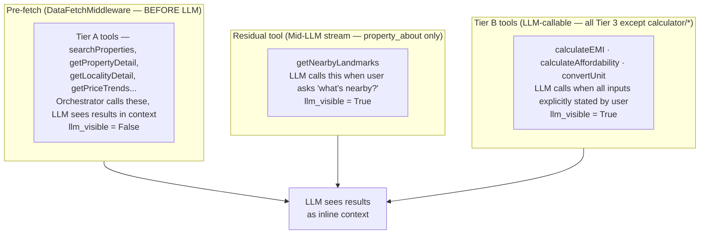
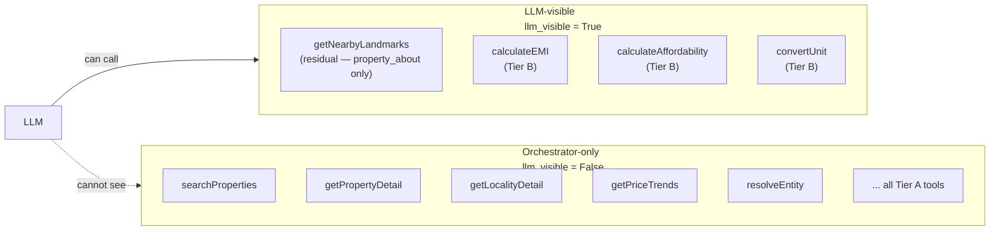

# LLM Tool Contracts

Full tool schemas, orchestrator API translations, tool visibility, data flow patterns, caching, and filter state management.

---

The following diagram shows how tools are split across three execution paths relative to the LLM.



---

## Tool Schemas (Full Definitions)

### `searchProperties`

> **Orchestrator-only tool** (`llm_visible: false`). Pre-fetched by `DataFetchMiddleware` using
> session `active_filters` as params. The LLM never calls this — it receives the result inline.
> Filter changes come from the SLM's `filter_delta`; `FilterApplyMiddleware` applies them before
> any LLM call.

```json
{
  name: "searchProperties",
  description: "Search for properties matching active session filters.",
  input_schema: {
    type: "object",
    properties: {
      query: {
        type: "string",
        description: "Natural language description of what the user wants. Used for semantic search on top of filters."
      },
      filters: {
        type: "object",
        properties: {
          transaction_type:   { type: "string", enum: ["rent", "buy"] },
          city:               { type: "string", description: "City name. Orchestrator resolves to city_uuid before calling Khoj." },
          localities:         { type: "array", items: { type: "string" }, description: "Locality/area names. Orchestrator resolves each to polygon UUID." },
          bhk:                { type: "array", items: { type: "integer" }, description: "e.g. [2,3] means 2BHK or 3BHK. Maps to apartment_type_id in Khoj." },
          price_min:          { type: "number", description: "Monthly rent or total buy price in INR (min_price in Khoj)" },
          price_max:          { type: "number", description: "Monthly rent or total buy price in INR (max_price in Khoj)" },
          area_min_sqft:      { type: "number", description: "Minimum carpet/built-up area in sqft (min_area in Khoj)" },
          area_max_sqft:      { type: "number", description: "Maximum area in sqft (max_area in Khoj)" },
          property_type:      { type: "string", enum: ["apartment", "villa", "plot", "builder_floor", "studio", "penthouse"], description: "Maps to property_type_id in Khoj." },
          furnishing:         { type: "string", enum: ["furnished", "semi-furnished", "unfurnished"], description: "Maps to furnish_type_id in Khoj." },
          amenities:          { type: "array", items: { type: "string" }, description: "e.g. ['gym', 'pool', 'parking', 'lift', 'power_backup', 'security', 'garden']. Each is sent as an individual boolean param to Khoj." },
          construction_status: {
            type: "array",
            items: { type: "string", enum: ["new_launch", "under_construction", "ready_to_move"] },
            description: "Filter by construction stage. Maps to construction_filters in Khoj; new_launch also requires initiation_date=1.0 and min_poss=0."
          },
          listed_by:          { type: "string", enum: ["owner", "broker", "builder"], description: "Who listed the property. Maps to contact_person_id (owner=4, broker=1, builder=3)." },
          search_type:        { type: "string", enum: ["project", "resale"], description: "New project vs resale/secondary market. Maps to type param in Khoj." },
          facing:             { type: "array", items: { type: "string", enum: ["east", "west", "north", "south"] } },
          is_verified:             { type: "boolean", description: "Housing.com verified listings only." },
          is_rera_verified:        { type: "boolean", description: "RERA registered projects only." },
          paid:                    { type: "boolean", description: "Filter to promoted/paid listings (true) or non-promoted (false). Omit to show both." },
          possession_status:       { type: "string", enum: ["ready_to_move", "under_construction", "new_launch"], description: "Orchestrator expands to Khoj wire params: ready_to_move → max_poss=0; new_launch → current_status + initiation_date." },
          availability_within_days: { type: "integer", description: "Rent only: property available within N days. Maps to custom_available_in=1, max_available_in=N in Khoj." },
          owner_only:              { type: "boolean", description: "Direct owner listings only (no brokers). Maps to contact_person_id=2 in Khoj." },
          family_friendly:         { type: "boolean", description: "Family-friendly properties only. Maps to family_friendly_properties=true + lease_type_ids=1 in Khoj." },
          media_filter:            { type: "string", enum: ["video_tour", "3d_tour"], description: "Only listings that have a video or 3D tour. Maps to media_filter in Khoj." },
          days_filter:             { type: "integer", description: "Only listings added within the last N days. Maps to days_filter in Khoj." }
        }
      },
      sort_by: {
        type: "string",
        enum: ["relevance", "price_asc", "price_desc", "newest", "area_desc"],
        description: "Maps to sort_key in Khoj. Default: relevance.",
        default: "relevance"
      },
      page: { type: "integer", default: 1 },
      page_size: { type: "integer", default: 5, maximum: 10 }
    },
    required: ["filters"]
  }
}
```

**Return schema (tool result — normalized from Khoj `data.hits[]`):**

```json
{
  search_result_set_id: string,    // opaque ID stored in session state for pagination/refinement
  total_count: number,             // Khoj: resale_total_count + np_total_count for buy; total for rent
  cursor: string | null,           // Khoj cursor for next page — store in session, pass on next call
  is_last_page: boolean,
  hits: Array<{
    property_id: string,           // Khoj: flat_id (resale/rent) or project_id (new projects)
    property_kind: "resale" | "rent" | "project",
    project_id: string | null,
    title: string,
    locality: string,
    city: string,
    bhk: number,
    area_sqft: number,
    price: number,
    price_unit: "per_month" | "total",
    price_display: string,         // "₹72,000/month"
    thumbnail_url: string,
    highlights: string[],          // ["Metro 500m", "Verified", "Ready to move"]
    is_verified: boolean,
    is_rera_verified: boolean,
    posted_days_ago: number,
    render_as: "property_card"     // tells client to render as card, not prose
  }>
}
```

---

### `getPropertyDetail`

> **Orchestrator-only tool** (`llm_visible: false`). Pre-fetched by `DataFetchMiddleware`; LLM
> receives the result inline. `property_type` is injected from session state and controls which
> backend service is called — the LLM never passes routing parameters.
>
> **Backend routing by `property_type` (orchestrator-injected):**
> | `property_type` | Service | Endpoint |
> |---|---|---|
> | `project` | Venus | `/api/v9/new-projects/{id}/webapp` |
> | `resale` | Casa | `/api/v2/flat/{id}/resale/details` |
> | `rent` | Casa | `/api/v2/flat/{id}/rent/details` |
> | `paying_guest` | Casa | `/api/v1/flat/{id}/rent/details` |
> | `commercial` | Jasprr | `/api/v0/commercial/{id}` |
> | `flatmate` | Jasprr | `/api/v0/residential/flatmates/{id}/details` |
>
> Response always includes `coordinates: {lat, lng}` and `polygon_uuid` — these are stored in
> session state and used by `getTravelTime` and `getDemandSupplyInsight` respectively.

```json
{
  name: "getPropertyDetail",
  description: "Fetch complete details for a specific property.",
  input_schema: {
    type: "object",
    properties: {
      property_id: { type: "string", description: "ID from search results or session context" }
      // property_type — orchestrator injects from session.active_property_kind
      // transaction_type — orchestrator injects from session.transaction_type
    },
    required: ["property_id"]
  }
}
```

**Return schema:**

```json
{
  property_id: string,
  title: string,
  description: string,
  bhk: number,
  bathrooms: number,
  area_sqft: number,
  carpet_area_sqft: number,
  floor: number,
  total_floors: number,
  facing: string,
  furnishing: string,
  price: number,
  price_display: string,
  maintenance: number | null,
  deposit: number | null,
  locality: string,
  city: string,
  full_address: string,
  coordinates: { lat: number, lng: number },
  amenities: string[],
  images: Array<{ url: string, caption: string }>,
  is_verified: boolean,
  available_from: string,
  project_id: string | null,
  project_name: string | null,
  seller: {
    seller_id: string,
    name: string,
    type: "owner" | "broker" | "builder",
    response_rate: number,    // 0–100
    avg_response_hours: number,
    listed_count: number
  },
  pro_tips: string[],        // curated by Housing data team
  cons: string[],
  render_as: "property_detail_card"
}
```

---

### `getLocalityDetail`

> **Orchestrator-only tool** (`llm_visible: false`). Pre-fetched for locality research and
> comparison intents. LLM receives the result inline.

```json
{
  name: "getLocalityDetail",
  description: "Get amenity, connectivity, review, and school data for a locality.",
  input_schema: {
    type: "object",
    properties: {
      locality:     { type: "string", description: "Locality name. Orchestrator resolves to polygon UUID for Odin (entityType=poly&entityIds={uuid})." },
      city:         { type: "string" },
      locality_uuid: { type: "string", description: "Optional. Polygon UUID if already known from session (active_locality_id) or prior resolveEntity call. Skips autosuggest resolution when provided." }
    },
    required: ["locality", "city"]
  }
}
```

**Return schema:**

```json
{
  locality: string,
  city: string,
  overview: string,            // 2-3 sentence editorial blurb
  connectivity: {
    metro_stations: Array<{ name: string, distance_km: number, line: string }>,
    bus_stops: number,
    highway_access: string[],
    airport_distance_km: number
  },
  amenities: {
    hospitals: Array<{ name: string, distance_km: number, type: string }>,
    schools: Array<{ name: string, distance_km: number, board: string, rating: number }>,
    malls: Array<{ name: string, distance_km: number }>,
    restaurants_count: number,
    parks: Array<{ name: string, distance_km: number }>
  },
  ratings: {
    overall: number,           // 1–5
    connectivity: number,
    safety: number,
    lifestyle: number,
    value_for_money: number
  },
  pros: string[],
  cons: string[],
  resident_reviews: Array<{
    text: string,
    rating: number,
    date: string,
    tenure_years: number
  }>,
  render_as: "locality_card"
}
```

---

### `getPriceTrends`

> **Orchestrator-only tool** (`llm_visible: false`). Pre-fetched for price trend and comparison
> intents. LLM receives the result inline.

```json
{
  name: "getPriceTrends",
  description: "Fetch historical price trend data for a locality.",
  input_schema: {
    type: "object",
    properties: {
      locality:         { type: "string", description: "Locality name. Orchestrator resolves to UUID for Gandalf (polygon_price_trend_details?uuid=...)." },
      city:             { type: "string" },
      transaction_type: { type: "string", enum: ["rent", "buy"], description: "Maps to flat_type: buy=1, rent=2 in Gandalf." },
      duration_years:   { type: "integer", enum: [1, 2, 5], default: 1, description: "Max 5 years; Gandalf limitation. Default 1 year." }
    },
    required: ["locality", "city", "transaction_type"]
  }
}
```

**Return schema:**

```json
{
  locality: string,
  transaction_type: "rent" | "buy",
  currency: "INR",
  unit: "per_sqft" | "per_month",
  data_points: Array<{
    month: string,          // "2024-01"
    avg_price: number,
    median_price: number,
    volume: number          // number of transactions
  }>,
  trend_direction: "up" | "down" | "stable",
  yoy_change_pct: number,
  insight: string,          // "Prices up 8.2% YoY, driven by new metro connectivity"
  render_as: "price_trend_chart"
}
```

---

### `getTransactionHistory`

```json
{
  name: "getTransactionHistory",
  description: "Fetch actual registered sale/rental transactions in a locality. Use for grounding price discussions in real data.",
  input_schema: {
    type: "object",
    properties: {
      locality:         { type: "string" },
      city:             { type: "string" },
      bhk_type:         { type: "integer" },
      transaction_type: { type: "string", enum: ["rent", "buy"] },
      limit:            { type: "integer", default: 10, maximum: 20 }
    },
    required: ["locality", "city", "transaction_type"]
  }
}
```

---

### `getProjectDetail`

```json
{
  name: "getProjectDetail",
  description: "Fetch builder, construction status, phases, RERA, and payment plan data for a housing project. Use when user asks about under-construction properties, builder reputation, or delivery timelines.",
  input_schema: {
    type: "object",
    properties: {
      project_id: { type: "string" }
    },
    required: ["project_id"]
  }
}
```

**Return schema:**

```json
{
  project_id: string,
  name: string,
  builder: {
    name: string,
    established_year: number,
    projects_delivered: number,
    projects_ongoing: number,
    rating: number,
    rera_registered: boolean
  },
  rera_number: string,
  launch_date: string,
  possession_date: string,
  construction_status: "planning" | "foundation" | "structure" | "finishing" | "ready",
  construction_progress_pct: number,
  total_units: number,
  units_sold_pct: number,
  configurations: Array<{
    bhk: number,
    area_sqft: number,
    price_range: { min: number, max: number },
    available_units: number
  }>,
  payment_plans: Array<{
    name: string,               // "30:70", "Construction Linked", "Flexi Pay"
    description: string,
    milestones: Array<{ event: string, percentage: number }>
  }>,
  amenities: string[],
  render_as: "project_card"
}
```

---

### `getFloorPlans`

```json
{
  name: "getFloorPlans",
  description: "Fetch floor plan images AND room dimension data for a property or project configuration. Always produces two outputs: (1) template floor_plans sent to FE for visual display, (2) dimension data read by LLM to write a textual layout analysis in markdown.",
  input_schema: {
    type: "object",
    properties: {
      property_id: { type: "string", description: "Use for a specific listing" },
      project_id:  { type: "string", description: "Use for a project to get all config plans" },
      bhk:         { type: "integer", description: "Filter by BHK within a project" }
    }
  }
}
```

**Return schema (dual output):**

```json
{
  plans: Array<{
    plan_id: string,
    bhk: number,
    area_sqft: number,
    image_url: string,
    image_3d_url: string | null,
    property_id: string | null,
    project_id: string | null,
    property_name: string,
    price_display: string,
    construction_status: string,
    // Dimension data — read by LLM, NOT sent to FE as-is
    rooms: Array<{
      name: string,                        // "Living Room", "Bedroom 1", "Kitchen"
      dimensions: string,                  // "18'2\" × 12'6\""
      area_sqft: number | null,
      notes: string | null                 // "Opens into common area", "Master bedroom with attached bath"
    }>,
    balconies: number,
    layout_type: string | null,            // "Linear corridor", "Central courtyard", etc.
    layout_notes: string | null,           // "Private zones separated from common areas"
    entry_type: string | null,             // "Opens into foyer", "Direct living room entry"
  }>,
  render_as: "floor_plans"                 // → template to FE
}
```

**Bot Orchestrator dual-output handling:**

```python
# After getFloorPlans tool call:
# 1. Full result (images + dimensions) → NOT sent to LLM as-is (too many tokens)
# 2. Template payload (images only, no dimension data) → FE via chat_event (templateId: "floor_plan_carousel")
# 3. Dimension summary → LLM context for generating text analysis

def summarise_floor_plans(result: dict) -> str:
    lines = []
    for p in result.get('plans', []):
        rooms = ', '.join(f"{r['name']}: {r['dimensions']}" for r in p.get('rooms', []))
        layout = p.get('layout_notes') or 'standard'
        lines.append(
            f"{p['bhk']}BHK {p['area_sqft']}sqft — Rooms: {rooms}. "
            f"Balconies: {p['balconies']}. Layout: {layout}."
        )
    return '\n'.join(lines)
```

LLM receives the summary and generates the markdown analysis (entry, kitchen, bedrooms, bathrooms, balconies, layout feel sections visible in the design screens). FE receives the image carousel template separately as a Phase 2 `chat_event` (templateId: `"floor_plan_carousel"`) from `respond_node`.
```

---

### `getSimilarProperties`

> **Orchestrator-only tool** (`llm_visible: false`). The `variant` param controls the Khoj
> similarity algorithm. SLM injects `similarity_variant` into `filter_delta` based on the
> user's phrasing; orchestrator reads it and passes to the tool.

```json
{
  name: "getSimilarProperties",
  description: "Fetch properties similar to a given one. Variant controls the comparison axis.",
  input_schema: {
    type: "object",
    properties: {
      property_id: { type: "string" },
      variant: {
        type: "string",
        enum: ["default", "better_priced", "compare_properties", "top_new_projects"],
        description: "default = overall similar | better_priced = cheaper alternatives | compare_properties = same config for side-by-side comparison | top_new_projects = similar new launches",
        default: "default"
      },
      count: { type: "integer", default: 3, maximum: 5 }
    },
    required: ["property_id"]
  }
}
```

---

### `getTrendingLocalities`

> **Orchestrator-only tool** (`llm_visible: false`). Pre-fetched by `DataFetchMiddleware`.
> `budget_range` removed — orchestrator injects from session `price_min`/`price_max` directly.

```json
{
  name: "getTrendingLocalities",
  description: "Get localities trending in searches, price appreciation, or new supply.",
  input_schema: {
    type: "object",
    properties: {
      city:             { type: "string" },
      transaction_type: { type: "string", enum: ["rent", "buy"] },
      ranked_by:        { type: "string", enum: ["search_volume", "price_appreciation", "new_supply", "overall"], default: "overall" }
      // budget_range — orchestrator injects from session.active_filters.price_min / price_max
    },
    required: ["city", "transaction_type"]
  }
}
```

---

### `resolveEntity`

```json
{
  name: "resolveEntity",
  description: "Resolve a free-text locality, project, developer, landmark, or building name to structured IDs. Called by EntityResolutionMiddleware — never by the LLM.",
  input_schema: {
    type: "object",
    properties: {
      query:        { type: "string", description: "The user-supplied name to resolve. e.g. 'Bandra West', 'Lodha Palava', 'DLF', 'Manyata Tech Park'." },
      entity_type:  {
        type: "string",
        enum: ["locality", "project", "developer", "landmark", "building", "city"],
        description: "Hint for autosuggest filtering. locality = area/neighbourhood, project = housing project, developer = builder, landmark = POI/establishment, building = specific society or building."
      },
      city:         { type: "string", description: "Optional city scope to narrow results." },
      service:      { type: "string", enum: ["buy", "rent"], description: "Transaction context — affects autosuggest ranking." }
    },
    required: ["query", "entity_type"]
  }
}
```

**Backed by:** `autosuggest.housing.com/v3/suggest?query=...&service=...&size=5`

**Return schema:**

```json
{
  resolved: boolean,
  candidates: Array<{
    uuid:          string,          // polygon UUID — use as poly param in Khoj, locality_uuid in Gandalf/Odin
    id:            string,          // entity ID (may differ from uuid for projects/developers)
    display_name:  string,          // canonical display name e.g. "Bandra West, Mumbai"
    type:          string,          // "locality" | "project" | "developer" | "landmark" | "building" | "city"
    filter_key:    string,          // Khoj query param for this entity type:
                                    //   locality → "poly" | landmark → "est" | developer → "uuid"
                                    //   project → "region_entity_id" | building → "bldng"
    city_name:     string,
    city_uuid:     string,
    coordinates:   [number, number] | null,  // [lat, lng] — present for landmarks AND buildings
                                              // Required for getTravelTime destination resolution
    score:         number           // autosuggest confidence, 0–1
  }>,
  // If resolved=true and candidates.length=1: orchestrator auto-populates active_locality_id / active_city
  // If candidates.length>1: LLM must present options for disambiguation
  needs_disambiguation: boolean
}
```

**Key rules:**
- If `needs_disambiguation: true`, the LLM must show options to the user — never pick one silently.
- The top candidate's `filter_key` determines which Khoj param to populate (not always `poly`).
- The top candidate's `uuid` maps to Gandalf's `uuid` param and Odin's `locality_uuid` param.
- `coordinates` is populated for landmarks AND buildings — orchestrator uses it as the destination in `getTravelTime` when the user names a destination by building or POI name.

---

### `applyFilter` — removed from LLM tool set

> **Orchestrator-internal only.** `applyFilter` is not a tool the LLM ever calls. Filter changes
> are expressed by the SLM as a `filter_delta` in its classification output. `FilterApplyMiddleware`
> applies the delta to session state deterministically before any LLM call. The LLM then receives
> `searchProperties` results (pre-fetched by `DataFetchMiddleware`) with filters already applied.
>
> There is no case where the LLM should modify filters at runtime — that pathway is removed.

---

### `contact_seller` — Tier 1 template-only action

> **No BE API call.** The BE emits a `contact_seller` template with the property and seller IDs
> from session state. The FE handles all seller contact interaction directly.

When `contact_seller` intent is classified:

1. Orchestrator confirms `active_property_id` and `active_seller_id` are in session state
2. FE template handles login if needed — `contact_seller` FE template has its own login flow
3. Orchestrator calls `build_contact_seller_template(session)` — **no external API call**
4. BE emits `contact_seller` template via `emit_final_state`; done

```json
{
  "templateId": "contact_seller",
  "data": {
    "property_id":    "<string>",
    "seller_id":      "<string>",
    "property_title": "<string>",
    "price_display":  "<string>"
  }
}
```

**FE responsibility:** on user confirming the card, the FE calls its own vendor APIs to initiate
contact (show phone number, WhatsApp, or submit a lead). No CRM call from BE.

**FE also sends `contact_seller_confirmed`** (`responseRequired: true`) back to BE so the pipeline
can generate a follow-up suggestion: *"While you wait — similar properties, locality reviews, or
floor plan?"*. This action skips SLM; BE synthesises the intent directly and calls the LLM.

**Venus note:** Venus provides the property data behind `getPropertyDetail`, `getFloorPlans`,
`getProjectDetail`, etc. — those BE-side fetches are unchanged. Only the CRM/lead-creation
step is absent from the BE.

---

## Orchestrator API Translation

The LLM uses clean, human-readable parameter names. The orchestrator translates them to real API wire format before each call. This separation means the LLM schemas never break when upstream APIs change.

### `searchProperties` → Khoj filter API

| LLM param | Khoj wire param | Notes |
|-----------|----------------|-------|
| `city` (name) | `city_uuid` | Orchestrator: autosuggest or session city UUID |
| `localities[]` (names) | `poly` (UUID or comma-separated UUIDs) | Orchestrator: resolveEntity per name |
| `bhk: [2,3]` | `apartment_type_id=2,3` | Direct integer mapping |
| `price_min` / `price_max` | `min_price` / `max_price` | Same values |
| `area_min_sqft` / `area_max_sqft` | `min_area` / `max_area` | Same values |
| `property_type: "apartment"` | `property_type_id=1` | apartment=1, villa=2, plot=4, builder_floor=3 |
| `furnishing: "furnished"` | `furnish_type_id=1` | furnished=1, semi=2, unfurnished=3 |
| `amenities: ["gym","pool"]` | `gym=true&pool=true` | Each amenity becomes a separate boolean key |
| `possession_status: "new_launch"` | `current_status=Under Construction&initiation_date={1yr ago epoch}` | Orchestrator expands |
| `possession_status: "ready_to_move"` | `max_poss=0` | |
| `possession_status: "under_construction"` | `current_status=Under Construction` | |
| `listed_by: "owner"` | `contact_person_id=4` | owner=4, broker=1, builder=3 |
| `owner_only: true` | `contact_person_id=2` | Stricter owner-only filter |
| `family_friendly: true` | `family_friendly_properties=true&lease_type_ids=1` | |
| `media_filter: "video_tour"` | `media_filter=video_tour` | |
| `days_filter: 7` | `days_filter=7` | Last N days |
| `sort_by: "price_asc"` | `sort_key=price_asc` | |
| `availability_within_days: 7` | `custom_available_in=1&max_available_in=7` | Rent only |
| `is_verified: true` | `is_verified=true` | |
| `is_rera_verified: true` | `is_rera_verified=true` | |
| Cursor pagination | `p={page}&cursor={cursor}` | Buy: `resale_total_count`, `np_total_count` |
| Bot mode | `reduce_data_size=true&for_bot=true` | Always injected by orchestrator; uses `/bot/filter` endpoint |

### `getPropertyDetail` → multi-service routing

| `property_type` (session) | Service | Endpoint |
|--------------------------|---------|----------|
| `project` | Venus | `/api/v9/new-projects/{id}/webapp?fixed_images_hash=true` |
| `resale` | Casa | `/api/v2/flat/{id}/resale/details` |
| `rent` | Casa | `/api/v2/flat/{id}/rent/details` |
| `paying_guest` | Casa | `/api/v1/flat/{id}/rent/details` |
| `commercial` | Jasprr | `/api/v0/commercial/{id}?service_id={serviceId}` |
| `flatmate` | Jasprr | `/api/v0/residential/flatmates/{id}/details` |

All responses include `coordinates: {lat, lng}` (stored as `session.active_property_coordinates`) and `polygon_uuid` (stored as `session.active_locality_id`) for downstream use by `getTravelTime` and `getDemandSupplyInsight`.

### `getPriceTrends` vs `getProjectPriceTrends`

| Context | Tool | Backend | Param |
|---|---|---|---|
| User asks about a **locality** | `getPriceTrends` | Gandalf `polygon_price_trend_details` | `uuid` = polygon UUID |
| User asks about a **specific project** | `getProjectPriceTrends` | Gandalf `NEW_PRICE_TRENDS` | `projectIds[]` |

### `getPriceTrends` → Gandalf

| LLM param | Gandalf wire param | Notes |
|-----------|-------------------|-------|
| `locality` (name) | `uuid` | Orchestrator resolves via session active_locality_id or autosuggest |
| `transaction_type: "buy"` | `flat_type=1` | |
| `transaction_type: "rent"` | `flat_type=2` | |
| `duration_years: 1` | `durationYears=1` | Max 5 — Gandalf data limitation |

### `getLocalityDetail` / `getLocalityReviews` → Odin

| LLM param | Odin wire params | Notes |
|-----------|-----------------|-------|
| `locality` + `city` | `entityType=poly&entityIds={uuid}` | Orchestrator resolves name → UUID via autosuggest; uses active_locality_id if in session |
| `locality_uuid` (if provided) | `entityIds={uuid}` directly | No resolution step needed |

### `resolveEntity` → Autosuggest

```
GET autosuggest.housing.com/v3/suggest?query={name}&service={buy|rent}&size=5
Response: { data: { templates: [ { uuid, id, type, city_name, city_uuid, bbx_uuid, lon_lat } ] } }
```

### `getTravelTime` → Regions

Two-phase orchestration for commute_time intent:

1. **Phase 1 (parallel_group 1):** `getPropertyDetail` if `session.active_property_coordinates` is not set — populates origin lat/lng from property detail response.
2. **Phase 2 (parallel_group 2):** `EntityResolutionMiddleware` has already resolved destination names to coordinates via `resolveEntity`. `DataFetchMiddleware` calls `getTravelTime` with:
   - `origin`: `{ lat: session.active_property_coordinates.lat, lng: session.active_property_coordinates.lng }`
   - `destinations`: `ctx.resolved_entities.map(e => ({ id: e.id, lat: e.coordinates[0], lng: e.coordinates[1] }))`

```
GET regions.housing.com/api/v1/travel-distance-and-time
  ?origin={encoded JSON lat/lng}
  &destinations={encoded JSON array of {id, lat, lng}}

Response: { [destination_id]: { distance, duration, distance_text, duration_text } }
```

### `getDemandSupplyInsight` → Casa

```
GET casa.housing.com/api/v2/flat/locality-bhk-demand-supply
  ?polygonUuid={polygon_uuid}
  &serviceType={buy|rent}

Response fields used:
  buyer_interest              — free-text sentiment string from backend, used verbatim in bot response
  potential_buyer_count       — integer, active buyers searching this locality
  potential_seller_count      — integer, active listings / sellers
  buyer_count_percentage_change  — MoM change in buyer count
  demand_percentages          — { bhk_1: pct, bhk_2: pct, ... } — what BHK configs buyers want
  supply                      — { bhk_1: listing_count, ... } — what BHK configs are listed
  demand_percentage_change    — overall demand MoM change
  supply_percentage_change    — overall supply MoM change
```

`polygon_uuid` is injected from `session.active_locality_id` (set when `getPropertyDetail` runs and stores `polygon_uuid`, or from `resolveEntity` for locality research intents).

### `getPriceBuckets` → Khoj

```
GET khoj.internal/api/v7/buy/search-count?showBucket=true&{active_filters}
    (or /v1/rent/search-count for rent)

Response fields:
  aggregations.price_aggs     — histogram buckets (buy)
  aggregations.percentile_aggs['90.0']  — 90th percentile price (rent)
  aggregations.price_aggregations_5k_bucket.price_aggs  — 5K-width rent buckets
```

### `getProjectPriceTrends` → Gandalf

```
GET data.housing.com/price_trends_housing/new_price_trends
  ?projectIds[]={ids}
  &flatType={1|2}          (1=buy, 2=rent from serviceMap)
  &apartmentTypeIds[]={bhk_ids}
  &propertyTypeId={1|2}

Response: { data: { projectTrends: { [listing_id]: { trend[], percent_growth, avg_price_per_sqft } } } }
```

### `createSearchAlert` → Subscriptions

```
POST subscriptions.housing.com/token_api/v3/create-filter
Body: {
  mailing_option: "daily" | "instant",
  filters: <backend codec encoding of session.active_filters>,
  service: "np_buy" | "rent"   (note: buy maps to "np_buy" for subscriptions service)
}

Response: { status, result: boolean, message }
Duplicate detection: status "DUPLICATE_FILTER" → "You are already subscribed to this search"
Cap enforcement: 400 → "You have reached the max limit of 5 alerts."
```

---

## Tool Visibility

The following diagram maps every tool to whether it is callable by the LLM or orchestrator-only.



Tools are split into two categories. The LLM only ever sees `llm_visible: true` tools.

| Category | Tools | Who calls them |
|---|---|---|
| **LLM-visible — Residual** | `getNearbyLandmarks` | LLM (intent-specific, property_about only) |
| **LLM-visible — Tier B** | `calculateEMI`, `calculateAffordability`, `convertUnit` | LLM (always injected for all Tier 3 intents except `calculator/*`; LLM calls when user states all required inputs mid-session) |
| **Orchestrator-only** | `searchProperties`, `resolveEntity`, `getPropertyDetail`, `getFloorPlans`, `getBrochure`, `getSimilarProperties`, `getLocalityDetail`, `getPriceTrends`, `getProjectPriceTrends`, `getTransactionHistory`, `getRatingsReviews`, `getTrendingLocalities`, `getTrendingProjects`, `getProjectDetail`, `getDemandSupplyInsight`, `getTravelTime`, `getPriceBuckets`, `getFilterSuggestions`, `getCollections`, `getPopularCityLandmarks`, `getTopSocieties`, `shortlistProperty`, `removeFromShortlist`, `getSavedProperties`, `getViewedProperties`, `getRecentlyViewed`, `getRecommendations`, `createSearchAlert` | DataFetchMiddleware, RoutingMiddleware |
| **Template-only (no tool)** | `contact_seller` | BE emits template from session state; FE handles seller contact |

The LLM's job is **NLG** (natural language generation) over data that arrives pre-loaded in its context. It does not discover, fetch, or choose which APIs to call — the orchestrator does that based on `data_requirements` in `INTENT_REGISTRY`.

---

## Data Flow (Pre-fetch model)

```
SLM classifies → DataFetchMiddleware fetches → PromptBuildMiddleware injects → LLM formats

Pattern 1: Search → Expand (two turns, not two tool calls)
─────────────────────────────────────────────────────────
Turn 1:  "Show me 2BHK flats in Bandra under 80k"
  DataFetchMiddleware: searchProperties({ bhk:[2], localities:["Bandra"], price_max:80000 })
  LLM receives results inline → "Here are 5 options in Bandra..." [renders cards]

Turn 2:  "Tell me more about the second one"
  DataFetchMiddleware: getPropertyDetail({ property_id: "prop_341" })
  LLM receives detail inline → "This is a 2BHK on the 8th floor..." [renders detail card]


Pattern 2: Property/project comparison (6 parallel pre-fetches, 1 LLM call)
────────────────────────────────────────────────────────────────────────────
User: "Compare DLF Privana and Godrej Meridian"
  DataFetchMiddleware parallel_group 1:
    getPropertyDetail(project_id_A)     ─┐
    getPropertyDetail(project_id_B)      │  ~150ms
    getProjectPriceTrends([A, B])        │  all parallel
    getRatingsReviews(project_id_A)      │
    getRatingsReviews(project_id_B)     ─┘
  LLM receives all results inline → streams comparison
  (For locality-vs-locality comparison see Pattern 9)


Pattern 3: Property Detail + Nearby (residual tool — only pattern where LLM calls a non-Tier-B tool)
─────────────────────────────────────────────────────────────────────────────────────────────────────
User: "Tell me about this property and what's nearby"
  DataFetchMiddleware: getPropertyDetail (pre-fetched, inline)
  LLM tool_definitions: [getNearbyLandmarks]  ← only residual tool
  LLM: if user asked about "nearby", calls getNearbyLandmarks({ categories, radius_meters })
  (location injected by orchestrator; LLM only specifies category/radius preference)

**Residual Tool Call Timeout:** The orchestrator applies a 2000ms timeout to residual tool calls
(getNearbyLandmarks). On timeout, inject `{ error: 'timeout', message: 'Unable to fetch nearby
landmarks right now.' }` and resume the LLM stream without landmark data. Log
`residual_tool_timeout` metric. getNearbyLandmarks results have a 24h cache TTL — cache hits avoid
this risk entirely for repeat property views.


Pattern 4: Project drill-down (sequential parallel_groups)
────────────────────────────────────────────────────────────
User: "Tell me about Lodha Palava"
  parallel_group 1: searchProperties (project query)
  PromptBuildMiddleware: resolves project_id from search result
  parallel_group 2: getProjectDetail({ project_id })
  LLM receives both inline → responds about project + layouts in one turn


Pattern 5: Commute time (two-group sequential, entity resolution first)
────────────────────────────────────────────────────────────────────────
User: "How far is this flat from Manyata Tech Park and BKC?"
  EntityResolutionMiddleware:
    resolveEntity("Manyata Tech Park", type="landmark") → {id, coordinates:[lat,lng]}
    resolveEntity("BKC", type="landmark")               → {id, coordinates:[lat,lng]}
  DataFetchMiddleware parallel_group 1:
    getPropertyDetail({ property_id: session.active_property_id })
    → stores coordinates: {lat, lng} in session.active_property_coordinates
  DataFetchMiddleware parallel_group 2:
    getTravelTime({
      origin:       session.active_property_coordinates,
      destinations: ctx.resolved_entities  ← Manyata + BKC with lat/lng
    })
  LLM receives: "Manyata Tech Park: 8.2 km, 22 min. BKC: 14 km, 38 min."


Pattern 6: Market insight (locality research — demand/supply)
──────────────────────────────────────────────────────────────
User: "Is Bandra a buyer's market right now?"
  EntityResolutionMiddleware: resolveEntity("Bandra", type="locality") → polygon_uuid
  DataFetchMiddleware parallel_group 1:
    getDemandSupplyInsight({ polygon_uuid, service_type: "buy" })
    → { buyer_interest: "High Interest", potential_buyer_count: 1240, ... }
  LLM receives buyer_interest + MoM changes + BHK demand breakdown inline
  LLM response: "Bandra is showing High Interest from buyers right now. There are
                 1,240 active buyers, up 12% from last month. 2BHKs account for
                 the highest demand at 38%."


Pattern 7: Price fairness check (bucket distribution)
───────────────────────────────────────────────────────
User: "Is 85L fair for a 2BHK in Andheri West?"
  DataFetchMiddleware: getPriceBuckets({ filters: session.active_filters })
  → { price_buckets: [{range:"60L-80L",count:145},{range:"80L-1Cr",count:87},...], p90:1.1Cr }
  LLM: "Most 2BHKs in Andheri West are priced between 60L–1Cr. At 85L, this
        property is right in the middle of the market — 40% of listings are
        cheaper, 60% are more expensive."


Pattern 8: Save search alert (Tier 1, no LLM)
───────────────────────────────────────────────
User: "Alert me when new 3BHKs appear in Powai under 1Cr"
  Classification: portfolio / save_alert (Tier 1)
  RoutingMiddleware: save_alert has requires_auth=True; if auth_token absent → emits chat_event { templateId: "login" } with text "Log in to save this search and get alerts."
  RoutingMiddleware: emits confirmation card
    "Save alert: 3BHK in Powai under ₹1Cr. You'll get daily email alerts. Confirm?"
  On confirmation:
    createSearchAlert({ filters: session.active_filters, mailing_option: "daily" })
    → { success: true, message: "You will get alerts for new properties" }
  Orchestrator sets `bot_response` with success message — no LLM involved. `emit_final_state` sends the SSE `chat_event`.


Pattern 9: Locality comparison (6 parallel pre-fetches, Sonnet, markdown output)
──────────────────────────────────────────────────────────────────────────────────
User: "What's the difference between Sector 50 and Sector 62 in Gurgaon?"
  EntityResolutionMiddleware:
    resolveEntity("Sector 50", "locality") → uuid_A   ─┐ parallel
    resolveEntity("Sector 62", "locality") → uuid_B   ─┘
  DataFetchMiddleware parallel_group 1:
    getDemandSupplyInsight(uuid_A)   ─┐
    getDemandSupplyInsight(uuid_B)    │
    getPriceTrends(uuid_A)            │  all parallel ~200ms
    getPriceTrends(uuid_B)            │
    getRatingsReviews(uuid_A)         │
    getRatingsReviews(uuid_B)        ─┘
  LLM receives all 6 results → generates structured markdown:

    ## Sector 50 vs Sector 62, Gurgaon

    | | Sector 50 | Sector 62 |
    |---|---|---|
    | Avg price/sqft | ₹X | ₹Y |
    | Price growth (1yr) | Z% | W% |
    | Active buyers | N | M |
    | Overall rating | 4.1 ★ | 3.8 ★ |

    ### Sector 50
    **Pros:** [derived from ratings/demand data]
    **Cons:** [derived from supply/trend data]

    ### Sector 62
    **Pros:** ...
    **Cons:** ...

    ### Verdict
    [LLM synthesis — which suits what profile, e.g. budget vs premium]

  LLM derives pros/cons and verdict from tool data — does not invent facts.
  buyer_interest string from getDemandSupplyInsight is used verbatim as sentiment signal.
```

---

## Tool Result Rendering Pipeline

Pre-fetched tool results feed into two separate paths — the **template path** (Phase 2) and the **LLM context path** (Phase 3):

```
Tool result arrives from DataFetchMiddleware
       │
       ▼
   Template intent?
  ├── Yes → build_template_events() maps result to templateId + data
  │          respond_node emits chat_event (messageType: "template") — Phase 2
  │          Truncated summary also injected into LLM context for Phase 3 commentary
  └── No  → Result injected directly into LLM context
             LLM generates full prose response — Phase 3 only
```

**Phase 2 chat_event example (property_search result):**

```json
{
  "messageId": "B",
  "sequenceNumber": 1,
  "messageType": "template",
  "templateId": "property_carousel",
  "sourceMessageState": "IN_PROGRESS",
  "data": {
    "properties": [
      {
        "property_id": "prop_341",
        "title": "2BHK in Bandra West",
        "price_display": "₹72,000/month",
        "area_sqft": 1100,
        "highlights": ["Metro 400m", "Furnished", "Verified"],
        "thumbnail_url": "https://cdn.housing.com/...",
        "quick_actions": [
          { "label": "Details",        "intent": "get_property_detail", "property_id": "prop_341" },
          { "label": "Similar",        "intent": "get_similar",         "property_id": "prop_341" },
          { "label": "Contact Seller", "intent": "contact_seller",      "property_id": "prop_341", "seller_id": "sel_892" }
        ]
      }
    ],
    "property_count": 47,
    "pagination": { "is_last_page": false },
    "quick_filters": [
      { "label": "Furnished only", "filter_delta": { "furnishing": "furnished" } },
      { "label": "Under ₹65k",     "filter_delta": { "price_max": 65000 } },
      { "label": "Metro nearby",   "filter_delta": { "amenities": ["metro_nearby"] } }
    ]
  }
}
```

`quick_filters` are chips rendered below the result cards — one tap sends an `applyFilter` intent without the user typing anything.

---

## Hallucination Prevention

### Rule: LLM never generates property facts

The system prompt explicitly forbids this, but the architecture enforces it structurally:

1. **Pre-fetched data is the only source** of prices, areas, locations, and amenities in the context.
   `DataFetchMiddleware` populates this before the LLM call; the LLM formats what it receives.
2. `getPropertyDetail` is always pre-fetched for `property_detail/*` intents — the LLM never needs
   to request it. The detail data is always in context before the LLM starts.
3. If a pre-fetch returns an empty result or an error, the orchestrator injects that signal into
   the context. Example: `{ searchProperties: { error: "no_results" } }` → LLM responds:
   *"I couldn't find properties matching those filters. Want to try broadening them?"*

### Tool result truncation (preventing context bloat)

Large tool results are truncated before being added to LLM context:

| Tool | Fields kept in context | Fields moved to metadata (not sent to LLM) |
|---|---|---|
| `searchProperties` | id, title, locality, bhk, area, price, highlights (5 max) | Full address, images, seller full profile |
| `getPropertyDetail` | All fields except images array | images[] (URLs stored in card, not in LLM context) |
| `getLocalityDetail` | Overview, ratings, pros/cons, top 3 schools/hospitals | Full amenity lists, all resident reviews |
| `getPriceTrends` | Last 12 data points, insight string | Full 60-month history |
| `getNearbyLandmarks` | Top 3 landmarks per category, `commute_summary`; max 15 total items (top 3 × 5 most relevant categories) | Raw rating data, full address strings, secondary photos |

The full data is stored in the card payload (sent directly to client), but the LLM only sees a truncated version. This reduces per-turn token cost significantly.

---

## Caching Tool Results

Property data changes infrequently. Tool results are cached in Redis:

```
cache:tool:property:{property_id}          TTL: 15 minutes
cache:tool:locality:{city}:{locality}      TTL: 1 hour
cache:tool:price_trends:{city}:{locality}  TTL: 6 hours
cache:tool:project:{project_id}            TTL: 30 minutes
cache:tool:floor_plans:{property_id}       TTL: 1 hour
cache:tool:trending:{city}                 TTL: 30 minutes
```

**Search results are not cached** — they depend on real-time inventory and must always reflect live stock.

Cache hit rate target: >80% for locality and price trend tools. This significantly reduces latency for common queries ("tell me about Bandra") and reduces load on downstream property APIs.

---

## Utility and User History Tools

Calculators and unit conversion have **two distinct execution paths** depending on intent:

**Path 1 — `calculator/*` intents (Tier 2, no LLM call):** The SLM classifies the turn as a
calculator intent. The orchestrator computes the result directly from SLM-extracted params and
assembles the response directly and sets `bot_response`. The LLM is not called at all for these turns.

**Path 2 — Non-calculator Tier 3 intents (LLM-visible, `tier_b: true`):** For all Tier 3 intents
except `calculator/*`, `calculateEMI`, `calculateAffordability`, and `convertUnit` are injected
into the LLM's tool definitions (`llm_visible: true`). The LLM may call them mid-session when the
user states all required inputs explicitly (e.g. "what's the EMI on this?" while viewing a property
detail — price is in context, LLM calls `calculateEMI` with it). These are pure local computation
(no API calls, sub-50ms) — the LLM receives the result and formats a response.

**Constraint for Path 2:** The LLM must only call Tier B tools when all required inputs are
explicitly available. It cannot invent a property price, salary, or unit value.

### `calculateEMI`

> **Two paths:** Tier 2 (orchestrator-computed, no LLM) for `calculator/*` intents; Tier B
> (LLM-visible tool, `llm_visible: true`) for all other Tier 3 intents.

```json
{
  name: "calculateEMI",
  // params extracted by SLM from user message, not LLM tool call
  input_schema: {
    type: "object",
    properties: {
      property_price:   { type: "number", description: "Total property price in INR. Required. e.g. 10000000 for ₹1Cr." },
      down_payment:     { type: "number", description: "Down payment amount in INR. If provided, overrides down_payment_pct." },
      down_payment_pct: { type: "number", description: "Down payment as % of price. Default 20 (i.e. 20% down). Used if down_payment is not given." },
      tenure_years:     { type: "integer", description: "Loan tenure in years. Default 20." },
      annual_rate:      { type: "number", description: "Annual interest rate as %. Default 8.5. Use this default unless user specified a rate." }
    },
    required: ["property_price"]
  }
}
```

**Orchestrator resolves loan amount before computing:**
```
loan_amount = property_price - (down_payment ?? property_price × down_payment_pct/100 ?? property_price × 0.20)
```

**Return schema (pure math — computed by orchestrator, no external API call):**

```json
{
  property_price:   number,
  loan_amount:      number,
  down_payment:     number,
  down_payment_pct: number,
  tenure_years:     number,
  annual_rate:      number,
  monthly_emi:      number,   // ₹ rounded to nearest rupee
  total_payment:    number,   // loan_amount + total_interest
  total_interest:   number,
  amortization_summary: Array<{
    year: number,
    principal_paid: number,
    interest_paid:  number,
    balance:        number
  }>,
  render_as: "emi_result"
}
```

**Pure math — no external API.** Formula: `EMI = P × r × (1+r)^n / ((1+r)^n - 1)` where
`P = loan_amount`, `r = annual_rate/12/100`, `n = tenure_years × 12`.

**Tier 2 path (calculator intent):** "What's the EMI on a 1Cr flat?" → SLM classifies as
`calculator/emi` → SLM extracts `property_price: 10000000` → Tier 2 → orchestrator computes with
defaults (20% down, 20yr, 8.5%) → result injected into LLM context → LLM formats response.
Zero LLM tool call round trips. If user says "at 9% for 15 years", SLM extracts those params too.

**Tier B path (non-calculator intent):** User is mid-session on a `property_about` turn and asks
"what would my EMI be?" — LLM has property price in context → calls `calculateEMI` with it as
a Tier B tool call → orchestrator computes → LLM formats response.

---

### `calculateAffordability`

> **Two paths:** Tier 2 (orchestrator-computed, no LLM) for `calculator/*` intents; Tier B
> (LLM-visible tool, `llm_visible: true`) for all other Tier 3 intents.
> If salary is not in context when called as a Tier B tool, the LLM must ask the user —
> salary cannot be defaulted or guessed.

Two modes depending on what the user provides:
- **Mode A — "What can I afford?"**: User gives salary → return recommended max budget + EMI estimate
- **Mode B — "Can I afford this?"**: User gives salary + property price → check affordability, show EMI breakdown for that price

```json
{
  name: "calculateAffordability",
  description: "Calculate what property budget a user can afford (Mode A), or check if a specific price is affordable (Mode B). Params extracted by SLM; computed by orchestrator. Salary is required — if not in context, SLM routes Tier 3 so LLM can ask.",
  input_schema: {
    type: "object",
    properties: {
      monthly_salary:    { type: "number", description: "Gross monthly salary in INR. Preferred." },
      annual_salary:     { type: "number", description: "Annual salary in INR. Used if monthly_salary not given; monthly = annual / 12." },
      property_price:    { type: "number", description: "Mode B: the specific property price to check affordability for. Omit for Mode A." },
      existing_emi:      { type: "number", description: "Existing monthly EMI obligations (car loan, personal loan etc). Default 0." },
      available_savings: { type: "number", description: "Savings available for down payment. Default 0." },
      tenure_years:      { type: "integer", description: "Preferred loan tenure in years. Default 20." },
      annual_rate:       { type: "number", description: "Expected home loan rate %. Default 8.5." }
    }
    // at least one of monthly_salary or annual_salary required
  }
}
```

**Return schema:**

```json
{
  mode: "budget_estimate" | "affordability_check",

  // Inputs echoed back for context
  monthly_salary:    number,
  existing_emi:      number,
  available_savings: number,

  // Budget computation (both modes)
  max_loan_amount:      number,   // salary × 60 × FOIR heuristic, minus existing EMI
  recommended_budget:   number,   // max_loan + available_savings (assumes 20% down from savings)
  min_down_payment:     number,   // 20% of recommended_budget
  foir_used:            number,   // Fixed Obligation to Income Ratio applied (typically 40–50%)

  // Mode A: EMI at recommended budget
  emi_at_budget: {
    property_price:  number,
    loan_amount:     number,
    monthly_emi:     number,
    tenure_years:    number,
  },

  // Mode B only: affordability verdict for the given price
  affordability_check?: {
    property_price:    number,
    is_affordable:     boolean,
    monthly_emi:       number,
    emi_to_income_pct: number,   // EMI as % of monthly salary
    shortfall?:        number,   // how much over budget (if not affordable)
    stretch_tenure?:   number,   // years needed to make EMI fit FOIR (if slightly over)
  },

  render_as: "affordability_result"
}
```

**Internal logic:** `calculateAffordability` calls the same EMI formula as `calculateEMI` internally — no separate API call. Both are orchestrator math functions.

**After Mode A:** LLM should note the `recommended_budget` and offer to search in that range.
The next search turn will have the budget in session filters; no tool call needed now.
**After Mode B:** If `is_affordable: false`, LLM should suggest a lower price range or longer tenure
based on `shortfall` and `stretch_tenure` in the result.

---

### `convertUnit`

> **Two paths:** Tier 2 (orchestrator-computed, no LLM) for `calculator/*` intents; Tier B
> (LLM-visible tool, `llm_visible: true`) for all other Tier 3 intents.
> SLM extracts `value`, `from`, `to` (and `state` if bigha). For Tier 2 path: orchestrator
> computes inline, result injected into LLM context. For Tier B path: LLM calls the tool when
> the user provides all required inputs mid-session.
> Exception: if `bigha` is involved and `state` is missing, the LLM must ask which state
> before calling (bigha size varies 10x across states).

```json
{
  name: "convertUnit",
  // params extracted by SLM from user message, not LLM tool call
  input_schema: {
    type: "object",
    properties: {
      value: { type: "number", description: "The numeric value to convert. Extract from user message." },
      from:  {
        type: "string",
        enum: ["sqft", "sqyard", "sqmeter", "acre", "guntha", "marla", "cent", "hectare", "bigha"],
        description: "The unit the user currently has."
      },
      to:    {
        type: "string",
        enum: ["sqft", "sqyard", "sqmeter", "acre", "guntha", "marla", "cent", "hectare", "bigha"],
        description: "The unit the user wants to convert to."
      },
      state: {
        type: "string",
        description: "Required only when from or to is 'bigha' — bigha size varies by state (UP, Bihar, Punjab etc)."
      }
    },
    required: ["value", "from", "to"]
  }
}
```

**Return schema (orchestrator lookup table, zero latency):**

```json
{
  value:      number,   // input
  from:       string,
  to:         string,
  result:     number,   // rounded to 4 decimal places
  formatted:  string,   // "1,200 sq.ft = 133.33 sq.yards"
  render_as: "unit_conversion"
}
```

**Conversion factors** (orchestrator lookup table — never in LLM memory):
```
sqft  → sqyard : ÷ 9
sqft  → sqmeter: × 0.0929
sqft  → acre   : ÷ 43560
sqft  → guntha : ÷ 1089
sqft  → marla  : ÷ 272.25
sqft  → cent   : ÷ 435.6
sqft  → hectare: × 0.0000929
bigha → sqft   : UP=27000, Bihar=27211, Punjab/Haryana=9070, Rajasthan=1936  (state required)
```

All conversions go through sqft as the intermediate unit — `from → sqft → to` using the table above.

**Tier 2 path (calculator intent):** "convert 1200 sqft to sq yards" → SLM classifies as
`calculator/convert_unit` → SLM extracts `value:1200, from:sqft, to:sqyard` → orchestrator
computes → result inline in LLM context → zero LLM tool call tokens.

**Tier B path (non-calculator intent):** User is mid-session and mentions a unit conversion
need → LLM calls `convertUnit` as a Tier B tool with user-stated values → orchestrator computes.

Bigha without state (either path) → LLM must ask which state before computing.

---

### `getRecentSearches`

> **Note:** `recent_searches` is served from session state (`session.search_history`) directly — no
> API call. The SLM routes to `portfolio/recent_searches` (Tier 2); the orchestrator formats
> `session.search_history` into the response without calling any external API.

---

### `getViewedProperties`

```json
{
  name: "getViewedProperties",
  description: "Fetch properties the user has viewed (opened property detail) in recent sessions. Use when user says 'show me what I looked at', 'properties I liked', or 'my history'. User identity is resolved from session context — no external param required.",
  input_schema: {
    type: "object",
    properties: {
      limit:            { type: "integer", default: 6, maximum: 20 },
      transaction_type: { type: "string", enum: ["rent", "buy"] }
    },
    required: []
  }
}
```

**Return schema:**

```json
{
  properties: Array<{
    property_id:     string,
    title:           string,
    locality:        string,
    price_display:   string,
    area_sqft:       number,
    thumbnail_url:   string,
    viewed_at:       string,    // ISO timestamp
    is_still_active: boolean,   // whether listing is still live
    status_change?:  string     // "Price reduced by ₹5k", "No longer available"
  }>,
  render_as: "property_carousel"   // reuses carousel with "Viewed on {date}" badge
}
```

**Note:** `is_still_active: false` must show a badge "No longer listed" on the card. `status_change` shows as a highlight chip — useful for re-engaging users on price-dropped properties.

---

### `getNearbyLandmarks`

The location can be supplied as a locality UUID **or** as lat/lng coordinates. The orchestrator resolves whichever is available from session state — the LLM should not guess or fabricate either.

**Location source priority (orchestrator resolves before tool call):**
1. `coordinates` from `location_shared` user action (most precise — user's actual location)
2. `coordinates` from active property's detail data (if user is looking at a specific property)
3. `locality_id` (polygon UUID) from `active_locality_id` in session state
4. `locality_id` from `resolveEntity` result (if user named a locality)

```json
{
  name: "getNearbyLandmarks",
  description: "Fetch nearby points of interest for a location. Use when user asks 'what's nearby', 'how far is the metro', 'are there schools close by'. Provide locality_id OR coordinates — never both, never neither. Check session state for active_locality_id or property coordinates before calling.",
  input_schema: {
    type: "object",
    properties: {
      locality_id:  {
        type: "string",
        description: "Polygon UUID of the locality (from resolveEntity or session.active_locality_id). Use when exploring a locality in general."
      },
      coordinates:  {
        type: "array",
        items: { type: "number" },
        minItems: 2,
        maxItems: 2,
        description: "[lat, lng] array. Use when user shared their location or when looking at a specific property that has coordinates."
      },
      landmark_types: {
        type: "array",
        items: {
          type: "string",
          enum: ["metro", "bus_stop", "school", "hospital", "mall", "park", "airport", "restaurant", "pharmacy", "bank", "gym"]
        },
        description: "Specific types to fetch. If omitted, returns top 3 of each type. Populate from user's question — 'how far is the metro?' → ['metro']."
      },
      radius_km: { type: "number", default: 3, maximum: 10 }
    }
    // exactly one of locality_id or coordinates required
  }
}
```

**Orchestrator pre-call resolution:**

```python
def resolve_nearby_landmarks_input(session: dict) -> dict:
    # 1. User shared location
    if session.get('user_coordinates'):
        return {'coordinates': session['user_coordinates']}
    # 2. Active property has coordinates
    if session.get('active_property_coordinates'):
        return {'coordinates': session['active_property_coordinates']}
    # 3. Active locality in session
    if session.get('active_locality_id'):
        return {'locality_id': session['active_locality_id']}
    # 4. Nothing resolved — return empty; LLM will see error and ask user
    return {}
```

If neither is available, the orchestrator returns `{ error: "no_location", message: "Ask user to share location or specify a locality." }` to the LLM before the tool is called.

**Return schema:**

```json
{
  // Location anchor echoed back so FE can centre the map correctly
  anchor: {
    type:         'locality' | 'coordinates',
    label:        string,          // "Bandra West" or "Your location"
    locality_id?: string,
    coordinates?: [number, number]
  },
  landmarks: Array<{
    name:        string,
    type:        string,
    distance_km: number,
    walk_mins?:  number,
    drive_mins?: number,
    rating?:     number,           // Google rating if available
    is_notable:  boolean           // flagship hospital, IIT-affiliated school, etc.
  }>,
  commute_summary: {
    nearest_metro?:    { name: string, distance_km: number, walk_mins: number },
    nearest_school?:   { name: string, distance_km: number, board: string },
    nearest_hospital?: { name: string, distance_km: number, type: string }
  },
  render_as: "landmarks_map"   // FE renders interactive mini-map + list
}
```

**Tier 1 routing:** "What's nearby" card action on property detail or locality card → `DIRECT_INTENT_MAP.view_landmarks` — orchestrator injects coordinates or locality_id from session, no LLM needed. Conversational ("what schools are near Andheri?"): Tier 2 if locality is already resolved, Tier 3 if entity resolution is needed first.

---

## Orchestrator: Intent Pivot & Filter State Management

### `sanitize_filters_on_pivot()`

Runs after SLM classification when `classification.pivot === true`. Clears filter keys that are semantically invalid after a pivot, without touching universal context.

```python
def sanitize_filters_on_pivot(
    classification: dict,
    session: dict,
) -> None:
    prev = session.get('previous_main_intent')
    next_ = classification['main_intent']
    delta = classification.get('filter_delta', {})
    active_filters = session.setdefault('active_filters', {})

    # City changed → old localities are in the wrong city
    if delta.get('city') and delta['city'] != session.get('active_city'):
        active_filters['localities'] = None
        session['active_locality_id'] = None
        session['srset_id'] = None

    # Service changed → price sanity (inherited from intern's param extractor RULE 5)
    new_service = delta.get('transaction_type') or active_filters.get('transaction_type')
    if delta.get('transaction_type'):
        price_max = active_filters.get('price_max')
        price_min = active_filters.get('price_min')
        if new_service == 'rent':
            # Rent budgets above ₹5L/month are nonsensical for Indian market
            if price_max and price_max >= 500000:
                active_filters['price_max'] = None
            if price_min and price_min >= 500000:
                active_filters['price_min'] = None
        if new_service == 'buy':
            # Buy prices below ₹5L are nonsensical
            if price_max and price_max < 500000:
                active_filters['price_max'] = None
            if price_min and price_min < 500000:
                active_filters['price_min'] = None
        # search_type is only valid for buy
        if new_service == 'rent':
            active_filters['search_type'] = None
        if new_service == 'rent':
            active_filters['construction_status'] = None

    # Pivoting away from property_search: BHK/price/amenities don't travel to
    # locality_research, project_research, comparison, portfolio.
    # BUT they remain in Redis — they are NOT deleted; build_session_state_block()
    # simply won't inject them for non-search intents.
    # This means when the user returns to property_search, filters are still intact.

    # Pivoting INTO property_search from locality/project research:
    # Carry the researched locality forward as a search filter if it was active.
    if (
        next_ == 'property_search'
        and prev in ('locality_research', 'project_research')
        and session.get('active_locality_id')
        and not delta.get('localities')
    ):
        # Inject the researched locality as a starting point for the new search
        # (user researched Koramangala then said "ok show me properties there")
        active_filters['localities'] = [session.get('active_locality_name')]
```

**Carry-over matrix** — what the orchestrator preserves vs clears on each pivot:

| From → To | Preserved | Cleared |
|-----------|-----------|---------|
| property_search → property_detail | city, service, active_property_id | srset_id (search context) |
| property_detail → property_search | city, service, all search filters (bhk/price/etc.) | active_property_id |
| property_search → locality_research | city, service, active_locality | bhk, price, amenities, srset_id (not injected for this intent) |
| locality_research → property_search | city, service, active_locality → restored as localities filter | — |
| any → comparison | city, service, comparison entities | bhk, price |
| comparison → property_search | city, service | comparison entities |
| any → portfolio | user_id, city, service | search filters (not relevant) |
| portfolio → property_search | city, service, filters from selected prior search | — |
| any → calculator | — (calculator is stateless) | — |

---

### `convert_price_per_sqft_to_absolute()`

Called when `filter_delta.price_per_sqft` is set. Converts a per-sqft rate to an absolute price range using area context from session state.

```python
from typing import Literal

# Typical built-up area range by BHK for Indian metro cities (sqft)
BHK_AREA_ASSUMPTIONS: dict[str, tuple[int, int]] = {
    '0':     (350,  500),   # Studio / 1RK
    '1':     (500,  750),
    '2':     (900,  1300),
    '3':     (1300, 1800),
    '4':     (2000, 3000),
    '5+':    (3000, 5000),
    'villa': (2500, 5000),  # wide variance
}
DEFAULT_BHK_KEY = '2'   # assume 2BHK if no context

def convert_price_per_sqft_to_absolute(
    price_per_sqft: float,
    bound: Literal['max', 'min', 'exact'],
    session: dict,
) -> dict[str, int | None]:
    # 1. Use explicit area range if set in session filters
    active_filters = session.get('active_filters', {})
    area_min_sqft = active_filters.get('area_min_sqft')
    area_max_sqft = active_filters.get('area_max_sqft')
    bhk = active_filters.get('bhk')

    if area_min_sqft and area_max_sqft:
        area_min, area_max = area_min_sqft, area_max_sqft
    else:
        # 2. Derive from BHK context
        if bhk and len(bhk) == 1:
            bhk_key = str(min(bhk[0], 5))
        else:
            bhk_key = DEFAULT_BHK_KEY
        area_min, area_max = BHK_AREA_ASSUMPTIONS.get(bhk_key, BHK_AREA_ASSUMPTIONS[DEFAULT_BHK_KEY])

    # 3. Apply bound
    if bound == 'max':
        return {'price_min': None, 'price_max': round(price_per_sqft * area_max)}
    elif bound == 'min':
        return {'price_min': round(price_per_sqft * area_min), 'price_max': None}
    else:  # 'exact'
        return {
            'price_min': round(price_per_sqft * area_min),
            'price_max': round(price_per_sqft * area_max),
        }
```

**Example:** "property under 30K/sqft" in a session with bhk:[2]:
- area range for 2BHK: [900, 1300] sqft
- bound: "max" (user said "under")
- price_max = 30000 × 1300 = **₹3.9Cr**
- price_min = null
- Injected into active_filters: { price_max: 39000000 }
- Note injected into session as `price_derived_from_sqft: true` so LLM can acknowledge the assumption

---

### `resolve_landmark_anchor()`

Called when `filter_delta.search_anchor` is set (sub_intent: explore_nearby with named POI).

```python
async def resolve_landmark_anchor(
    anchor_name: str,
    session: dict,
) -> dict | None:
    results = await autosuggest(anchor_name, 'landmark', session.get('service'))
    if not results:
        return None

    # Landmarks/establishments have lon_lat in autosuggest response
    top = next(
        (r for r in results if r.get('type') in ('landmark', 'establishment', 'poi')),
        results[0],
    )

    if not top.get('coordinates'):
        return None
    return {'lat': top['coordinates'][0], 'lng': top['coordinates'][1], 'label': top['display_name']}
# Orchestrator then builds Khoj URL with lat, long, outer_radius (default 3000m)
# instead of poly/city_uuid approach.
```

---

### Clarification: `nested_qna` Triggers

When `classification.clarification_needed` is not null, the orchestrator emits a `nested_qna` frame instead of proceeding to LLM/tool execution.

```json
{
  "messageId": "...",
  "sequenceNumber": 0,
  "messageType": "template",
  "templateId": "nested_qna",
  "sourceMessageState": "COMPLETED",
  "data": {
    "selections": [
      {
        "questionId": "q1",
        "title": "Are you looking to rent or buy?",
        "type": "single_select",
        "options": [
          { "id": "rent", "title": "Rent" },
          { "id": "buy",  "title": "Buy"  }
        ]
      }
    ]
  }
}
```
<!-- SSE chat_event — canonical ChatEventToUser envelope; data shape per api-contract.md Part D5 -->

| `clarification_needed.type` | Question | Options | Follow-up |
|-----------------------------|----------|---------|-----------|
| `missing_required` (service) | "Are you looking to rent or buy?" | Rent / Buy chips | `set_service` intent |
| `missing_required` (city) | "Which city are you searching in?" | Open text (no chips) | User types city |
| `disambiguation` (entity) | "Which one did you mean?" | Up to 3 entity chips | `set_entity` intent |
| `confirm_inferred` (service) | "Just to confirm — are you looking to rent?" | Yes / No chips | Confirm or correct |
| `missing_required` (calculator) | Specific question, e.g. "What's the property price?" | Open text | User types value |

**Principle:** Only ask when execution would fail or produce wrong results without the answer. Never interrupt a flowing search conversation for nice-to-have clarification.

---

