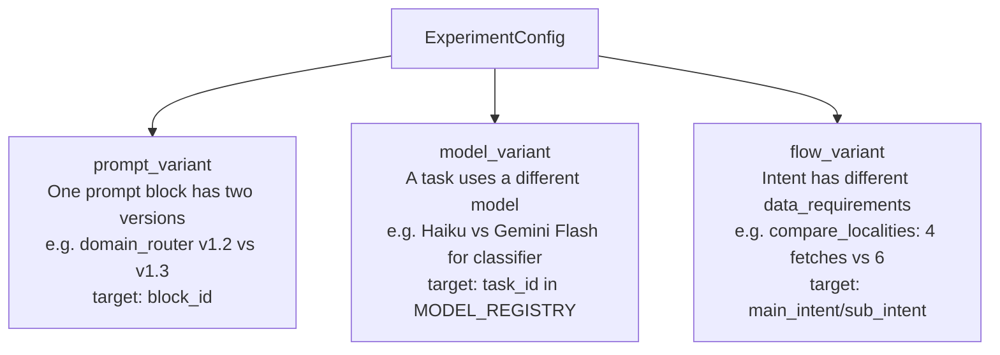
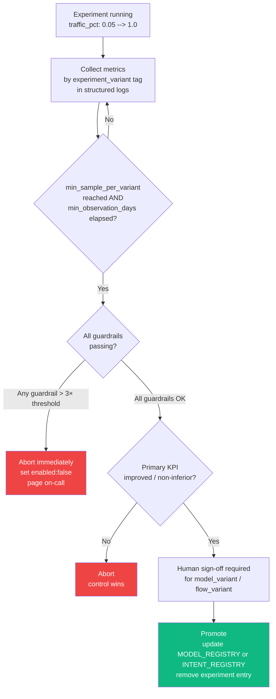

# A/B Experiment Framework

ExperimentConfig, traffic assignment, experiment types, success metrics per type, and graduation procedure.

---

## Part 13 — A/B Experiment Framework

Three experiment types can run concurrently. Assignment is deterministic: the same session always
gets the same variant across its lifetime — no statefulness needed.

### Experiment Types

| Type | What varies | Example |
|---|---|---|
| `prompt_variant` | One prompt block has two versions | `slm/01-rule-engine` v1.2 vs v1.3 |
| `model_variant` | Routing tier uses a different model | Tier 3a: Haiku vs Sonnet for 10% of traffic |
| `flow_variant` | Intent has different `data_requirements` or `residual_tools` | `compare_localities`: 4 fetches vs 6 fetches |

The graph below shows what each experiment type targets and how it differs from the others.



### ExperimentConfig

```python
from pydantic import BaseModel
from typing import Literal

class ExperimentVariant(BaseModel):
    variant_id:  str     # 'control' or 'treatment_A', 'treatment_B', etc.
    weight:      float   # 0.0–1.0; weights across all variants must sum to 1.0
    description: str

class ExperimentConfig(BaseModel):
    experiment_id:    str
    type:             Literal['prompt_variant', 'model_variant', 'flow_variant']
    target:           str          # task_id for model_variant; block_id for prompt_variant; intent key for flow_variant
    variants:         list[ExperimentVariant]
    start_date:       str          # ISO 8601
    end_date:         str | None
    enabled:          bool         = True
    traffic_pct:      float        = 1.0
    metrics:          Optional['ExperimentMetrics'] = None
    # For model_variant experiments: the variant ModelAssignment.
    # Control is always MODEL_REGISTRY[target]; this is the challenger.
    variant_assignment: Optional['ModelAssignment'] = None

    @model_validator(mode='after')
    def validate_model_experiment(self) -> 'ExperimentConfig':
        if self.type == 'model_variant' and self.enabled and self.variant_assignment is None:
            raise ValueError(
                f"ExperimentConfig '{self.experiment_id}': model_variant experiments require "
                f"variant_assignment to be set."
            )
        return self

ACTIVE_EXPERIMENTS: list[ExperimentConfig] = []
# Populated at startup from experiments.yaml (or feature flag service).
# Hot-reload via file watcher or periodic poll (every 60s).
```

### Traffic Assignment

```python
import hashlib

def assign_variant(session_id: str, experiment: ExperimentConfig) -> str | None:
    """Deterministic: SHA256(session_id + experiment_id) → bucket 0–999.
    Returns None if the session is outside the traffic_pct window."""
    if not experiment.enabled:
        return None

    digest  = hashlib.sha256(f'{session_id}:{experiment.experiment_id}'.encode()).hexdigest()
    bucket  = int(digest[:4], 16) % 1000                      # 0–999

    if bucket >= int(experiment.traffic_pct * 1000):
        return None                                            # excluded from experiment

    # Normalize to 0–1 within the included window; pick variant by weight
    norm   = bucket / (experiment.traffic_pct * 1000)
    cutoff = 0.0
    for v in experiment.variants:
        cutoff += v.weight
        if norm < cutoff:
            return v.variant_id
    return experiment.variants[-1].variant_id                 # float rounding safety

def resolve_experiments(session_id: str) -> dict[str, str]:
    """{ experiment_id: variant_id } for all active experiments this session participates in."""
    return {
        exp.experiment_id: assign_variant(session_id, exp)
        for exp in ACTIVE_EXPERIMENTS
        if assign_variant(session_id, exp) is not None
    }
```

### experiment_node

Inserted between `route_node` and `fetch_data_node`:

```python
async def experiment_node(state: BotState) -> dict:
    """Resolves active experiments and applies variant overrides to routing.
    
    Overrides propagated downstream:
    - model_variant   → overrides state['routing']['model']
    - prompt_variant  → sets experiment_id so LLMPromptComposer picks the variant block
    - flow_variant    → overrides data_requirements for the classified intent at runtime
    
    All NodeMetrics emitted after this node carry experiment_id + experiment_variant.
    """
    session_id  = state['session']['session_id']
    assignments = resolve_experiments(session_id)

    if not assignments:
        return {}

    # Tag the first active experiment on this turn (rare to have multiple active simultaneously)
    experiment_id      = next(iter(assignments))
    experiment_variant = assignments[experiment_id]

    routing = dict(state.get('routing') or {})
    for exp_id, variant_id in assignments.items():
        exp = next((e for e in ACTIVE_EXPERIMENTS if e.experiment_id == exp_id), None)
        if exp and exp.type == 'model_variant':
            routing['model'] = variant_id   # variant_id IS the model hint ('haiku' or 'sonnet')

    result: dict = {'experiment_id': experiment_id, 'experiment_variant': experiment_variant}
    if routing != state.get('routing'):
        result['routing'] = routing
    return result
```

Graph wiring (see Part 5 for full graph — `experiment` node is included there):
```
route → summary → experiment → fetch_data → respond → build_prompt → llm → validate_output → followup
```

### Experiment Success Metrics

Every `ExperimentConfig` must declare `metrics` before going live. No experiment runs without defined success criteria — this is enforced at startup (startup check reads `ACTIVE_EXPERIMENTS` and validates each has `metrics` populated).

```python
@dataclass
class ExperimentMetrics:
    # PRIMARY METRIC — the one thing the experiment is trying to move.
    # The experiment is a success only if primary_kpi improves.
    primary_kpi:      str     # metric name logged in NodeMetrics / structured logs
    primary_target:   str     # 'increase' | 'decrease' | 'maintain'
    primary_mde:      float   # minimum detectable effect (absolute, e.g. 0.02 = 2pp)

    # GUARDRAILS — metrics that must NOT regress beyond threshold.
    # A variant that wins on primary_kpi but fails a guardrail is rejected.
    guardrails: list[GuardrailSpec]

    # STATISTICAL REQUIREMENTS
    min_sample_per_variant: int     # calls before declaring significance
    confidence_level:       float   # typically 0.95
    min_observation_days:   int     # avoid day-of-week bias; typically 7

    # BUSINESS METRICS (logged for context; do not gate graduation)
    business_metrics: list[str]     # metric names to surface in the experiment dashboard

@dataclass
class GuardrailSpec:
    metric:       str     # metric name
    max_delta:    float   # maximum allowed degradation (positive = more is worse)
    direction:    str     # 'increase_bad' | 'decrease_bad'
    # Example: max_delta=0.05 direction='increase_bad' on 'error_rate'
    # means: variant error_rate must not exceed control error_rate + 5pp
```

**Pre-defined metrics per experiment type:**

#### `model_variant` experiments (SLM model swap)

```python
ExperimentMetrics(
    primary_kpi    = 'sub_intent_accuracy',   # exact match rate on labeled eval set
    primary_target = 'maintain',              # variant must not be worse than control
    primary_mde    = 0.005,                   # will detect a 0.5pp accuracy difference

    guardrails = [
        GuardrailSpec('p95_latency_ms',    max_delta=20,   direction='increase_bad'),
        GuardrailSpec('error_rate',         max_delta=0.005, direction='increase_bad'),
        GuardrailSpec('cost_per_call_usd', max_delta=None, direction=None),  # observe only
        GuardrailSpec('cross_domain_intent_rate', max_delta=0.005, direction='increase_bad'),
    ],

    min_sample_per_variant = 5000,
    confidence_level       = 0.95,
    min_observation_days   = 7,

    business_metrics = [
        'session_length_turns',       # if classifier quality drops, users rephrase more
        'clarification_rate',         # bad classification → more clarification turns
        'out_of_scope_rate',          # increase suggests misclassification as OOS
    ],
)
```

#### `model_variant` experiments (LLM model swap, Tier 3a)

```python
ExperimentMetrics(
    primary_kpi    = 'llm_output_rubric_score',   # see LLM Output Rubric below
    primary_target = 'maintain',
    primary_mde    = 0.05,   # 5-point scale — detect 0.25-point difference

    guardrails = [
        GuardrailSpec('ttft_p95_ms',               max_delta=200,  direction='increase_bad'),
        GuardrailSpec('output_validation_violation_rate', max_delta=0.002, direction='increase_bad'),
        GuardrailSpec('cost_per_call_usd',         max_delta=None, direction=None),
    ],

    min_sample_per_variant = 2000,
    confidence_level       = 0.95,
    min_observation_days   = 7,

    business_metrics = [
        'contact_seller_rate',     # downstream proxy for response quality
        'session_continuation_rate',  # user sends another message vs drops off
        'properties_viewed_per_session',
    ],
)
```

#### `prompt_variant` experiments

```python
ExperimentMetrics(
    primary_kpi    = 'task_specific',   # set per-experiment (e.g. filter_accuracy for SLM prompts)
    primary_target = 'increase',
    primary_mde    = 0.01,

    guardrails = [
        GuardrailSpec('p95_latency_ms',  max_delta=10,   direction='increase_bad'),
        GuardrailSpec('error_rate',       max_delta=0.002, direction='increase_bad'),
    ],

    min_sample_per_variant = 1000,
    confidence_level       = 0.95,
    min_observation_days   = 3,    # prompt changes respond faster

    business_metrics = ['session_length_turns', 'clarification_rate'],
)
```

#### `flow_variant` experiments (data_requirements change)

```python
ExperimentMetrics(
    primary_kpi    = 'fetch_latency_p50_ms',   # more fetches = more latency?
    primary_target = 'decrease',
    primary_mde    = 50,   # 50ms improvement is meaningful

    guardrails = [
        GuardrailSpec('llm_output_rubric_score',   max_delta=0.1, direction='decrease_bad'),
        GuardrailSpec('fetch_error_rate',           max_delta=0.01, direction='increase_bad'),
    ],

    min_sample_per_variant = 500,
    confidence_level       = 0.90,   # flow changes are lower risk
    min_observation_days   = 3,

    business_metrics = ['properties_viewed_per_session'],
)
```

### LLM Output Rubric (automated)

The `llm_output_rubric_score` metric is computed by `validate_output_node` on every Tier 3 turn. Not a human score — a rule-based rubric run after each LLM call:

```python
@dataclass
class RubricDimension:
    name:   str
    weight: float   # weights sum to 1.0
    check:  Callable[[str, BotState], float]   # returns 0.0–1.0

LLM_OUTPUT_RUBRIC: list[RubricDimension] = [
    RubricDimension('no_validation_violations', 0.30,
        lambda text, state: 0.0 if validate_bot_output(text, current_intent(state)).violations else 1.0
    ),
    RubricDimension('length_appropriate',        0.20,
        lambda text, state: _length_score(text, state)   # 1.0 if 1-3 sentences for followup
    ),
    RubricDimension('no_phase1_repeat',          0.20,
        lambda text, state: 0.0 if state.get('summary_emitted') and _starts_with_summary(text) else 1.0
    ),
    RubricDimension('factual_grounding',         0.20,
        lambda text, state: _grounding_score(text, state['pre_fetched_data'])
        # checks that any price/area/location claim appears in pre_fetched_data
    ),
    RubricDimension('language_match',            0.10,
        lambda text, state: _language_match(text, state['normalized_message'])
        # response language matches user message language (basic Hindi detection)
    ),
]

def compute_rubric_score(text: str, state: BotState) -> float:
    return sum(d.weight * d.check(text, state) for d in LLM_OUTPUT_RUBRIC)
```

The rubric score is emitted in every `llm_call` log event. Dashboard shows rolling 7-day p25/p50/p75. Alert if p50 drops below 0.70.

### Graduation Procedure (updated)

The flowchart below shows the full experiment lifecycle from data collection through the guardrail and KPI gates to promotion or abort.



An experiment graduates when ALL gates pass:

| Gate | Requirement |
|---|---|
| Primary KPI | Statistically significant improvement or non-inferiority at `confidence_level` |
| Sample size | ≥ `min_sample_per_variant` calls AND ≥ `min_observation_days` elapsed |
| All guardrails | No guardrail exceeded in either direction |
| Human sign-off | Required for `model_variant` and `flow_variant`; optional for `prompt_variant` |

Graduation steps:
1. Merge PR that updates MODEL_REGISTRY (for `model_variant`) or prompt block / INTENT_REGISTRY (for others)
2. Version-bump changed artifacts per Part 7 policy
3. Set `enabled: false` + `end_date` on ExperimentConfig in `experiments.yaml`
4. Delete variant fixtures from `tests/fixtures/` that are now the new control

**Abort criteria:** abort immediately (without waiting for sample size) if any guardrail exceeds 3× its `max_delta` threshold. Set `enabled: false`, page on-call.
within one hot-reload cycle (≤60s). No deploy needed for rollback.

---

