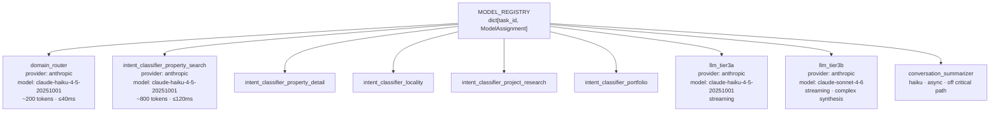
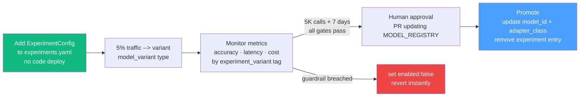

# Model Registry & Provider Adapters

ModelAssignment schema, MODEL_REGISTRY with all task assignments, provider adapters, and self-hosted support.

---

## Part 15 — Model Registry & Provider Adapters

Every AI call in the system (SLM domain routing, SLM intent classification, LLM response, conversation summarisation) references a single MODEL_REGISTRY. Swapping a model is a config change, not a code change. A/B testing and self-hosted inference are built into the same mechanism.

**Design principle:** Graph nodes depend on `DomainRouterPort`, `ClassifierPort`, and `LLMPort` — Protocols, not concrete implementations. The MODEL_REGISTRY determines which concrete adapter backs each Protocol at startup. The pipeline is unaware of which provider or model version is running.

The graph below shows every task registered in MODEL_REGISTRY and its key properties.



---

### ModelAssignment — per-task configuration

```python
from __future__ import annotations
from dataclasses import dataclass, field
from typing import Literal, Optional

ProviderName = Literal['anthropic', 'google', 'openai', 'self_hosted']

@dataclass
class QualityContract:
    """Measurable thresholds. Variant must meet ALL before promotion to control."""
    min_accuracy:       Optional[float] = None  # 0.0–1.0; from eval suite
    p95_latency_ms:     Optional[int]   = None
    p99_latency_ms:     Optional[int]   = None
    max_input_tokens:   Optional[int]   = None  # hard cap; prompt build fails if exceeded
    max_output_tokens:  Optional[int]   = None  # hard cap; truncate or raise

@dataclass
class ModelTokens:
    """Expected token counts per call — for cost projection and budget alerts."""
    input_uncached:  int   # tokens NOT in prompt cache (session context, message)
    input_cached:    int   # tokens always in prompt cache (static prompt blocks)
    output:          int   # average output tokens

@dataclass
class CostProfile:
    """Per-provider costs (USD per 1M tokens). Update when pricing changes."""
    input_per_1m:        float   # full input cost (cache miss)
    output_per_1m:       float
    cache_read_per_1m:   float   # cost for cached input (typically 10% of input_per_1m)
    cache_write_per_1m:  float   # cost to write to cache (typically 125% of input_per_1m)
    expected:            ModelTokens

    def cost_per_call(self) -> float:
        """Expected USD per call at steady state (cache warm)."""
        t = self.expected
        return (
            t.input_uncached  * self.input_per_1m       / 1_000_000
          + t.input_cached    * self.cache_read_per_1m  / 1_000_000
          + t.output          * self.output_per_1m      / 1_000_000
        )

    def daily_cost(self, calls_per_day: int) -> float:
        return self.cost_per_call() * calls_per_day

@dataclass
class ModelAssignment:
    task_id:          str           # stable identifier — never changes even if model changes
    description:      str           # WHY this model is used here; what makes it suitable
    provider:         ProviderName
    model_id:         str           # provider-specific model identifier
    adapter_class:    str           # fully-qualified class name; resolved at startup
    prompt_file:      Optional[str] # path to static prompt; None if built dynamically by the node
    quality_contract: QualityContract
    cost_profile:     CostProfile
    timeout_ms:       int
    max_retries:      int
    fallback_behavior: str  # 'use_last_domain' | 'out_of_scope' | 'error' | 'cached_response'
```

---

### MODEL_REGISTRY

```python
MODEL_REGISTRY: dict[str, ModelAssignment] = {

    # ── Stage 1: Domain Router ────────────────────────────────────────
    'domain_router': ModelAssignment(
        task_id     = 'domain_router',
        description = (
            'Routes user message to one of 5 domains (property_search, property_detail, '
            'locality, project_research, portfolio). 5-way classification. '
            'Speed and stability > accuracy — wrong domain is caught by validate_slm_node '
            'and treated as out_of_scope. Tiny prompt; any capable small model works here.'
        ),
        provider      = 'anthropic',
        model_id      = 'claude-haiku-4-5-20251001',
        adapter_class = 'bot.adapters.anthropic.AnthropicChatAdapter',
        prompt_file   = 'prompts/slm/domain_router.md',
        quality_contract = QualityContract(
            min_accuracy   = 0.98,
            p95_latency_ms = 50,
            max_input_tokens  = 260,
            max_output_tokens = 25,
        ),
        cost_profile = CostProfile(
            input_per_1m       = 0.80,
            output_per_1m      = 4.00,
            cache_read_per_1m  = 0.08,
            cache_write_per_1m = 1.00,
            expected = ModelTokens(input_uncached=35, input_cached=170, output=12),
        ),
        timeout_ms        = 500,
        max_retries       = 1,
        fallback_behavior = 'use_last_domain',
    ),

    # ── Stage 2: Domain-Scoped Intent Classifiers ─────────────────────
    # All five use the same model currently. Separate task_ids so each domain
    # can be experimented on independently (e.g., test Gemini Flash on locality
    # domain without touching property_search).

    'intent_classifier_property_search': ModelAssignment(
        task_id     = 'intent_classifier_property_search',
        description = (
            'Full intent + filter_delta extraction for property search domain. '
            'BHK, price, locality, amenities, property_type, construction_status. '
            'Filter extraction accuracy matters more than raw intent accuracy here — '
            'wrong filter key = wrong search results shown to user.'
        ),
        provider      = 'anthropic',
        model_id      = 'claude-haiku-4-5-20251001',
        adapter_class = 'bot.adapters.anthropic.AnthropicChatAdapter',
        prompt_file   = 'prompts/slm/domains/property_search.md',
        quality_contract = QualityContract(
            min_accuracy   = 0.95,
            p95_latency_ms = 150,
            max_input_tokens  = 950,
            max_output_tokens = 160,
        ),
        cost_profile = CostProfile(
            input_per_1m       = 0.80,
            output_per_1m      = 4.00,
            cache_read_per_1m  = 0.08,
            cache_write_per_1m = 1.00,
            expected = ModelTokens(input_uncached=175, input_cached=770, output=110),
        ),
        timeout_ms        = 2000,
        max_retries       = 2,
        fallback_behavior = 'out_of_scope',
    ),

    'intent_classifier_property_detail': ModelAssignment(
        task_id     = 'intent_classifier_property_detail',
        description = (
            'Intent classification for specific-property queries. '
            'Smaller filter_delta surface than property_search; entity extraction '
            '(active_property_id from session or ordinal reference) is the key task.'
        ),
        provider      = 'anthropic',
        model_id      = 'claude-haiku-4-5-20251001',
        adapter_class = 'bot.adapters.anthropic.AnthropicChatAdapter',
        prompt_file   = 'prompts/slm/domains/property_detail.md',
        quality_contract = QualityContract(min_accuracy=0.95, p95_latency_ms=150,
                                           max_input_tokens=850, max_output_tokens=130),
        cost_profile = CostProfile(
            input_per_1m=0.80, output_per_1m=4.00,
            cache_read_per_1m=0.08, cache_write_per_1m=1.00,
            expected=ModelTokens(input_uncached=170, input_cached=650, output=90),
        ),
        timeout_ms=2000, max_retries=2, fallback_behavior='out_of_scope',
    ),

    'intent_classifier_locality': ModelAssignment(
        task_id     = 'intent_classifier_locality',
        description = (
            'Locality and comparison intent classification. Covers the full locality_research '
            'taxonomy plus comparison intents. Entity extraction (locality names, '
            'commute destinations) is critical — locality names are diverse and ambiguous.'
        ),
        provider      = 'anthropic',
        model_id      = 'claude-haiku-4-5-20251001',
        adapter_class = 'bot.adapters.anthropic.AnthropicChatAdapter',
        prompt_file   = 'prompts/slm/domains/locality.md',
        quality_contract = QualityContract(min_accuracy=0.93, p95_latency_ms=150,
                                           max_input_tokens=1000, max_output_tokens=150),
        cost_profile = CostProfile(
            input_per_1m=0.80, output_per_1m=4.00,
            cache_read_per_1m=0.08, cache_write_per_1m=1.00,
            expected=ModelTokens(input_uncached=175, input_cached=820, output=110),
        ),
        timeout_ms=2000, max_retries=2, fallback_behavior='out_of_scope',
    ),

    'intent_classifier_project_research': ModelAssignment(
        task_id     = 'intent_classifier_project_research',
        description = (
            'Project and builder query classification. Smallest domain by volume (~5%). '
            'Project names are high-entropy (Lodha Palava, M3M Escala, Prestige Falcon) — '
            'entity extraction accuracy is more important than sub-intent classification.'
        ),
        provider      = 'anthropic',
        model_id      = 'claude-haiku-4-5-20251001',
        adapter_class = 'bot.adapters.anthropic.AnthropicChatAdapter',
        prompt_file   = 'prompts/slm/domains/project_research.md',
        quality_contract = QualityContract(min_accuracy=0.92, p95_latency_ms=150,
                                           max_input_tokens=850, max_output_tokens=130),
        cost_profile = CostProfile(
            input_per_1m=0.80, output_per_1m=4.00,
            cache_read_per_1m=0.08, cache_write_per_1m=1.00,
            expected=ModelTokens(input_uncached=165, input_cached=670, output=95),
        ),
        timeout_ms=2000, max_retries=2, fallback_behavior='out_of_scope',
    ),

    'intent_classifier_portfolio': ModelAssignment(
        task_id     = 'intent_classifier_portfolio',
        description = (
            'Portfolio intent classification. Simplest domain — 5 sub-intents, minimal '
            'filter_delta. Almost any capable small model can achieve ≥95% here. '
            'Prime candidate for self-hosted model cost reduction.'
        ),
        provider      = 'anthropic',
        model_id      = 'claude-haiku-4-5-20251001',
        adapter_class = 'bot.adapters.anthropic.AnthropicChatAdapter',
        prompt_file   = 'prompts/slm/domains/portfolio.md',
        quality_contract = QualityContract(min_accuracy=0.97, p95_latency_ms=120,
                                           max_input_tokens=700, max_output_tokens=100),
        cost_profile = CostProfile(
            input_per_1m=0.80, output_per_1m=4.00,
            cache_read_per_1m=0.08, cache_write_per_1m=1.00,
            expected=ModelTokens(input_uncached=155, input_cached=520, output=75),
        ),
        timeout_ms=2000, max_retries=2, fallback_behavior='out_of_scope',
    ),

    # ── LLM: Tier 3a (Haiku — conversational followup) ───────────────
    'llm_tier3a': ModelAssignment(
        task_id     = 'llm_tier3a',
        description = (
            'Conversational followup commentary for template intents (property_search, '
            'similar_properties, locality_carousel, portfolio/recommendations). '
            '1–3 sentences. Tone matters more than depth — Haiku is sufficient. '
            'Also used for text-only Tier 3a intents (locality_overview, commute_time). '
            'System prompt is heavily cached (~4,000 tokens static blocks).'
        ),
        provider      = 'anthropic',
        model_id      = 'claude-haiku-4-5-20251001',
        adapter_class = 'bot.adapters.anthropic.AnthropicStreamingAdapter',
        prompt_file   = None,   # built dynamically by build_prompt_node from FOLLOWUP_PROMPT_BLOCKS
        quality_contract = QualityContract(
            p95_latency_ms = 2000,   # time to first token
            max_output_tokens = 250,
        ),
        cost_profile = CostProfile(
            input_per_1m       = 0.80,
            output_per_1m      = 4.00,
            cache_read_per_1m  = 0.08,
            cache_write_per_1m = 1.00,
            expected = ModelTokens(input_uncached=700, input_cached=4000, output=90),
        ),
        timeout_ms        = 10000,
        max_retries       = 1,
        fallback_behavior = 'error',
    ),

    # ── LLM: Tier 3b (Sonnet — complex multi-source synthesis) ────────
    'llm_tier3b': ModelAssignment(
        task_id     = 'llm_tier3b',
        description = (
            'Full NLG synthesis for complex intents: locality comparison, project comparison, '
            'multi_intent decomposition. Uses Sonnet because: (1) 6 parallel pre-fetched results '
            'must be synthesised coherently; (2) markdown table output is expected and validated; '
            '(3) response quality delta vs Haiku is meaningful to users making large purchase '
            'decisions. Prompt cache is the decisive cost advantage vs other providers.'
        ),
        provider      = 'anthropic',
        model_id      = 'claude-sonnet-4-6',
        adapter_class = 'bot.adapters.anthropic.AnthropicStreamingAdapter',
        prompt_file   = None,
        quality_contract = QualityContract(
            p95_latency_ms = 4000,
            max_output_tokens = 800,
        ),
        cost_profile = CostProfile(
            input_per_1m       = 3.00,
            output_per_1m      = 15.00,
            cache_read_per_1m  = 0.30,
            cache_write_per_1m = 3.75,
            expected = ModelTokens(input_uncached=2000, input_cached=3500, output=350),
        ),
        timeout_ms        = 20000,
        max_retries       = 1,
        fallback_behavior = 'error',
    ),

    # ── Conversation Summarizer ───────────────────────────────────────
    'conversation_summarizer': ModelAssignment(
        task_id     = 'conversation_summarizer',
        description = (
            'Compresses oldest 10 turns into a ≤250-token prose summary. '
            'Runs async, off the critical path (followup_node fires it as a background task). '
            'Quality bar: must preserve active_property_id, active_locality_id, '
            'transaction_type, and price range. Entity names must be preserved verbatim. '
            'Any capable small model works; cheapest option wins.'
        ),
        provider      = 'anthropic',
        model_id      = 'claude-haiku-4-5-20251001',
        adapter_class = 'bot.adapters.anthropic.AnthropicChatAdapter',
        prompt_file   = 'prompts/summarizer.md',
        quality_contract = QualityContract(
            p95_latency_ms    = 5000,   # async — generous
            max_output_tokens = 280,
        ),
        cost_profile = CostProfile(
            input_per_1m       = 0.80,
            output_per_1m      = 4.00,
            cache_read_per_1m  = 0.08,
            cache_write_per_1m = 1.00,
            expected = ModelTokens(input_uncached=3500, input_cached=0, output=220),
        ),
        timeout_ms        = 8000,
        max_retries       = 1,
        fallback_behavior = 'cached_response',   # keep old summary if this call fails
    ),
}
```

---

### Model Selection Guides

Each task entry in MODEL_REGISTRY carries a `description` field. The extended guide below documents the reasoning behind current assignments and the criteria for evaluating replacements. **Read this before proposing a model change.**

```python
@dataclass
class ModelSelectionGuide:
    task_id:            str
    why_ai_not_rules:   str    # Why can't this be rule-based? What requires a model?
    input_profile:      str    # What does the input look like? Size, language, variability.
    output_contract:    str    # What must the output ALWAYS contain? What's the schema?
    failure_modes:      list[str]  # How can this model fail, and what's the user impact?
    selection_priority: str    # 'accuracy_first' | 'cost_first' | 'latency_first'
    disqualifiers:      list[str]  # Hard limits. A model fails these → eliminated immediately.
    eval_case_file:     str    # Path to calibrated test cases for this task.
    not_suitable:       list[str]  # Models explicitly tested and rejected, with reason.
```

```python
MODEL_SELECTION_GUIDES: dict[str, ModelSelectionGuide] = {

    'domain_router': ModelSelectionGuide(
        task_id = 'domain_router',
        why_ai_not_rules = (
            'Domain routing requires semantic understanding. Rule-based routing on keywords '
            'fails on: (a) Hindi/regional language inputs, (b) pronouns ("this property", "it"), '
            '(c) ambiguous verbs ("show me" can be property_search OR property_detail), '
            '(d) evolving product vocabulary as new domains are added.'
        ),
        input_profile = (
            '~35 uncached tokens per call. Input is always short (1 user message + '
            'previous_domain context). Language varies: English, Hindi, Hinglish. '
            'No long documents, no complex reasoning required.'
        ),
        output_contract = (
            'MUST output a valid DomainType literal. MUST output confidence 0.0–1.0. '
            'MUST default to out_of_scope when uncertain (confidence < 0.65). '
            'No other fields. Output length: ~12 tokens.'
        ),
        failure_modes = [
            'Misroutes property_detail to property_search → Stage 2 classifier loads wrong taxonomy '
            '→ validate_slm_node catches cross-domain intent → classified as out_of_scope → user '
            'gets "I don\'t understand" instead of a property detail. High user impact.',
            'Misroutes ambiguous queries to out_of_scope too aggressively → Stage 2 skipped → '
            'canned response for queries the system CAN handle. False negative impact.',
            'Low confidence threshold too high → many valid queries become out_of_scope. '
            'Watch false-positive-OOS rate metric.',
        ],
        selection_priority = 'accuracy_first',
        disqualifiers = [
            'Domain accuracy < 98% on eval set (5-class classification at this quality bar '
            'eliminates most small open-source models)',
            'p95 latency > 80ms (Stage 1 must be fast; it adds to Stage 2 latency)',
            'Does not support JSON-mode or structured output (domain must be a valid enum literal)',
            'No support for multilingual input (Hindi/Hinglish is ~30% of traffic)',
        ],
        eval_case_file = 'tests/model_eval/domain_router/cases.jsonl',
        not_suitable   = [
            'Rule-based regex routing: fails on Hindi ordinals, pronouns, evolving vocabulary',
            'GPT-4o-mini: accurate but 3× more expensive than Haiku for the same task — '
            'Stage 1 cost savings are minimal, accuracy delta is also minimal. Not worth it.',
        ],
    ),

    'intent_classifier_property_search': ModelSelectionGuide(
        task_id = 'intent_classifier_property_search',
        why_ai_not_rules = (
            'Filter extraction is the core value. A rule-based system can handle "2bhk" → bhk=[2] '
            'but fails on: "a flat not too expensive" (no price stated), "properties near the '
            'highway" (amenity inference), "60 lakhs max for 2-3 rooms" (unit conversion + BHK '
            'range), "mujhe 3 kamre chahiye" (Hindi BHK expression), "show me bigger options" '
            '(relative filter from session context). The SLM handles ALL of these.'
        ),
        input_profile = (
            '~175 uncached + 770 cached tokens. The 770 cached tokens are the property_search '
            'domain taxonomy + filter rules. Per-request input is the message + last 3 turns + '
            'active_filters (compact representation). High variability: price in lakhs/crores, '
            'BHK as words or numbers, localities in regional languages.'
        ),
        output_contract = (
            'MUST output valid main_intent (property_search) and sub_intent from the domain taxonomy. '
            'MUST output filter_delta as a dict with typed values (bhk as list[int], price as int '
            'in rupees, localities as list[str]). MUST NOT output a sub_intent from another domain. '
            'MUST NOT invent filter keys not in FILTER_REGISTRY.'
        ),
        failure_modes = [
            'Wrong BHK semantics (ADD vs REPLACE) → user adds 3BHK but BHK=[3] replaces [2] → '
            'previous filter lost. High frequency, high user impact.',
            'Wrong price unit conversion ("80L" → 8000 instead of 8000000) → wrong search results. '
            'Must be caught by price sanity check in sanitize_node.',
            'Hallucinated filter key not in FILTER_REGISTRY → validate_slm_node coerces to empty '
            'filter_delta → silent filter loss.',
            'Locality name ambiguity ("Andheri" → which Andheri?) → should output the name for '
            'resolve_entities to handle, not try to resolve the UUID itself.',
        ],
        selection_priority = 'accuracy_first',
        disqualifiers = [
            'Filter key accuracy < 90% (keys, not values — a model that invents filter keys '
            'is worse than one that omits them)',
            'Hindi input accuracy < 85% (Hindi price expressions, BHK words are frequent)',
            'Hallucination rate on filter values > 2% (inventing price values not stated by user)',
            'p95 latency > 200ms',
        ],
        eval_case_file = 'tests/model_eval/property_search/cases.jsonl',
        not_suitable = [
            'Models without JSON-mode output: schema compliance is a hard requirement',
            'Models < 7B parameters (in our eval, sub-7B models struggle with multi-filter '
            'extraction and Hindi unit conversion simultaneously)',
        ],
    ),

    'llm_tier3a': ModelSelectionGuide(
        task_id = 'llm_tier3a',
        why_ai_not_rules = (
            'The followup commentary must contextualise pre-fetched results in natural language, '
            'vary its phrasing across turns, respond in the user\'s language (Hindi/English/Hinglish), '
            'and handle edge cases (no results, partial results, filter conflicts). '
            'Template strings handle none of this gracefully at scale.'
        ),
        input_profile = (
            '~700 uncached + ~4000 cached tokens. The 4000 cached tokens are the system prompt '
            '(identity, rules, output format) — this is the primary cost lever via prompt caching. '
            'Per-request input includes pre-fetched results (truncated), last 3 turns, and '
            'session context. Output: 1–3 sentences for template followup, up to 8 sentences '
            'for text-only intents like locality_overview.'
        ),
        output_contract = (
            'MUST produce output that passes validate_bot_output (no URLs, phone numbers, emails). '
            'MUST NOT repeat Phase 1 summary when is_followup=True. '
            'MUST NOT fabricate property IDs, prices, or addresses not in pre_fetched_data. '
            'SHOULD respond in the same language as the user message. '
            'Length: 1–3 sentences for followup commentary; up to 8 for full text-only intents.'
        ),
        failure_modes = [
            'Phase 1 repetition when is_followup=True: "I see you\'re looking for..." after the '
            'summary already said this. Detected by rubric dimension no_phase1_repeat.',
            'Hallucinated property details (invented price, wrong locality): caught by '
            'factual_grounding rubric dimension but may slip through for subtle errors.',
            'Wrong language response (English reply to Hindi query): caught by language_match rubric.',
            'Output too long: user on mobile sees a wall of text. Caught by length_appropriate rubric.',
        ],
        selection_priority = 'accuracy_first',
        disqualifiers = [
            'Does not support streaming (SSE requires chunked token delivery)',
            'Cannot follow is_followup instruction reliably (>5% phase 1 repeat rate)',
            'p95 TTFT > 3s (first token must arrive before user loses patience)',
            'llm_output_rubric_score p50 < 0.70',
            'Does not preserve user language (Hindi user getting English response)',
        ],
        eval_case_file = 'tests/model_eval/llm_tier3a/cases.jsonl',
        not_suitable = [
            'Models without streaming API support',
            'Gemini Flash (as of June 2026 eval): borderline rubric score on is_followup compliance; '
            're-evaluate after fine-tuning or when next version releases',
        ],
    ),

    'llm_tier3b': ModelSelectionGuide(
        task_id = 'llm_tier3b',
        why_ai_not_rules = (
            'Comparison synthesis is the hardest task in the system. The model must hold '
            '6 parallel data sets (2 localities × 3 tools each) in context, produce structured '
            'markdown comparison tables, maintain factual grounding throughout, and write '
            'a nuanced recommendation. This requires genuine reasoning capacity.'
        ),
        input_profile = (
            '~2000 uncached + ~3500 cached tokens. The 3500 cached tokens are the Sonnet system '
            'prompt — prompt caching here saves ~$661/day at 70K calls/day. Per-request input '
            'includes 6 pre-fetched result sets (price trends, locality detail, transaction '
            'history for 2 entities). Output: 300–500 tokens (markdown table + prose analysis).'
        ),
        output_contract = (
            'MUST produce a markdown comparison table (|---|---|) — this is ALLOWED by '
            'validate_bot_output for comparison intents (intent_allowlist). '
            'MUST NOT hallucinate comparison data points not in pre_fetched_data. '
            'MUST produce a clear recommendation or hedge if data is insufficient. '
            'MUST use factual figures from tool results for any price or growth claim.'
        ),
        failure_modes = [
            'Data fabrication in comparison table (inventing appreciation % not in getPriceTrends): '
            'high severity — user making a large purchase decision. factual_grounding rubric catches '
            'most but not all fabrication.',
            'Failure to produce markdown table (invalid table syntax): caught by validate_output_node '
            'which strips it — user gets prose instead of table.',
            'Context window exceeded with 6 large result sets: caught by context_length_exceeded '
            'handler which drops oldest turns and retries.',
        ],
        selection_priority = 'accuracy_first',
        disqualifiers = [
            'Cannot reliably produce valid markdown tables',
            'factual_grounding rubric score < 0.80 on comparison eval cases',
            'No equivalent to Anthropic\'s prompt caching (must be verified per provider)',
            'Context window < 32k tokens (6 parallel results can be large)',
        ],
        eval_case_file = 'tests/model_eval/llm_tier3b/cases.jsonl',
        not_suitable = [
            'GPT-4o: no reliable prompt caching → $661/day more expensive for same quality',
            'Gemini 1.5 Pro: context caching requires per-session management → '
            'does not benefit from shared system prompt cache across all users',
            'Claude Haiku: tested — comparison table quality noticeably worse than Sonnet '
            'for 2-entity analysis; rubric score 0.61 vs Sonnet 0.84 on our eval set',
        ],
    ),
}
```

**When proposing a model change:**
1. Read the `ModelSelectionGuide` for that `task_id`
2. Confirm the proposed model does not trigger any `disqualifiers`
3. Run `pytest tests/model_eval/<task_id>/ --real-model MODEL_VARIANT=<provider>/<model>`
4. Confirm `report.meets_contract` is True
5. Set up an `ExperimentConfig` with correct `ExperimentMetrics` (do not skip to production)
6. Get PR approval from the team member who wrote the last eval for this task

---

### Cost at 1M Messages/Day

Steady-state assumptions: cache warm, 85% of calls reach Stage 2 (15% out_of_scope stop at Stage 1), 70% of non-out_of_scope calls reach Tier 3 LLM, 10% of Tier 3 calls use Sonnet (Tier 3b), 5% of sessions trigger conversation summarisation.

```python
def daily_cost_report(calls_per_day: int = 1_000_000) -> dict:
    """Current daily cost at given call volume. Run this after any MODEL_REGISTRY change."""
    return {
        'domain_router':       MODEL_REGISTRY['domain_router'].cost_profile
                                .daily_cost(calls_per_day),
        'intent_classifier':   sum(
                                    MODEL_REGISTRY[f'intent_classifier_{d}'].cost_profile
                                    .daily_cost(int(calls_per_day * 0.85 * share))
                                    for d, share in [
                                        ('property_search',  0.50),   # 50% of Stage 2 traffic
                                        ('property_detail',  0.20),
                                        ('locality',         0.15),
                                        ('project_research', 0.05),
                                        ('portfolio',        0.10),
                                    ]
                                ),
        'llm_tier3a':          MODEL_REGISTRY['llm_tier3a'].cost_profile
                                .daily_cost(int(calls_per_day * 0.70 * 0.90)),
        'llm_tier3b':          MODEL_REGISTRY['llm_tier3b'].cost_profile
                                .daily_cost(int(calls_per_day * 0.70 * 0.10)),
        'summarizer':          MODEL_REGISTRY['conversation_summarizer'].cost_profile
                                .daily_cost(int(calls_per_day * 0.05)),
    }
```

**At 1M messages/day (current model assignments):**

| Component | Calls/day | Daily cost | Notes |
|---|---|---|---|
| Stage 1 domain router | 1,000,000 | ~$29 | Dominated by output tokens (12 × $4/1M) |
| Stage 2 classifiers (combined) | ~850,000 | ~$440 | Output tokens dominate even here |
| LLM Tier 3a (Haiku) | ~630,000 | ~$655 | System prompt cached; big wins from cache |
| LLM Tier 3b (Sonnet) | ~70,000 | ~$462 | 7% of calls, 40% of LLM cost |
| Conversation summarizer | ~50,000 | ~$15 | Off critical path |
| **Total** | | **~$1,601/day** | **~$585K/year** |

**Biggest lever:** Tier 3b (Sonnet) is 40% of LLM cost from only 7% of calls. Reducing Sonnet usage or finding a cheaper alternative for comparison intents has the highest ROI.

**Cascade saving vs old monolithic SLM:** ~$200/day at 1M calls/day → ~$73K/year. Output token reduction (Stage 1 emits 12 tokens vs 150 for full classification) drives this more than input token savings.

---

### Provider Adapter Pattern

Each provider is a concrete implementation of the relevant Protocol. The adapter class name in MODEL_REGISTRY is resolved at startup:

```python
# bot/adapters/__init__.py

ADAPTER_REGISTRY: dict[str, type] = {
    'bot.adapters.anthropic.AnthropicChatAdapter':      AnthropicChatAdapter,
    'bot.adapters.anthropic.AnthropicStreamingAdapter': AnthropicStreamingAdapter,
    'bot.adapters.google.GoogleChatAdapter':            GoogleChatAdapter,
    'bot.adapters.openai.OpenAIChatAdapter':            OpenAIChatAdapter,
    'bot.adapters.self_hosted.SelfHostedChatAdapter':   SelfHostedChatAdapter,
    'bot.adapters.self_hosted.SelfHostedStreamAdapter': SelfHostedStreamAdapter,
}

def build_adapter(assignment: ModelAssignment) -> object:
    """Instantiate the concrete adapter from MODEL_REGISTRY at startup."""
    cls = ADAPTER_REGISTRY[assignment.adapter_class]
    return cls(
        model_id   = assignment.model_id,
        timeout_ms = assignment.timeout_ms,
        max_retries= assignment.max_retries,
    )
```

**Self-hosted adapter:** Implements the same Protocols. Only difference is the endpoint and cost model:

```python
@dataclass
class SelfHostedConfig:
    endpoint:          str     # http://gpu-cluster.internal:8000/v1/chat/completions
    model_id:          str     # actual model name on server: "Qwen/Qwen2.5-7B-Instruct"
    gpu_cost_per_hour: float   # amortized cost; tracked separately from API costs
    max_concurrent:    int     # vLLM concurrent request limit
    # Cost per call is NOT per-token for self-hosted — it's (call_duration × gpu_cost/s)
    # Track this via SelfHostedMetrics, not CostProfile.cost_per_call()

class SelfHostedChatAdapter:
    """Implements ClassifierPort and DomainRouterPort.
    Sends OpenAI-compatible chat completion requests to a local vLLM server.
    Response format is identical to AnthropicChatAdapter — same Protocol, different wire.
    """
    def __init__(self, model_id: str, endpoint: str, timeout_ms: int, max_retries: int):
        self.client = httpx.AsyncClient(base_url=endpoint, timeout=timeout_ms/1000)
        self.model  = model_id

    async def classify(self, input: dict) -> dict:
        resp = await self.client.post('/v1/chat/completions', json={
            'model':       self.model,
            'messages':    [{'role': 'system', 'content': input['taxonomy_prompt']},
                            {'role': 'user',   'content': build_user_block(input)}],
            'temperature': 0.0,
            'max_tokens':  input.get('max_output_tokens', 160),
        })
        return parse_json_output(resp.json()['choices'][0]['message']['content'])
```

**To switch any model or add self-hosted:** Update MODEL_REGISTRY entry. No graph node changes, no prompt changes, no pipeline changes.

---

### Model A/B Testing

Model experiments use the existing `ExperimentConfig` with `type: 'model_variant'`. The `experiment_node` resolves the variant and writes it to BotState. The `ModelRouter` reads BotState and selects the variant adapter:

```python
class ModelRouter:
    """Resolves which ModelAssignment to use for a given task on a given turn.
    Integrates with ACTIVE_EXPERIMENTS for A/B testing.
    """
    def __init__(self, registry: dict[str, ModelAssignment],
                 experiments: list[ExperimentConfig]):
        self.registry    = registry
        self.experiments = {e.experiment_id: e for e in experiments
                           if e.type == 'model_variant' and e.enabled}

    def get_assignment(self, task_id: str, state: BotState) -> ModelAssignment:
        # Check if this session is in an active model experiment for this task
        exp_id      = state.get('experiment_id')
        exp_variant = state.get('experiment_variant')

        if exp_id and exp_variant and exp_id in self.experiments:
            exp = self.experiments[exp_id]
            if exp.target == task_id and exp_variant != 'control':
                # Return the variant assignment from the experiment config
                return exp.variant_assignment   # ExperimentConfig carries full ModelAssignment

        return self.registry[task_id]
```

**Model experiment lifecycle:**

The flowchart below traces a model experiment from configuration through monitoring to promotion or abort.



```
1. Add ExperimentConfig to experiments.yaml (no code deploy needed — hot-reloaded)
2. Start at traffic_pct: 0.05  (5% → ~50K calls/day at 1M volume)
3. Monitor in dashboard: accuracy, latency p95, cost per call — by experiment_variant tag
4. Check QualityContract thresholds after min_sample_size reached (~5,000 calls)
5. Graduate to traffic_pct: 1.0 or abort
6. Promote: update MODEL_REGISTRY model_id + adapter_class, remove experiment entry
```

**Measuring a model experiment:**

Every `slm_classification` and `llm_call` log includes `experiment_id` and `experiment_variant`. Query:

```sql
-- Compare Stage 2 accuracy between control (Haiku) and variant (Gemini Flash)
SELECT
  experiment_variant,
  COUNT(*)                                           AS calls,
  AVG(CASE WHEN main_intent = expected_intent THEN 1.0 ELSE 0.0 END)  AS accuracy,
  PERCENTILE_CONT(0.95) WITHIN GROUP (ORDER BY latency_ms)            AS p95_latency_ms,
  SUM(cost_usd)                                      AS total_cost
FROM slm_classification_log
WHERE experiment_id = 'exp_classifier_property_search_gemini_001'
  AND ts BETWEEN '2026-05-29' AND '2026-06-05'
GROUP BY experiment_variant;
```

---

### Quality Gate: Promotion Criteria

A variant is eligible for promotion only when ALL of these hold over the evaluation window (minimum 5,000 calls, 7 days):

```python
def check_promotion_eligibility(
    control_metrics: dict,
    variant_metrics: dict,
    contract: QualityContract,
) -> tuple[bool, list[str]]:
    """Returns (eligible, reasons_for_rejection)."""
    rejections = []

    if contract.min_accuracy:
        if variant_metrics['accuracy'] < contract.min_accuracy:
            rejections.append(
                f"accuracy {variant_metrics['accuracy']:.3f} < required {contract.min_accuracy}"
            )
        if variant_metrics['accuracy'] < control_metrics['accuracy'] - 0.005:
            rejections.append(
                f"accuracy {variant_metrics['accuracy']:.3f} is >0.5% below control "
                f"{control_metrics['accuracy']:.3f}"
            )

    if contract.p95_latency_ms:
        if variant_metrics['p95_latency_ms'] > contract.p95_latency_ms:
            rejections.append(
                f"p95 latency {variant_metrics['p95_latency_ms']}ms > SLO {contract.p95_latency_ms}ms"
            )

    return len(rejections) == 0, rejections
```

No auto-promotion. Promotion always requires human sign-off via a deployment PR that updates MODEL_REGISTRY.
