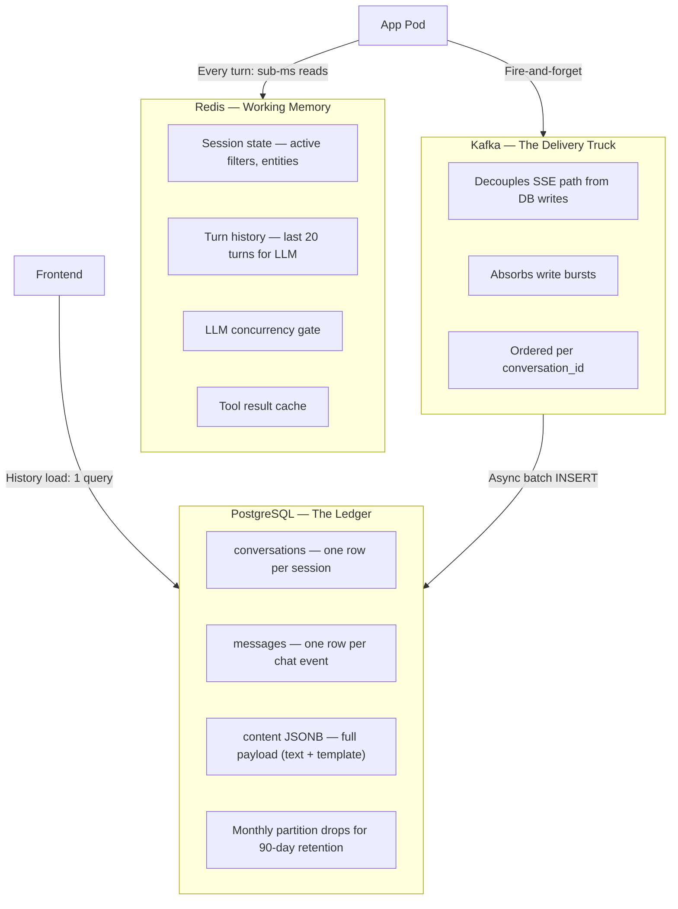
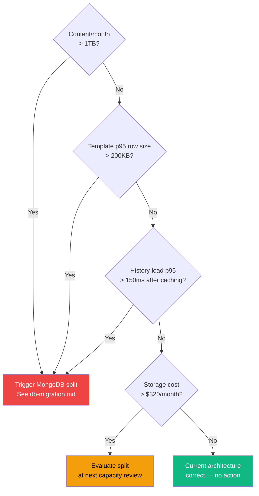

# Database Architecture Decisions

Why these databases were chosen, how to think about the trade-offs, and a QnA framework for reassessing when production numbers change.

See [db-migration.md](db-migration.md) if a threshold has been crossed and you need to act.

---

## 11. Database Selection Rationale

| Store | Used for | Key reason |
|---|---|---|
| **PostgreSQL** | All persistent chat data — conversations, messages (text + template content) | Single query for history load. Relational pagination. Monthly partition drops for retention. Append-only messages = zero VACUUM overhead on content column. |
| **Redis** | Session state, LLM concurrency gate, tool cache, rate limiting | Sub-ms reads, atomic counters (INCR/DECR), TTL-native, pub/sub for LLM queue. Not durable — Redis loss only affects in-flight sessions, not history. |
| **Kafka** | Async write pipeline | Decouples SSE latency from DB write latency. Ordered delivery per conversation. Replayable if consumer crashes. Already in prod. |
| **MongoDB** | Not used | The two-step history load (Postgres → MongoDB → stitch) adds latency, complexity, and two failure points. At 15GB/day template content and 90-day retention, PostgreSQL handles it comfortably with partitioning. |

---

## 12. Mental Model — Why This Architecture and How to Think About It

### The two questions that drive every storage decision

Every storage decision in this system traces back to two questions:

**1. Who reads this data, how often, and in what shape?**
**2. How painful is it to change the write path vs the read path?**

For chat history: users browse their own history occasionally (not every session), the access pattern is always `conversation_id + time cursor → page of messages`, and the read needs to return complete renderable data in one shot (no FE-side assembly). That's a textbook relational pagination query. PostgreSQL is the right answer.

For session state: the bot reads and updates it on *every single turn*, needs sub-millisecond access, and the data is inherently ephemeral (if Redis goes down, the user just starts a new session — no data loss that matters). That's Redis.

For write throughput isolation: you don't want a slow Postgres insert to make the user wait 50ms more for an SSE event. That's Kafka.

---

### Why PostgreSQL for large JSONB isn't the scary thing it sounds like

The concern with storing 40–100KB JSONB in PostgreSQL usually comes from one of three places:

**Fear 1: "JSONB is slow to write."**
JSONB parsing cost at insert is ~microseconds for a 100KB document. At our write throughput (Kafka consumer, batched), this is invisible. The bottleneck is disk I/O and network, not JSON parsing.

**Fear 2: "Bloat — JSONB updates cause table bloat, need frequent VACUUM."**
This is true for tables with frequent UPDATEs. Our messages table is **append-only** — content is written once and never touched again. VACUUM has nothing to do. There is no dead tuple accumulation, no bloat, no autovacuum thrash. This is the single most important property of our schema.

**Fear 3: "Storing 100KB per row will make queries slow."**
A history page load fetches 20 rows. Even if all 20 are 100KB templates, that's 2MB of data. PostgreSQL returns this from a single sequential scan of 20 rows within one partition. It's fast because the query is index-scan → sequential fetch within an index-range, not a full table scan. The `(conversation_id, created_at DESC)` index makes this O(log N + 20) regardless of how many rows exist.

---

### The partition drop is the key operational insight

Traditional retention logic: run a DELETE every night, deal with bloat, deal with VACUUM, deal with replication lag.

Partition drop logic: `DROP TABLE messages_2026_01`. This is a metadata operation. It takes milliseconds. It doesn't lock the parent table (no impact on live queries). It doesn't generate WAL proportional to the data size. It reclaims ~500GB of disk instantly. PostgreSQL forgets the partition exists.

This changes the calculus significantly. You can store more in Postgres than feels instinctively safe because you know the cleanup is free.

---

### The two-database pattern: when it helps, when it hurts

The intuition behind a Postgres + MongoDB split is: keep Postgres lean (fast queries, small rows, fits in shared_buffers) and let MongoDB absorb large documents.

This is correct at certain scales. It starts hurting when:
- **Every read requires both databases.** There's no read path that needs only the MongoDB data — you always need the Postgres metadata first. So every history page load becomes: Postgres query → extract refs → MongoDB batch fetch → stitch. Sequential, two failure modes, stitching code.
- **The data volume doesn't justify it.** At 15GB/day, Postgres steady state is ~2.2TB over 90 days. A single r7g.2xlarge with a 2.5TB gp3 SSD handles this. The MongoDB cluster you'd spin up to "save" Postgres would be a larger instance than the Postgres upgrade you avoided.
- **You already have partitioning.** The main scaling lever for Postgres is partition management. With monthly partitions you're dropping 500GB per month with zero operational cost. MongoDB's TTL index is elegant, but it's solving the same problem Postgres partitioning already solves.

The split becomes worthwhile when: content/day > ~30GB (template frequency increases or sizes grow), OR when steady-state storage exceeds ~3TB and gp3 SSD costs become significant, OR when you need cross-collection queries that MongoDB handles better.

---

### How to think about each store's "job"

The graph below maps each store to its role and shows how data flows between the application and each store.



```
PostgreSQL  =  The ledger
               Durable, ordered, queryable. Answers "what happened in this conversation?"
               Optimised for: paginated access by conversation + time.

Redis       =  Working memory
               Fast, ephemeral, shared. Answers "what does the bot need right now?"
               Optimised for: sub-ms reads, TTL expiry, atomic operations.
               Not a backup for anything — data loss is survivable.

Kafka       =  The delivery truck
               Ordered, durable in-transit. Bridges the SSE path to the DB write path.
               Optimised for: decoupling latency, absorbing write bursts, replay.

MongoDB     =  The document warehouse (not used yet)
               Horizontal scale for large documents. Shines when you need to store
               millions of large, heterogeneous documents and access them by _id.
               The right choice when Postgres JSONB storage > ~3TB steady state.
```

---

## 13. Decision Framework — When to Reconsider This Architecture

Run through these questions when reviewing production metrics or planning capacity. The thresholds are derived from the sizing math in Section 6.

---

### Q1: Is total content written per day growing beyond estimates?

**Check:** `SELECT pg_size_pretty(pg_total_relation_size('messages'))` per partition after 30 days. Compare against the ~516GB/month estimate.

| Observation | Action |
|---|---|
| < 300GB/month (well below estimate) | No action. Template frequency is lower than modelled. |
| 300–600GB/month (within estimate) | No action. Architecture holds. |
| 600GB–1TB/month | Watch closely. Approach MongoDB split planning but don't act yet. |
| > 1TB/month (> 2× estimate) | **Trigger: initiate MongoDB split.** Postgres steady state will exceed 3TB within 90 days. See Section 14. |

---

### Q2: Are template payload sizes larger than estimated?

**Check:** Track `pg_column_size(content)` in the Kafka consumer metrics (`size_bytes` field). Alert if p95 exceeds 120KB for template rows.

| Observation | Action |
|---|---|
| p95 < 100KB (as designed) | No action. |
| p95 100–200KB | Investigate which templateId is bloating. Can the FE payload be trimmed? (e.g. return 5 images instead of 20, send thumbnail URLs not full metadata). Fix the payload before changing the DB. |
| p95 > 200KB | **Trigger MongoDB split** regardless of total volume. Rows this large degrade B-tree index efficiency (TOAST kicks in above 8KB; rows > ~8KB are stored off-page, requiring an extra read). |

---

### Q3: Are history load latencies acceptable?

**Check:** Track `GET /api/v1/chat/get-conversation-details` p95 latency. Target: < 50ms.

| Observation | Action |
|---|---|
| p95 < 30ms | Healthy. |
| p95 30–50ms | Check `EXPLAIN ANALYZE` on the messages query. Ensure `(conversation_id, created_at DESC)` index is used. Check if shared_buffers is warm. |
| p95 50–150ms | Check if Postgres is doing TOAST lookups (content > 8KB being stored off-page). Add connection headroom to PgBouncer. Consider read replica for history queries. |
| p95 > 150ms | **Trigger: add Redis caching layer for recent history pages** (see Q5). If caching doesn't help, trigger MongoDB split. |

---

### Q4: Is Postgres storage becoming expensive?

**Check:** gp3 SSD cost at $0.08/GB. Current estimate: 2.5TB = $200/month just for storage.

| Storage used | Monthly cost | Action |
|---|---|---|
| < 1.5TB | < $120/month | No action. |
| 1.5–2.5TB | $120–$200/month | Within plan. No action. |
| 2.5–4TB | $200–$320/month | Evaluate MongoDB split at next capacity review. |
| > 4TB | > $320/month | **Trigger MongoDB split.** Storage cost now justifies operational complexity. |

---

### Q5: Is template frequency much lower than estimated (good news)?

If production shows templates in < 10% of turns:

| Daily content | Action |
|---|---|
| < 5GB/day | Switch to **quarterly partitions** (drop every 3 months instead of monthly). Simpler maintenance, same outcome. |
| < 2GB/day | Could consolidate to a single table with a manual retention job. Partitioning overhead not worth it. |

---

### Q6: Is write throughput a bottleneck?

**Check:** Kafka consumer lag on `chat.messages` topic. Alert if lag > 10,000 messages.

| Observation | Action |
|---|---|
| Lag < 1,000 consistently | Healthy. |
| Lag 1,000–10,000 | Increase batch size to 1,000 or add a 4th consumer replica. |
| Lag > 10,000 (sustained) | Consumer replicas maxed. Profile the bulk INSERT — likely index write overhead. Consider disabling index maintenance during batch and rebuilding async (dangerous, only with DBA). |
| Writes consistently > 8,000 rows/sec | **Trigger: evaluate write sharding** or vertical scale on Postgres primary. |

---

### The decision tree (compact form)

The flowchart below is a visual form of the same decision tree, with colour-coded outcomes.



```
Is content/month > 1TB?  →  Yes → Trigger MongoDB split (Section 14)
  ↓ No
Is p95 content row size > 200KB?  →  Yes → Trigger MongoDB split
  ↓ No
Is history load p95 > 150ms after caching?  →  Yes → Trigger MongoDB split
  ↓ No
Is storage cost > $320/month?  →  Yes → Evaluate split at next review
  ↓ No
Current architecture is correct. No action.
```

---

