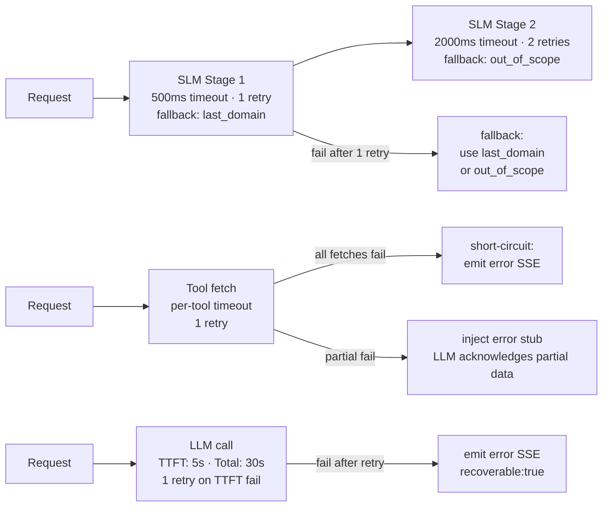
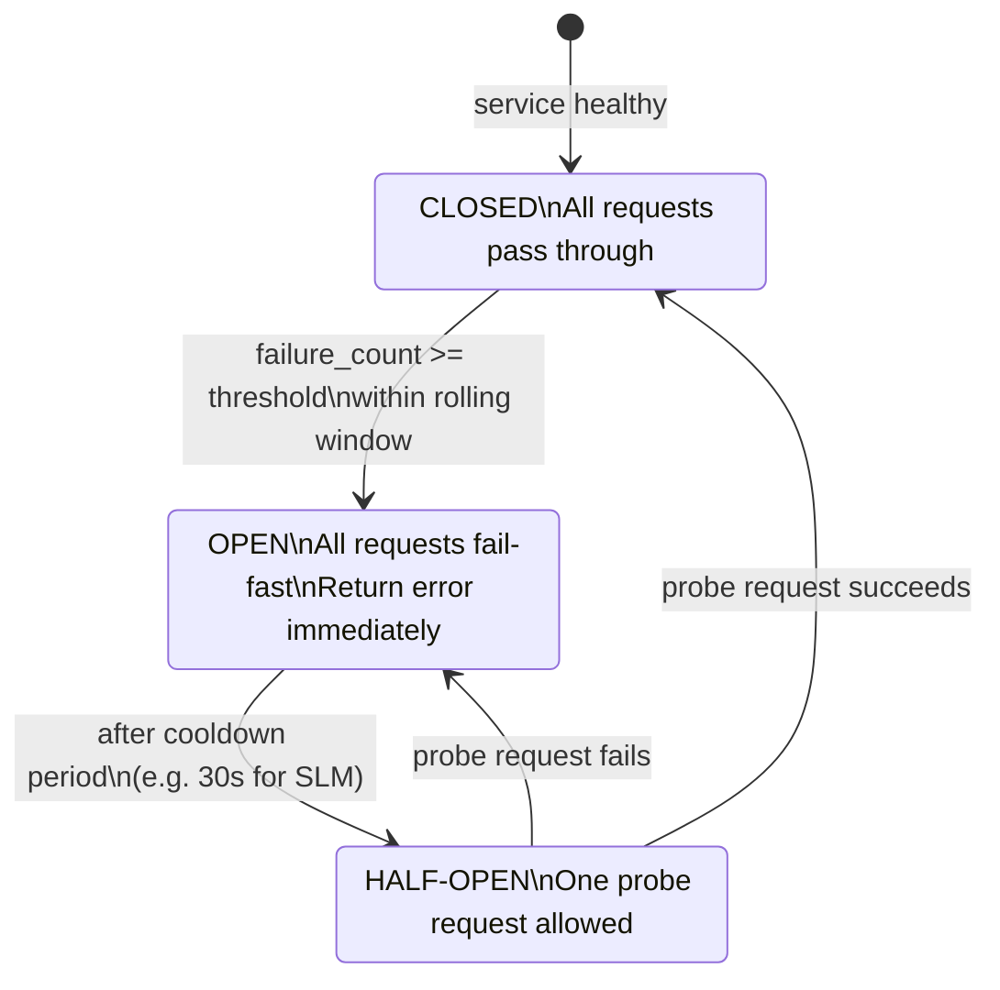

# Resilience: Timeouts, Retries & Circuit Breakers

Per-node timeout budgets, retry policies, circuit breaker configuration, and fallback behaviors.

---

## Part 8 — Resilience: Timeouts, Retries, Circuit Breakers, Scalability

### Timeout Budgets

Every external call is wrapped with `asyncio.wait_for`. `DataRequirement.timeout_ms` overrides the
default per fetch. Overall per-turn target for Tier 3a: ≤ 1.5s to first LLM chunk.

| Call | Hard Timeout | Notes |
|---|---|---|
| Haiku SLM Stage 1 — domain router | 500ms | Fast 5-way classification; fallback to last_domain on timeout |
| Haiku SLM Stage 2 — intent classifier | 2,000ms | Full intent + filter_delta; fallback to out_of_scope on timeout |
| Khoj `searchProperties` | 1,500ms | User-blocking; fast-fail over waiting |
| Casa `getPropertyDetail` | 2,000ms | |
| Venus `getFloorPlans` / `getBrochure` | 2,000ms | |
| Gandalf `getPriceTrends` | 2,000ms | |
| Odin `getLocalityDetail` / `getRatingsReviews` | 2,000ms | |
| Autosuggest `resolveEntity` | 500ms | Hot-path entity resolution; skip on timeout |
| Claude stream (time-to-first-token) | 5,000ms | Abort stream if no chunk arrives within 5s; retry once |
| Claude stream (total response) | 30,000ms | Kill the stream if total response takes > 30s (runaway generation) |
| Redis read (cache / session load) | 50ms | Fail open — treat as cache miss, never block |
| Redis write (session save) | 100ms | Log + continue; handled by optimistic locking |
| Kafka publish | 500ms | Queued locally on failure; see reliability below |

```python
# TOOL_DEFAULT_TIMEOUTS — used by execute_prefetch when DataRequirement.timeout_ms is absent
# Values in milliseconds; converted to seconds via / 1000 when passed to asyncio.wait_for.
TOOL_DEFAULT_TIMEOUTS: dict[str, int] = {
    'searchProperties':       1500,
    'resolveEntity':           500,
    'getPropertyDetail':      2000,
    'getLocalityDetail':      2000,
    'getPriceTrends':         2000,
    'getProjectPriceTrends':  2000,
    'getRatingsReviews':      2000,
    'getFloorPlans':          2000,
    'getBrochure':            2000,
    'getTrendingLocalities':  2000,
    'getProjectDetail':       2000,
    'getSimilarProperties':   2000,
    'getTransactionHistory':  2000,
    'getNearbyLandmarks':     2000,
    'getDemandSupplyInsight': 2000,
    'getTravelTime':          3000,    # longer: involves Google Maps routing
    'getPriceBuckets':        1500,    # same backend as searchProperties count
    'getFilterSuggestions':   2000,
    'getCollections':         2000,
    'getPopularCityLandmarks': 2000,
    'getTopSocieties':        2000,
    'getRecentlyViewed':      1500,
    'createSearchAlert':      3000,    # write-side; longer budget acceptable
    # Tier B — internal computation, no network hop
    'calculateEMI':             50,
    'calculateAffordability':   50,
    'convertUnit':              10,
    'resolveLandmarkAnchor':  2000,    # autosuggest call in derive_node
}
```

### Retry Policy

Retries are allowed only for idempotent reads against transient errors.
Write-side tools (`shortlistProperty`, `removeFromShortlist`, `createSearchAlert`) must **never** be retried automatically.
`contact_seller` makes **no BE API call** — it is template-only, so this constraint does not apply to it.

| Error | Retryable? | Strategy |
|---|---|---|
| 5xx (500, 502, 503, 504) | Yes — reads only | 1 retry after 300ms |
| Network timeout | Yes — reads only | 1 retry immediately |
| 429 with `Retry-After` | Yes | Wait header value; max 1 retry |
| 400 Bad Request | No | Bad params; retrying won't help |
| 404 Not Found | No | Entity does not exist |
| 401 / 403 | No | Auth failure; surface to user |
| Write-side tools | Never | Duplicate side effects (double lead, double shortlist) |

Max retries: **1**. No multi-hop backoff loops — the per-turn latency budget cannot absorb them.
Retry logic lives in the `CachedExecutorPort` implementation, using `tenacity` (`@retry`, `wait_fixed`, `stop_after_attempt`) — not in graph nodes.

The diagram below shows how each node's timeout and retry budget maps to its specific fallback behaviour.



### SLM Failure Fallback

If SLM classification fails (timeout or 5xx) after 1 retry:
- Route to `out_of_scope` Tier 0 handler
- Emit canned response: *"I'm having trouble understanding that — could you rephrase?"*
- Log `classifier_unavailable` metric; alert if rate > 1% over 5 minutes

Do not attempt to classify with a backup model — the graph is already behind budget.

### Circuit Breakers

A circuit breaker wraps each backend via the `ToolExecutorPort` implementation.
Prevents cascading failures when a backend is degraded — fail fast instead of queue-and-wait.

The state machine below shows the three states and the transitions between them.



```
CLOSED (normal)
  → opens after 5 consecutive failures within 30s
OPEN (failing fast)
  → immediately rejects with CircuitOpenError for a cool-down window
  → fetch_data_node records this as a fetch_error (same path as timeout)
HALF_OPEN
  → allows 1 probe request after cool-down
  → success → CLOSED; failure → OPEN again
```

| Backend | Open threshold | Cool-down |
|---|---|---|
| Khoj | 5 failures | 15s |
| Casa | 5 failures | 15s |
| Venus / Gandalf / Odin | 5 failures | 15s |
| Autosuggest | 5 failures | 10s |
| SLM (Haiku) | 3 failures | 30s |
| Claude (LLM) | 3 failures | 30s |

When a circuit is OPEN, the LLM is instructed via the `fetch_errors` context block:
*"Data for [tool] is temporarily unavailable. Acknowledge this and respond with what you have."*

### Scalability Notes

**SSE and load balancing:**
SSE streaming requires the same instance to hold the in-flight Claude stream for the duration of
the response. Two options:
- **Option A (v1):** Sticky sessions at the load balancer keyed by `session_id`. Simple; less
  fault-tolerant if an instance goes down mid-stream.
- **Option B (multi-region):** Each instance publishes chunks to a Redis Stream keyed by
  `session_id`; a thin edge layer subscribes and forwards to the client's SSE connection.
  Fully stateless instances; more complex.

Recommendation: Option A for v1.

**Session write conflicts:**
`SessionStorePort.save` uses an optimistic version field. If two concurrent turns on the same
session attempt to write simultaneously, the second write returns `false`. The caller
(`reconcileSessionConflict`) re-fetches session state and re-applies only the safe fields
(turn list append, viewed property IDs). The session is never left in a corrupted state.

**Kafka reliability:**
`persistToKafka` is not fire-and-forget. On publish failure, the message is placed in a local
in-memory retry queue (ring buffer, max 500 entries). A background worker retries every 5s for up
to 10 minutes. After 10 minutes, the message is written to a dead-letter file and an alert fires.
Messages are never silently dropped.

**Cache stampede prevention:**
When a cache miss occurs for a high-traffic key, a single-flight lock ensures only one request
calls the upstream API; all concurrent requests for the same key await that one in-flight promise.
Cache TTLs are jittered ±10% to stagger expiry across hot keys.

---

