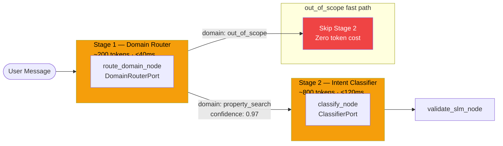
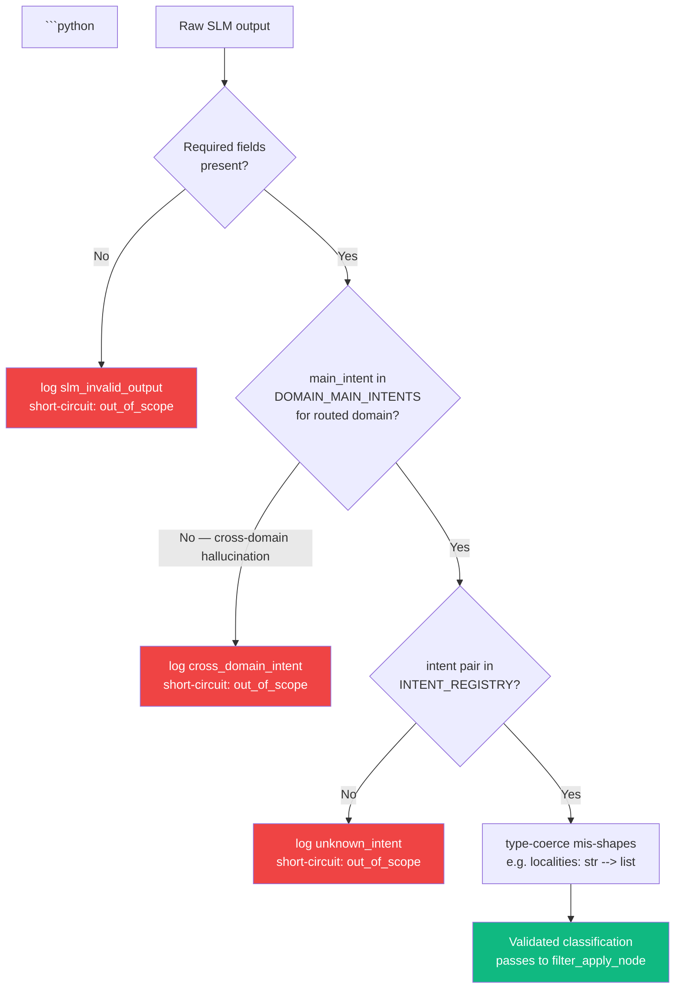

# Pipeline: Classification Nodes

safety_node, normalize_node, route_domain_node (Stage 1), classify_node (Stage 2), validate_slm_node.

---

The diagram below shows how a user message flows through the two-stage classification cascade, including the out_of_scope fast path that skips Stage 2 entirely.



---

```python
# ── 1. safety_node ────────────────────────────────────────────────────
# Tier 0. Regex-only — no AI.
# Input:  state['raw_message']
# Output: state['safety_result']
# Short-circuits: if blocked, sets bot_response and returns END.
async def safety_node(state: BotState) -> dict:
    safety_result = check_content_safety(state['raw_message'])
    if safety_result['blocked']:
        return {
            'safety_result': safety_result,
            'bot_response':  canned_safety_response(safety_result['reason']),
        }
    return {'safety_result': safety_result}

# ── 2. normalize_node ─────────────────────────────────────────────────
# Minimal pre-processing that is unambiguously safe. Raw message goes to SLM as-is.
# Input:  state['raw_message']
# Output: state['normalized_message']
# Does NOT pre-extract prices or amounts — regex cannot distinguish "under 80L budget"
# from "Block 80L Extension" or "Property ID 5K". The SLM has context; regex does not.
# Amount strings in SLM output ("2cr", "80L") are converted to integers by parse_amount()
# in derive_node AFTER SLM returns structured output.
async def normalize_node(state: BotState) -> dict:
    normalized = normalize_text(state['raw_message'])  # unicode normalization, trim only

    # Gibberish guard: catches keyboard mash before wasting an SLM call.
    # Intentionally narrow — only flags pathological patterns, never legitimate input.
    # Multi-word messages bypass entirely (they have intent structure).
    # Long Indian city names pass: "thiruvananthapuram" max consonant run = 3, vowel ratio = 39%.
    if is_gibberish(normalized):
        return {
            'normalized_message': normalized,
            'bot_response': "I didn't catch that — could you describe what you're looking for?",
        }
    return {'normalized_message': normalized}

def is_gibberish(msg: str) -> bool:
    words = msg.strip().split()
    if len(words) > 1:
        return False   # multi-word → has structure, pass through

    word = words[0].lower()
    if len(word) < 6:
        return False   # too short to classify reliably

    vowels = set('aeiou')

    # Check 1: consecutive consonant run ≥ 5
    # Keyboard mash: "sdfghjkl" → run of 8. Legitimate: "thiruvananthapuram" → max run of 3 ("nth").
    max_run = run = 0
    for ch in word:
        if ch.isalpha() and ch not in vowels:
            run += 1
            max_run = max(max_run, run)
        else:
            run = 0
    if max_run >= 5:
        return True

    # Check 2: repeated character (e.g., "jjjjjj", "aaaaaaa")
    if re.search(r'(.)\1{4,}', word):
        return True

    # Check 3: vowel starvation on strings ≥ 8 chars
    # Real Indian place names: 25–40% vowels. Keyboard mash: 0–11%.
    if len(word) >= 8:
        vowel_ratio = sum(1 for ch in word if ch in vowels) / len(word)
        if vowel_ratio < 0.15:
            return True

    return False

# ── 3a. route_domain_node ─────────────────────────────────────────────
# Stage 1: Domain router. Tiny SLM call (~200 tokens) that classifies the message
# into one of 5 coarse domains. Determines which domain-scoped taxonomy is loaded
# for Stage 2 (classify_node).
#
# Prompt:    prompts/slm/domain_router.md  (static, always cached)
# Input:     normalized_message, last_intent, previous_domain
# Output:    state['domain'] ∈ DomainType
# Latency:   ≤40ms budget (tiny prompt, single-token logit output)
# Short-circuit: if domain == 'out_of_scope' → classify_node synthesises a canned
#                classification and returns immediately without a Stage 2 call.
#
# OCP: adding a new domain = add a DomainType literal + a new taxonomy file
#      prompts/slm/domains/<domain>.md. route_domain_node itself does not change.

DOMAIN_PROMPT = load_template('prompts/slm/domain_router.md')   # cached at startup

async def route_domain_node(state: BotState, router: DomainRouterPort) -> dict:
    session = state['session']
    result  = await router.route({
        'message':         state['normalized_message'],
        'previous_domain': session.get('last_domain'),
        'last_intent':     session.get('last_intent'),
    })
    domain     = result.get('domain', 'out_of_scope')
    confidence = result.get('confidence', 0.0)

    # Low-confidence domain routing → treat as out_of_scope; clarify via nested_qna
    if confidence < 0.65 and domain != 'out_of_scope':
        domain = 'out_of_scope'

    return {'domain': domain}

# ── 3b. classify_node ─────────────────────────────────────────────────
# Stage 2: Domain-scoped intent classifier.
# Receives state['domain'] from route_domain_node and loads the matching
# domain-specific taxonomy (~800 tokens, cached per domain).
#
# Prompt:   prompts/slm/domains/<domain>.md  — one file per domain
# Input:    normalized_message, domain, last 3 turns, active_filters
# Output:   state['classification'] (full SLMOutput schema)
# Latency:  ≤120ms budget
#
# If domain == 'out_of_scope': skip SLM call entirely; synthesise a
# canonical out_of_scope classification and return. Zero token cost.
#
# Cache behaviour: each domain prompt is cached independently.
# Updating locality intents only invalidates the locality domain cache —
# property_search cache stays warm.

DOMAIN_TAXONOMY_PROMPTS: dict[str, str] = {
    'property_search':  load_template('prompts/slm/domains/property_search.md'),
    'property_detail':  load_template('prompts/slm/domains/property_detail.md'),
    'locality':         load_template('prompts/slm/domains/locality.md'),
    'project_research': load_template('prompts/slm/domains/project_research.md'),
    'portfolio':        load_template('prompts/slm/domains/portfolio.md'),
}
# NOTE: 'comparison' is NOT a separate domain. comparison/compare_localities is handled
# within the 'locality' domain prompt; comparison/compare_projects within 'project_research'.
# DOMAIN_MAIN_INTENTS allows 'comparison' main_intent from both of these domains.
# calculator/* intents are handled within 'property_detail' domain prompt.

async def classify_node(state: BotState, classifier: ClassifierPort) -> dict:
    domain  = state.get('domain', 'out_of_scope')
    session = state['session']

    # out_of_scope fast path — no Stage 2 SLM call
    if domain == 'out_of_scope':
        return {'classification': {
            'main_intent':        'out_of_scope',
            'sub_intent':         'out_of_scope_query',
            'entities_mentioned': [],
            'multi_intent':       False,
            'pivot':              False,
            'filter_delta':       {},
            'clarification_needed': None,
            'reasoning':          'domain_router: out_of_scope',
        }}

    taxonomy_prompt = DOMAIN_TAXONOMY_PROMPTS[domain]
    classification  = await classifier.classify({
        'message':          state['normalized_message'],
        'domain':           domain,
        'taxonomy_prompt':  taxonomy_prompt,
        'history':          session['last_3_turns'],
        'previous_intent':  session.get('last_intent'),
        'active_filters':   compact_filters(session['active_filters']),
    })
    return {'classification': classification}

# ── 3c. validate_slm_node ─────────────────────────────────────────────
# Validates Stage 2 SLM JSON output before any downstream node consumes it.

# The flowchart below shows the three successive guardrail checks validate_slm_node applies, with short-circuit behaviour on any failure.



```
# Also cross-checks that the returned intent belongs to the domain routed
# by Stage 1 — catches the rare case where Stage 2 hallucinates a cross-domain intent.
# Input:  state['classification'] (raw Stage 2 SLM output), state['domain']
# Output: state['classification'] validated; short-circuits with out_of_scope on failure

# Maps each DomainType to the main_intents valid within it
DOMAIN_MAIN_INTENTS: dict[str, set[str]] = {
    'property_search':  {'property_search'},
    # calculator sub-intents (calculate_emi, calculate_affordability, convert_unit) are routed via
    # the property_detail domain prompt — they appear as property_detail sub-intents there.
    # standalone `calculator` main_intent (from INTENT_REGISTRY) is also allowed here.
    'property_detail':  {'property_detail', 'calculator'},
    'locality':         {'locality_research', 'comparison'},
    'project_research': {'project_research', 'comparison'},
    'portfolio':        {'portfolio'},
    'out_of_scope':     {'out_of_scope'},
    # multi_intent is explicitly exempted in the cross-domain check (line below) — it can arise
    # from any domain and should not be gated by DOMAIN_MAIN_INTENTS.
}
# NOTE: multi_intent is handled by the explicit guard `c['main_intent'] != 'multi_intent'` in
# validate_slm_node, so it is intentionally absent from DOMAIN_MAIN_INTENTS.
async def validate_slm_node(state: BotState) -> dict:
    c = state.get('classification')
    valid = (
        c is not None
        and isinstance(c.get('main_intent'), str)
        and isinstance(c.get('sub_intent'),  str)
        and isinstance(c.get('multi_intent'), bool)
        and isinstance(c.get('pivot'),        bool)
        and isinstance(c.get('entities_mentioned'), list)
    )

    if not valid:
        log.error('slm_invalid_output', {'raw': c, 'session': state['session']['session_id']})
        return {'bot_response': "I had trouble understanding that — could you rephrase?"}

    # Unknown intent: SLM returned a pair not in INTENT_REGISTRY.
    # Cross-domain hallucination check: Stage 2 must only return intents in its domain.
    domain          = state.get('domain', 'out_of_scope')
    allowed_intents = DOMAIN_MAIN_INTENTS.get(domain, set())
    if (c['main_intent'] not in allowed_intents
            and c['main_intent'] != 'multi_intent'
            and c['main_intent'] != 'out_of_scope'):
        log.warn('cross_domain_intent', {
            'domain':      domain,
            'main_intent': c['main_intent'],
            'session':     state['session']['session_id'],
        })
        # Re-route as out_of_scope; domain router confidence was insufficient
        return {'bot_response': build_out_of_scope_response({
            'main_intent': 'out_of_scope',
            'sub_intent':  'out_of_scope_query',
        })}

    # Unknown intent: Stage 2 returned a pair not in INTENT_REGISTRY.
    if (not get_intent_record(c['main_intent'], c['sub_intent'])
            and c['main_intent'] != 'multi_intent'):
        log.warn('unknown_intent', {
            'main_intent': c['main_intent'],
            'sub_intent':  c['sub_intent'],
            'domain':      domain,
            'session':     state['session']['session_id'],
        })
        return {'bot_response': build_out_of_scope_response({
            'main_intent': 'out_of_scope',
            'sub_intent':  'out_of_scope_query',
        })}

    # Type-coerce known SLM mis-shape patterns before downstream nodes see them.
    # These are cheap fixes for patterns where the SLM occasionally outputs a valid-looking
    # but incorrectly typed value. Coercion here is safer than crashing in filter_apply_node.
    c = dict(c)

    # localities must be list[str] or None — SLM occasionally outputs a single string
    delta = dict(c.get('filter_delta') or {})
    if 'localities' in delta and isinstance(delta['localities'], str):
        delta['localities'] = [delta['localities']]
        c['filter_delta'] = delta

    # clarification_needed must be a non-empty string or None — not a bool
    cn = c.get('clarification_needed')
    if cn is True:
        c['clarification_needed'] = 'Could you clarify what you are looking for?'
    elif cn is False or cn == '':
        c['clarification_needed'] = None

    # clarification_data must be present when clarification_needed is set.
    # Old SLM output without structured options — wrap as free-text question.
    if c.get('clarification_needed') and not c.get('clarification_data'):
        c['clarification_data'] = {'question_id': 'q1', 'options': []}

    # entities_mentioned items must each have 'name' and 'inferred_type' keys
    # (SLM outputs 'inferred_type', not 'type' — must match the SLM output schema)
    entities = [
        e for e in c.get('entities_mentioned', [])
        if isinstance(e, dict) and 'name' in e and 'inferred_type' in e
    ]
    if len(entities) != len(c.get('entities_mentioned', [])):
        log.warn('slm_malformed_entities', {
            'raw': c.get('entities_mentioned'),
            'session': state['session']['session_id'],
        })
        c['entities_mentioned'] = entities

    return {'classification': c}

