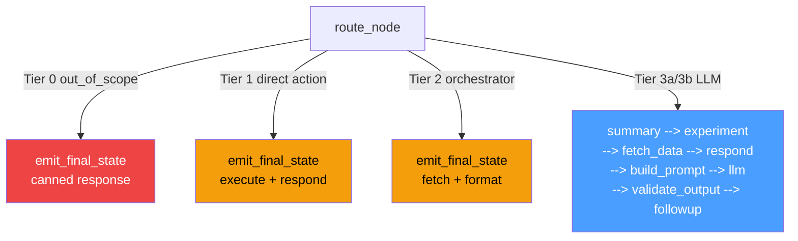
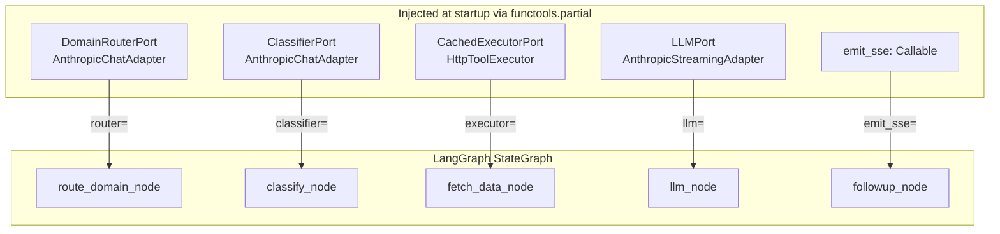

# Pipeline Overview

High-level architecture, the LangGraph StateGraph diagram, and adapter interface contracts.

---

# SOLID Architecture — Housing.com Bot

## Implementation Stack

| Layer | Technology |
|---|---|
| Language | Python 3.12 |
| Web framework | FastAPI — HTTP + SSE via `StreamingResponse` |
| Orchestration | LangGraph `StateGraph` — the middleware pipeline is a directed async graph |
| Schema validation | Pydantic v2 `BaseModel` for all domain models; `TypedDict` for graph state |
| Async | `asyncio` throughout (`asyncio.gather`, `asyncio.wait_for`) |
| LLM clients | Direct Anthropic SDK (`anthropic.AsyncAnthropic`) + Google GenAI SDK (`google.generativeai`). LangChain wrappers (`ChatAnthropic`, `ChatGoogleGenerativeAI`) used for unified interface only — not LangChain chains. |
| Retries | `tenacity` (`@retry`, `wait_exponential`, `stop_after_attempt`) |
| Observability | LangSmith tracing — enabled by default via `LANGCHAIN_TRACING_V2=true` (comes free with LangGraph) |
| Future RAG | LangChain document loaders + vectorstores integrate naturally as additional graph nodes |

---

## Why This Doc Exists

As the system grew, the same information appeared in multiple places:

| Information | # of Copies Before |
|---|---|
| Intent taxonomy (what intents exist) | 8 (classifier prompt, TOOLS_BY_INTENT, TOOLS_BY_SUBINTENT_HAIKU, DIRECT_INTENT_MAP, build_session_state_block, derive_routing_tier, select_tier3_model, sanitize_filters_on_pivot) |
| Tool definitions (what tools exist, what params they need) | 5 (LLM system prompt Section 2, validateToolCall, TOOLS_BY_INTENT, api_translation, tool cache config) |
| Filter schema (what filter keys exist, what they map to in Khoj) | 4 (SLM prompt filter_delta section, searchProperties input schema, validateToolCall, Khoj API translation) |

Adding a new intent → 8 places to update. Adding a new tool → 5 places. A new filter → 4 places. Each is a separate PR and a separate chance for drift.

**The fix: Three declarative registries as single sources of truth.** Everything else derives from them.

---

## Architecture Overview

```
┌─────────────────────────────────────────────────────────────┐
│                    THREE REGISTRIES                          │
│                                                             │
│  INTENT_REGISTRY     TOOL_REGISTRY     FILTER_REGISTRY      │
│  (what intents       (what tools       (what filter keys    │
│   exist + their       exist + their     exist + their       │
│   routing/tier)       schemas/APIs)     Khoj mappings)      │
└──────────────────────────────────────────────────────────────┘
              ↓ derived at build time ↓
┌─────────────────────────────────────────────────────────────┐
│                  PROMPT COMPOSER                             │
│   Static blocks + template blocks assembled per request     │
│   SLM prompt: rule-engine + taxonomy.tmpl + filter-delta    │
│   LLM prompt: identity + tool-defs.tmpl + session.tmpl      │
└──────────────────────────────────────────────────────────────┘
              ↓ executed per request ↓
┌─────────────────────────────────────────────────────────────┐
│           LANGGRAPH StateGraph PIPELINE (FastAPI/SSE)         │
│   safety → normalize → route_domain → classify →           │
│   validate_slm → filter_apply → sanitize → derive →        │
│   clarify → resolve_entities → route → summary →           │
│   experiment → fetch_data → respond → build_prompt →       │
│   llm → validate_output → followup                         │
│                                                             │
│   route_domain: Stage 1 — 5-way domain router (~200 tok)   │
│   classify:     Stage 2 — domain-scoped intent (~800 tok)   │
└──────────────────────────────────────────────────────────────┘
```

---

The diagram below shows the full LangGraph pipeline as a left-to-right node graph, with SLM classification nodes highlighted in amber, SSE-emitting nodes in green, and the LLM node in blue.

```mermaid
graph LR
    S([safety]) --> N([normalize])
    N --> RD([route_domain\nStage 1 SLM\n~40ms])
    RD --> CL([classify\nStage 2 SLM\n~120ms])
    CL --> VS([validate_slm])
    VS --> FA([filter_apply])
    FA --> SA([sanitize])
    SA --> DE([derive])
    DE --> CLA([clarify])
    CLA --> RE([resolve_entities])
    RE --> RT([route\nTier 0/1/2/3])
    RT --> SU([summary\nPhase 1 SSE])
    SU --> EX([experiment])
    EX --> FD([fetch_data])
    FD --> RS([respond\nPhase 2 SSE])
    RS --> BP([build_prompt])
    BP --> LLM([llm\nPhase 3 SSE])
    LLM --> VO([validate_output])
    VO --> FO([followup])

    style RD fill:#f59e0b,color:#000
    style CL fill:#f59e0b,color:#000
    style SU fill:#10b981,color:#fff
    style RS fill:#10b981,color:#fff
    style FO fill:#10b981,color:#fff
    style LLM fill:#4a9eff,color:#fff
```



The diagram below shows how the route node short-circuits for Tier 0–2 requests and follows the full LLM path only for Tier 3.



The diagram below illustrates the adapter injection pattern — each port interface is bound to a concrete adapter at startup via `functools.partial`, keeping graph nodes decoupled from I/O implementations.



---

