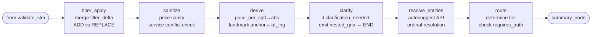
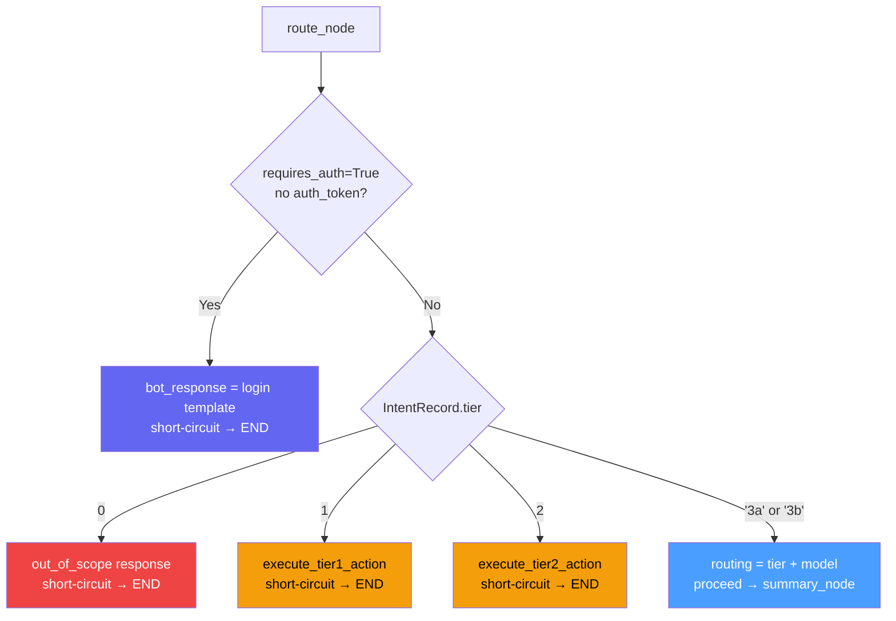

# Pipeline: Processing Nodes

filter_apply_node, sanitize_node, derive_node, clarify_node, resolve_entities_node, route_node, summary_node.

---

The diagram below shows the linear flow of all processing nodes from validated classification through to summary emission.



---

# ── 4. filter_apply_node ──────────────────────────────────────────────
# Merge filter_delta into session.active_filters.

# The diagram below illustrates how filter_apply_node chooses between ADD and REPLACE semantics based on the FilterRecord's default_operation.

```mermaid
graph TD
    FD[filter_delta from SLM] --> Q{FilterRecord\ndefault_operation?}
    Q -->|REPLACE| R[Replace entire value\nbhk: current=[2,3]\ndelta=[3] → stored=[3]]
    Q -->|ADD| A[Merge into existing\namenities: current=[lift]\ndelta=[pool] → stored=[lift,pool]]
    A --> G{existing is null?}
    G -->|Yes — treat as empty list| A2[stored = delta value\nnot replace]
    G -->|No| A3[stored = existing + new items]
```
# Guards: skips if clarification_needed is set (user hasn't confirmed the ambiguous intent
# yet — applying a partial delta would corrupt session state before the user responds).
# Amount parsing: tagged strings ("2cr", "80L") are converted here, BEFORE writing to session.
# derive_node (step 6) runs after and converts derived signals (price_per_sqft →
# absolute range, search_anchor → lat/lng). It no longer needs to re-parse amounts.
# Input:  state['classification']['filter_delta'], state['session']['active_filters']
# Output: updated session['active_filters']; state['filter_delta_applied']
async def filter_apply_node(state: BotState) -> dict:
    c = state.get('classification') or {}
    filter_delta = c.get('filter_delta')
    clarification_needed = c.get('clarification_needed')
    session = dict(state['session'])  # shallow copy to avoid mutating input

    if filter_delta and not clarification_needed:
        # Parse tagged amount strings before writing to session.
        # SLM outputs "2cr", "80L", "30K" — parse_amount converts to integers.
        # Must happen here: derive_node runs after, and session must hold numbers.
        for key in ('price_min', 'price_max', 'price_per_sqft'):
            if isinstance(filter_delta.get(key), str):
                filter_delta[key] = parse_amount(filter_delta[key])
        session = apply_filter_delta(session, filter_delta)
        return {'session': session, 'filter_delta_applied': True}
    return {}

# ── 5. sanitize_node ──────────────────────────────────────────────────
# Runs sanitize_filters_on_pivot() when the intent changed.
# Input:  state['classification']['pivot'], state['session']
# Output: updated state['session']['active_filters'] (clears invalid cross-intent filters)
async def sanitize_node(state: BotState) -> dict:
    c = state.get('classification') or {}
    if c.get('pivot'):
        session = sanitize_filters_on_pivot(c, dict(state['session']))
        return {'session': session, 'sanitized': True}
    return {}

# ── 6. derive_node ────────────────────────────────────────────────────
# Converts derived filter signals to concrete API params.
# Amount strings are already numeric by this point — filter_apply_node (step 4) ran
# parse_amount() before writing to session. This node handles structural transforms:
#   1. price_per_sqft → price_min/price_max range (via convert_price_per_sqft_to_absolute)
#   2. search_anchor string → lat/lng/outer_radius (via autosuggest, with timeout)
# Input:  state['session']['active_filters'] (amounts already numeric)
# Output: state['derived_filters'], updated state['session']['active_filters']
async def derive_node(state: BotState) -> dict:
    session = dict(state['session'])
    filters = dict(session.get('active_filters', {}))
    derived: dict = {}

    # user_location_needed: SLM set this flag on explore_nearby when user has no saved location.
    # Short-circuit here — emit share_location template (FE renders a location permission button).
    # The pipeline resumes on the next turn when the user sends location_shared or location_denied.
    if filters.get('user_location_needed'):
        return {
            'bot_response': {
                'template_id': 'share_location',
                'data':        {},
            },
        }

    if filters.get('price_per_sqft'):
        price_range = convert_price_per_sqft_to_absolute(
            filters['price_per_sqft'],
            filters.get('price_sqft_bound'),
            filters.get('bhk'),
        )
        filters.update(price_range)
        del filters['price_per_sqft']
        derived.update(price_range)

    if filters.get('search_anchor'):
        # autosuggest call — must be time-bounded to not stall the pipeline.
        anchor = await asyncio.wait_for(
            resolve_landmark_anchor(filters['search_anchor'], session),
            timeout=2.0,  # 2000ms
        )
        filters['lat']          = anchor['lat']
        filters['lng']          = anchor['lng']
        filters['outer_radius'] = anchor['outer_radius_metres']
        del filters['search_anchor']
        derived.update(anchor)

    session['active_filters'] = filters
    return {'session': session, 'derived_filters': derived}

# ── 7. clarify_node ───────────────────────────────────────────────────
# Short-circuits if SLM signalled clarification_needed.
# validate_slm_node guarantees clarification_data is present (with empty options for
# free-text questions) before this node runs, so no fallback is needed here.
# Input:  state['classification']['clarification_needed'], state['classification']['clarification_data']
# Output: sets bot_response with nested_qna template payload; graph exits to emit_final_state.
async def clarify_node(state: BotState) -> dict:
    c = state.get('classification') or {}
    if c.get('clarification_needed'):
        clarification_data = c.get('clarification_data', {})
        nested_qna_payload = {
            'selections': [{
                'questionId': clarification_data.get('question_id', 'q1'),
                'title':      c['clarification_needed'],
                'type':       'single_select' if clarification_data.get('options') else 'text_input',
                'options':    clarification_data.get('options', []),
            }]
        }
        return {
            'bot_response': {
                'template_id': 'nested_qna',
                'data':        nested_qna_payload,
            },
            'clarification_emitted': True,
        }
    return {}

# ── 8. resolve_entities_node ──────────────────────────────────────────
# Pre-resolves entities before LLM call (~50ms via autosuggest).
# Input:  state['classification']['entities_mentioned'], state['session']
# Output: state['resolved_entities'], updated state['session']['resolved_entity_map']
async def resolve_entities_node(state: BotState) -> dict:
    c = state.get('classification') or {}
    main_intent = c.get('main_intent', '')
    sub_intent  = c.get('sub_intent', '')
    entities    = c.get('entities_mentioned') or []
    session     = dict(state['session'])

    if requires_pre_resolution(main_intent, sub_intent) and entities:
        resolved = await pre_resolve_entities(entities, session)
        session.setdefault('resolved_entity_map', {}).update(resolved)
        return {'resolved_entities': resolved, 'session': session}
    return {}

# ── 9. route_node ─────────────────────────────────────────────────────
# Determines tier, model, auth check. Short-circuits tiers 0/1/2.

# The flowchart below shows the tier decision tree inside route_node, including the auth check and each short-circuit exit.


# validate_slm_node has already guaranteed the intent is in INTENT_REGISTRY,
# so record is always defined here (no fallback needed for tier/model).
# Input:  state['classification'], state['session'], INTENT_REGISTRY
# Output: state['routing']
async def route_node(state: BotState) -> dict:
    c            = state['classification']
    main_intent  = c['main_intent']
    sub_intent   = c['sub_intent']
    record       = get_intent_record(main_intent, sub_intent)  # guaranteed by validate_slm_node

    # Auth check: requires_auth = True means this intent needs BE-fetched user data (portfolio,
    # save_alert). FE-side actions (shortlist, contact_seller) handle their own login flow within
    # the template — they don't set requires_auth=True.
    # Response: chat_event with templateId="login" + a plain text message. emit_final_state sends it.
    if record.requires_auth and not state['session'].get('auth_token'):
        return {'bot_response': build_login_template_response(main_intent, sub_intent)}

    routing = {'tier': record.tier, 'model': record.model}

    # Tier 0 — out_of_scope: canned response, no AI
    if routing['tier'] == 0:
        return {'routing': routing, 'bot_response': build_out_of_scope_response(c)}
    # Tier 1 — direct action: orchestrator acts without LLM.
    # Write-side tools (contact_seller, shortlist_property, create_search_alert) require an
    # explicit confirmation card emitted first; execute_tier1_action handles this internally.
    if routing['tier'] == 1:
        return {'routing': routing, 'bot_response': await execute_tier1_action(state)}
    # Tier 2 — orchestrator fetches and formats, no LLM
    if routing['tier'] == 2:
        return {'routing': routing, 'bot_response': await execute_tier2_action(state)}

    return {'routing': routing}

# ── 9b. summary_node ───────────────────────────────────────────────────
# Emits a SHORT, deterministic summary message BEFORE data fetching begins.
# Goal: user sees a "what I understood" confirmation immediately after entity resolution —
# not after results arrive. Example: "I see you're looking for 2BHK in Indiranagar, Bengaluru"
# NOT "I found 20 properties..." (that belongs in the followup, after templates).
#
# EAGERNESS GUARD — skip summary if:
#   1. Tier is not 3 (Tier 0/1/2 short-circuited from route_node before this node)
#   2. Intent has no templates (text-only intent — LLM response is the main content)
#   3. Any mentioned entity was not resolved with high confidence (sector 32 not in DB →
#      would mislead user if summary says "finding properties in sector 32" before we
#      realise we need to ask which sector 32 they mean)
#
# Input:  state['classification'], state['session'], state['resolved_entities'], state['routing']
# Output: emits message_delta + chat_event (seq 0, sourceMessageState: IN_PROGRESS);
#         sets state['summary_emitted'] = True
ENTITY_CONFIDENCE_THRESHOLD = 0.70   # below this → clarification is likely → skip summary

async def summary_node(state: BotState, emit_sse: Callable) -> dict:
    routing = state.get('routing') or {}
    if routing.get('tier') not in ('3a', '3b'):
        return {}

    c = state.get('classification') or {}
    intent_key = (c.get('main_intent', ''), c.get('sub_intent', ''))

    # Dispatch to the intent-specific builder. If intent is not in SUMMARY_BUILDERS,
    # it's a text-only intent — skip summary, LLM followup will be the only message.
    builder = SUMMARY_BUILDERS.get(intent_key)
    if not builder:
        return {}

    # Eagerness guard: skip if any mentioned entity was not confidently resolved.
    # Example: "sector 32" → two DB matches (Gurgaon / Noida) → low confidence →
    # clarification will follow → don't pre-announce a wrong entity name.
    entities_mentioned = c.get('entities_mentioned', [])
    resolved = state.get('resolved_entities') or {}
    for entity in entities_mentioned:
        name = entity.get('name', '')
        conf = (resolved.get(name) or {}).get('confidence', 1.0)
        if conf < ENTITY_CONFIDENCE_THRESHOLD:
            log.info('summary_skipped_low_confidence_entity', {
                'entity': name, 'confidence': conf, 'request_id': state.get('request_id'),
            })
            return {}

    summary_text = builder(c, state['session'], resolved)
    if not summary_text:
        return {}   # Builder returned '' — intent has no useful summary copy

    source_msg_id   = state['request_id']
    conversation_id = state['session']['session_id']
    now             = datetime.utcnow().isoformat() + 'Z'
    summary_msg_id  = str(uuid.uuid4())

    # Emit as a single message_delta chunk (deterministic text — not a real LLM stream
    # but follows the same protocol so the FE handles it uniformly)
    emit_sse('message_delta', {
        'messageId':       summary_msg_id,
        'sourceMessageId': source_msg_id,
        'sequenceNumber':  0,
        'chunkIndex':      0,
        'messageType':     'text',
        'content':         {'text': summary_text},
    })

    summary_event = ChatEventToUser(
        conversation_id      = conversation_id,
        message_id           = summary_msg_id,
        source_message_id    = source_msg_id,
        message_type         = 'text',
        message_state        = 'COMPLETED',
        source_message_state = 'IN_PROGRESS',   # more events follow (templates + followup)
        created_at           = now,
        sequence_number      = 0,
        sender               = {'type': 'bot'},
        content              = MessageContent(text=summary_text),
    )
    emit_sse('chat_event', summary_event.model_dump(by_alias=True))
    await persist_to_kafka(conversation_id, [summary_event.model_dump(by_alias=True)])

    return {'summary_emitted': True}

# ── PARAM_RESOLVERS — OCP-compliant strategy map ───────────────────────
# Adding a new ParamSource = add one entry here.
# execute_prefetch never needs modification.
#
# build_params_from_session/entity/filter_delta inspect TOOL_REGISTRY.input_params
# for the given tool and match them to the source by key name convention.
# No hidden per-tool knowledge — the registry is the only source of truth for
# what params a tool needs.
PARAM_RESOLVERS: dict[str, Any] = {
    'session': lambda req, state:
        build_params_from_session(req.tool, state['session']),

    'entity_resolution': lambda req, state: _resolve_entity_params(req, state),

    'filter_delta': lambda req, state:
        build_params_from_filter_delta(req.tool, state['session']['active_filters']),
}

def _resolve_entity_params(req: DataRequirement, state: BotState) -> dict:
    entities = list((state.get('resolved_entities') or {}).values())
    idx      = req.entity_index if req.entity_index is not None else 0
    if idx >= len(entities):
        raise ValueError(
            f'entity_index {idx} not resolved for tool {req.tool}'
        )
    return build_params_from_entity(req.tool, entities[idx], state['session'])

# ── execute_prefetch ──────────────────────────────────────────────────
# SRP: resolves params (via resolver map) then executes the tool with a
# per-fetch timeout. Does not know anything about grouping or partial failure.
# Returns the storage key (fetch_key or tool name) so fetch_data_node can
# store the result without knowing about the key convention.
async def execute_prefetch(
    req: DataRequirement,
    state: BotState,
    executor: CachedExecutorPort,
) -> tuple[str, Any]:
    resolve = PARAM_RESOLVERS[req.params_source]
    params  = resolve(req, state)
    wired   = translate_to_wire_format(req.tool, params, state['session'])
    ttl     = get_tool_cache_ttl(req.tool)
    timeout_s = (req.timeout_ms or TOOL_DEFAULT_TIMEOUTS.get(req.tool) or 2000) / 1000

    data = await asyncio.wait_for(
        executor.execute(req.tool, wired, ttl),
        timeout=timeout_s,
    )
    key = req.fetch_key or req.tool
    return key, data

