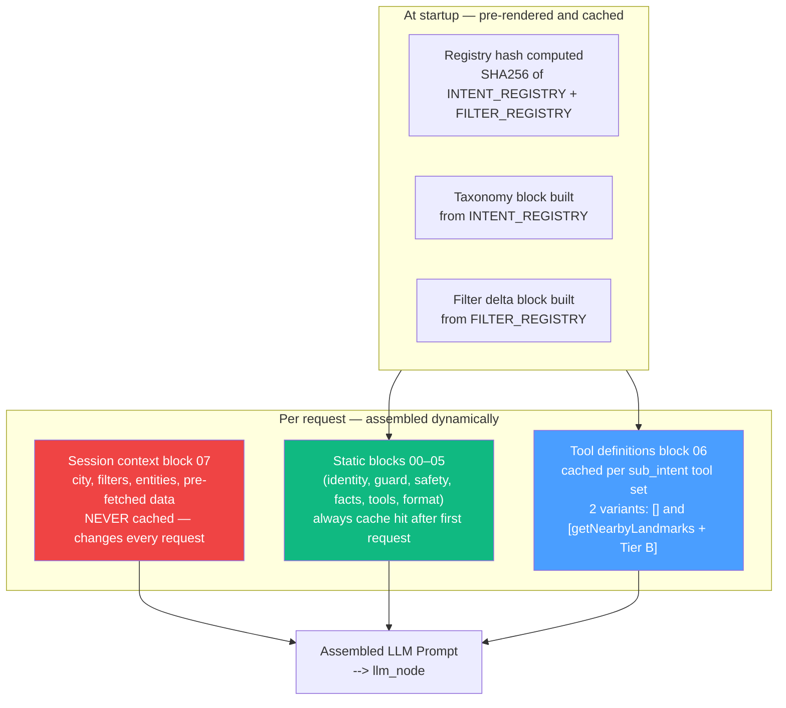

# Prompt Block Architecture

System prompt file structure, cache strategy, block numbering, and LLMContext/LLMPromptResult types.

---

## Part 4 — Prompt Block Architecture

The following diagram shows which prompt blocks are pre-rendered at startup, which are cached per intent, and which are assembled fresh on every request.



### File Structure

```
prompts/
├── slm/
│   ├── composer.py           ← SLMPromptComposer implementation
│   └── blocks/
│       ├── 00-role.md        ← Static. Who the SLM is and what it must not do.
│       ├── 01-rule-engine.md ← Static. Rules 0–7 text verbatim.
│       ├── 02-intent-taxonomy.md.tmpl  ← Template. {{ intent_blocks }} injected from INTENT_REGISTRY.
│       ├── 03-filter-delta-rules.md.tmpl ← Template. {{ filter_blocks }} from FILTER_REGISTRY.
│       ├── 04-implicit-derivation.md  ← Static. Landmark anchor, price-per-sqft, tone signals.
│       ├── 05-output-schema.md        ← Static. Output JSON format spec, field rules.
│       └── examples/
│           ├── property_search.md     ← Positive + negative examples for property_search.
│           ├── property_detail.md
│           ├── locality_research.md
│           ├── comparison.md
│           ├── multi_intent.md
│           └── out_of_scope.md
│
└── llm/
    ├── composer.py           ← LLMPromptComposer implementation
    └── blocks/
        ├── 00-identity.md             ← Static. Cached. "You are Housing Assistant..."
        ├── 01-domain-guard.md         ← Static. Cached. What the bot will/won't do.
        ├── 02-safety.md               ← Static. Cached. Content safety rules.
        ├── 03-factual-constraints.md  ← Static. Cached. No hallucination, no URLs, etc.
        ├── 04-tool-use-rules.md       ← Static. Cached. Parallel calls, confirmation, etc.
        ├── 05-output-format.md        ← Static. Cached. Response style, followup chips.
        ├── 06-tool-definitions.md.tmpl ← Template. {{ tool_definitions }} from TOOL_REGISTRY.
        ├── 07-session-context.md.tmpl  ← Template. {{ session_state }} injected per request.
        └── examples/
            ├── property_search.md
            ├── property_detail.md
            ├── comparison.md
            └── calculator.md
```

### Block Responsibilities

| Block | Static / Template | Prompt Cache? | Responsibility |
|---|---|---|---|
| `slm/00-role.md` | Static | Yes | SLM role definition, hard no-gos (no suggestions, no injection execution) |
| `slm/01-rule-engine.md` | Static | Yes | Rules 0–7 ordered, with examples per rule |
| `slm/02-intent-taxonomy.md.tmpl` | Template | Yes (stable) | Full intent list generated from INTENT_REGISTRY.description fields |
| `slm/03-filter-delta-rules.md.tmpl` | Template | Yes (stable) | filter_delta semantics + per-filter examples from FILTER_REGISTRY |
| `slm/04-implicit-derivation.md` | Static | Yes | Tone-based signals, price/sqft derivation, proximity anchor logic |
| `slm/05-output-schema.md` | Static | Yes | Output JSON schema, field rules, multi-intent variant |
| `slm/examples/*.md` | Static | Yes | 5–10 positive + 3–5 negative examples per intent cluster |
| `llm/00-identity.md` | Static | Yes | Bot persona, language detection, tone |
| `llm/01-domain-guard.md` | Static | Yes | What the bot answers and refuses |
| `llm/02-safety.md` | Static | Yes | Out-of-domain, injection attempts, vulgar content handling |
| `llm/03-factual-constraints.md` | Static | Yes | No memory-based facts, tool-only facts, no URLs |
| `llm/04-tool-use-rules.md` | Static | Yes | One searchProperties call, parallel calls, confirmation before write |
| `llm/05-output-format.md` | Static | Yes | Verb-first sentence, no tables, response length, chip format |
| `llm/06-tool-definitions.md.tmpl` | Template | Yes (per intent set) | Tools scoped to sub_intent, generated from TOOL_REGISTRY |
| `llm/07-session-context.md.tmpl` | Template | No (per request) | Active filters, city, service, viewed properties, intent context |
| `llm/examples/*.md` | Static | Yes | 3–5 complete turn examples with tool calls and expected output |

### Prompt Composer Interfaces

```python
from dataclasses import dataclass
from typing import Protocol, Optional, runtime_checkable

# ── SLM Prompt Composer ─────────────────────────────────────────────────

@dataclass
class SLMContext:
    conversation_history: list[dict]    # last 3 turns (ConversationTurn dicts)
    previous_intent: dict | None        # {'main_intent': str, 'sub_intent': str} | None
    active_filters: dict                # compact current filter state
    user_message: str                   # raw user input

@runtime_checkable
class SLMPromptComposerProtocol(Protocol):
    def build(self, context: SLMContext) -> str:
        """Returns fully assembled SLM system prompt.
        Sections 00–05 + examples are cached on cold start.
        Template blocks (02, 03) are pre-rendered from registries at startup.
        """
        ...

# ── LLM Prompt Composer ─────────────────────────────────────────────────

@dataclass
class LLMContext:
    main_intent: str
    sub_intent: str
    prompt_block: str                   # path to prompt file, dispatched via FOLLOWUP_PROMPT_BLOCKS
    is_followup: bool                   # True when summary_node already emitted a phase-1 event
    session: dict                       # SessionState
    turn_count: int
    has_session_summary: bool
    session_summary: Optional[str] = None

@dataclass
class LLMPromptResult:
    system: str
    tool_definitions: list[dict]
    cache_breakpoints: list[int]        # byte offsets where prompt cache checkpoints sit

@runtime_checkable
class LLMPromptComposerProtocol(Protocol):
    def build(self, context: LLMContext) -> LLMPromptResult:
        """Blocks 00–05 are static → always cached.
        Block 06 varies by sub_intent tool set → separate cache per intent group.
        Block 07 is per-request → never cached.
        """
        ...
```

### Template Rendering Rules

1. **Template blocks are pre-rendered at startup** from the registry, not on every request. The rendered string is the static input to the prompt cache.
2. **Registry changes require re-render + cache invalidation.** Add `registry_hash` to cache key — a SHA256 of the registry JSON triggers re-render when either registry changes.
3. **Examples are appended after the corresponding block** they illustrate. They are part of the same cached section.
4. **`07-session-context.md.tmpl` is never cached** — it changes every request. It is the only dynamic section.

---

