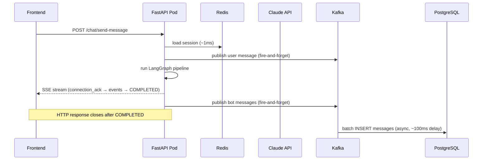

# Housing.com Conversational Platform — System Design

## Overview

Housing.com is transitioning to a fully conversational model. All users land on a chat interface and interact with one of five services:

| Service | Type | Transport |
|---|---|---|
| Search & Discovery Bot | AI | SSE (POST /chat/message + GET /chat/stream) |
| Seller Property Management Bot | AI | SSE |
| Support Agent Bot | AI | SSE |
| Support Human Chat | Relay | WebSocket (WS /chat/connect) |
| User-Seller Chat | Relay | WebSocket |

**This is a hybrid architecture.** AI bots use SSE. Real-time relay channels use WebSocket. See `sse-vs-websocket.md` for the reasoning behind each choice.

The diagram below shows the full system — clients connect through a routing gateway to either AI bot services (SSE) or relay services (WebSocket), all backed by shared infrastructure.

```mermaid
graph TB
    subgraph Client
        FE[Chat Frontend]
    end

    subgraph Gateway
        GW[Routing Gateway\nConnection Broker]
    end

    subgraph AI Bots — SSE
        SD[Search & Discovery Bot\nLangGraph Pipeline]
        SM[Seller Management Bot]
        SA[Support Agent Bot]
    end

    subgraph Relay Services — WebSocket
        SH[Support Human Chat]
        US[User-Seller Chat]
    end

    subgraph Shared Infrastructure
        PG[(PostgreSQL\nChat History)]
        RD[(Redis Cluster\nSession State)]
        KF[(Kafka\nAsync Writes)]
        MG[(MongoDB\nif migrated)]
    end

    FE -->|1 handshake per session| GW
    GW -->|SSE endpoint| SD
    GW -->|SSE endpoint| SM
    GW -->|SSE endpoint| SA
    GW -->|WS endpoint| SH
    GW -->|WS endpoint| US

    SD --> PG
    SD --> RD
    SD --> KF

    style SD fill:#4a9eff,color:#fff
    style GW fill:#f59e0b,color:#fff
```

---

## 1. Transport Architecture

### AI Bots — SSE

Each AI bot exposes two endpoints:
- `POST /chat/message` — client sends a message
- `GET /chat/stream` — client opens SSE stream to receive events

```
Client                              Bot Service
  │──── POST /chat/message ────────►│
  │                                 │  (LangGraph pipeline runs)
  │──── GET /chat/stream ──────────►│
  │◄─── message_delta ──────────────│  (streaming text chunk)
  │◄─── chat_event ─────────────────│  (structured template/state event)
  │◄─── chat_event (COMPLETED) ─────│  (turn complete)
```

### Relay Channels — WebSocket

User-Seller Chat and Support Human Chat use persistent WebSocket connections for genuine bidirectionality: either party can push a message at any time, presence indicators, read receipts.

```
Buyer/User ──── WSS /chat/connect ──── WS Gateway ──── Seller/Agent
```

---

## 2. High-Level Architecture

```
                 ┌────────────────────────────────────────────┐
                 │              Clients                        │
                 │     Web (React)  ·  Android  ·  iOS        │
                 └──────────────┬──────────────┬──────────────┘
                                │ SSE + HTTP   │ WSS
              ┌─────────────────▼──┐    ┌──────▼──────────────┐
              │   API Gateway       │    │   WS Gateway (NLB)  │
              │   (HTTP/2)          │    │   (Nginx / AWS NLB) │
              └─────────┬───────────┘    └──────┬──────────────┘
                        │                       │
       ┌────────────────┼────────────┐          │
       │                │            │          │
┌──────▼──────┐  ┌──────▼──────┐  ┌─▼──────┐  ┌▼─────────────────┐
│ Search &    │  │ Seller Prop │  │Support │  │  Relay Services  │
│ Discovery   │  │ Mgmt Bot    │  │Agent   │  │  (User-Seller,   │
│ Bot         │  │             │  │Bot     │  │  Support Human)  │
│ (SSE, AI)   │  │ (SSE, AI)   │  │(SSE,AI)│  │  (WebSocket)     │
└──────┬──────┘  └──────┬──────┘  └─┬──────┘  └┬────────────────┘
       │                │            │           │
       └────────────────┼────────────┘           │
                        │                        │
       ┌────────────────▼────────────────────────▼──────┐
       │                Message Broker                    │
       │   Kafka  (durability, replay, audit)             │
       │   Redis Pub/Sub  (real-time fan-out)             │
       └────────────────┬───────────────────────────────┘
                        │
       ┌────────────────┼───────────────────────┐
       │                │                       │
┌──────▼──────┐  ┌──────▼──────────┐  ┌────────▼───────┐
│ PostgreSQL  │  │ Elasticsearch   │  │ Redis          │
│ (conv, msgs)│  │ (properties)    │  │ (session, hot  │
│             │  │                 │  │  state, dedup, │
│             │  │                 │  │  pub/sub)      │
└─────────────┘  └─────────────────┘  └────────────────┘
```

---

## 3. AI Bot Pipeline (LangGraph)

All three AI bots run the same LangGraph `StateGraph` pipeline. `BotState` is a `TypedDict` that flows through each node. The nodes execute in this order:

```
safety → normalize → route_domain → classify → validate_slm → filter_apply → sanitize →
derive → clarify → resolve_entities → route → summary → experiment →
fetch_data → respond → build_prompt → llm → validate_output → followup
```

Classification is a two-stage cascade: `route_domain` (Stage 1, ~200 tokens, domain router) feeds `classify` (Stage 2, ~800 tokens, domain-scoped intent classifier). Total: ~1,280 tokens vs the former 2,650-token monolithic call — 52% cheaper, independently scalable per domain.

`solid-architecture.md` owns the detailed implementation of each node, the registry design, and the prompt composition strategy.

---

## 4. SSE Event Types

The AI bots emit three event types on the stream:

| Event | Purpose | Key Fields |
|---|---|---|
| `message_delta` | Streaming text chunk | `delta` (append-only text fragment) |
| `chat_event` | Structured event (template, status) | `templateId`, `messageId`, `sequenceNumber`, `sourceMessageState` |
| `error` | Error payload | error detail |

`sourceMessageState` is either `IN_PROGRESS` (more events coming for this turn) or `COMPLETED` (turn is done — treat the accumulated `chat_event` payload as authoritative).

---

## 5. Session State

The sequence below traces the exact data flow for a single user turn — from the frontend POST through Redis, Kafka, the LangGraph pipeline, and back to the client via SSE.



State is managed per-conversation, not per-connection.

**Hot state (Redis):** Active session data available within a single TCP round-trip. Keyed by `conversation_id`. TTL refreshed on activity.

**Durable state (PostgreSQL):** All conversations and messages are persisted asynchronously via Kafka. Source of truth for history, audit, and reconnect recovery.

`BotState` is a `TypedDict` that flows through the LangGraph graph in memory during a single turn. It is not a Redis state machine with named states. The Redis/PostgreSQL "state machine" with `BOT_ACTIVE`, `P2P_ACTIVE` named states was a prior design that was replaced by the LangGraph approach.

### Redis Key Space

The diagram below maps the full Redis key taxonomy across the four functional namespaces — session state, LLM gate, tool cache, and rate limiting.

```mermaid
graph LR
    subgraph session["Session State (TTL: 24h)"]
        S1[session:{id}]
        S2[conv:context:{id}]
        S3[conv:turns:{id}]
        S4[conv:summary:{id}]
    end
    subgraph gate["LLM Gate"]
        G1[llm:concurrent:count]
        G2[llm:queue]
    end
    subgraph cache["Tool Cache (various TTLs)"]
        C1[cache:tool:property:{id}]
        C2[cache:tool:locality:{id}]
        C3[cache:tool:...]
    end
    subgraph rl["Rate Limiting (TTL: 60s)"]
        R1[ratelimit:chat:{token}]
        R2[ratelimit:llm:{token}]
    end
```

```
session:{session_id}              → {user_id, conversation_id, node_id}     TTL: 24h
conv:context:{conversation_id}    → structured session header (~5KB)          TTL: 24h (re-seeded from Postgres on reconnect)
conv:turns:{conversation_id}      → list of last N raw turns (LPUSH + LTRIM) TTL: 7d
conv:summary:{conversation_id}    → compressed summary of older turns        TTL: 7d
presence:{user_id}                → {status, last_seen, node_id}             TTL: 5min (heartbeat)
p2p:dedup:{message_id}            → 1 (idempotency)                          TTL: 24h
support:queue:{tier}              → sorted set of conversation_ids by priority
p2p:channel:{conversation_id}     → Redis Pub/Sub channel (ephemeral)
```

**Cache read strategy:** Session read always hits Redis first. On cache miss, falls back to Postgres then re-warms Redis (~20–50ms extra). This overhead is acceptable for reconnect only — it does not occur in steady-state turns where Redis is warm.

**Pipeline efficiency:** `conv:context`, `conv:turns`, and `conv:summary` are fetched in a single Redis pipeline (one round-trip) per turn, not three sequential calls.

---

## 6. Relay Channel Architecture (WebSocket)

Near-zero latency is achieved by separating the **delivery path** (Redis Pub/Sub) from the **persistence path** (Kafka → PostgreSQL).

```
Seller WS ──► WS Node A ──► Redis Pub/Sub ──► WS Node B ──► Buyer WS
                  │         (channel per conv)       │
                  └──────────────► Kafka ◄───────────┘
                                      │
                               Persistence Svc
                                      │
                                 PostgreSQL
```

### Hot Path (~5–15ms end to end)

1. Buyer sends a message to WS Node B.
2. Node B publishes to Redis channel `p2p:{conversation_id}`.
3. WS Node A (holding seller's connection) receives instantly.
4. Node A pushes the message to the seller.

### Warm Path (async persistence)

1. The same message is also published to Kafka topic `chat.p2p.messages`.
2. Persistence Service consumes and writes to PostgreSQL.
3. If the recipient is offline, Notification Service consumes and sends FCM/APNS push.

### Offline Message Flow

```
Buyer sends message
      │
      ▼
Redis Pub/Sub → no subscriber (seller offline)
      │
      ▼
Kafka topic: chat.p2p.messages
      │
      ▼
Notification Service → FCM/APNS push
      │
Seller opens app → reconnects WS →
server delivers missed messages from PostgreSQL
```

---

## 7. WebSocket Scaling

```
              NLB (Layer 4)
                   │
     ┌─────────────┼─────────────┐
     │             │             │
┌────▼──────┐ ┌────▼──────┐ ┌───▼───────┐
│ WS Node 1 │ │ WS Node 2 │ │ WS Node N │
│ ~100k     │ │           │ │           │
│ conns     │ │           │ │           │
└────┬──────┘ └────┬──────┘ └───┬───────┘
     └─────────────┼─────────────┘
             Redis Pub/Sub
         (one channel per conversation_id)
```

- **Session state:** Fully in Redis. Any node can handle any reconnect.
- **Load balancing:** NLB with IP hash for connection affinity. Correctness does not depend on affinity (Redis handles routing), but it reduces subscription churn.
- **Scaling trigger:** HPA on connection count, not CPU. Target: ~80k connections per pod.
- **Redis Cluster hash tags:** Redis Pub/Sub channels for P2P must use hash tags (`{p2p}`) in Redis Cluster mode so all channels for a conversation route to the same slot. Without hash tags, cluster sharding breaks cross-node Pub/Sub.

---

## 8. Data Models

### PostgreSQL

```sql
conversations (
  id              UUID PRIMARY KEY,         -- conversation_id
  user_id         UUID NOT NULL,
  mode            TEXT NOT NULL,            -- 'BOT' | 'P2P' | 'SUPPORT'
  context         JSONB,                    -- active filters, viewed properties, intent
  created_at      TIMESTAMPTZ DEFAULT NOW(),
  updated_at      TIMESTAMPTZ DEFAULT NOW()
);

messages (
  id              UUID PRIMARY KEY,         -- UUID v7 (time-sortable)
  conversation_id UUID NOT NULL REFERENCES conversations(id),
  sender_id       TEXT NOT NULL,            -- user_id, 'BOT', or agent_id
  sender_type     TEXT NOT NULL,            -- 'USER' | 'BOT' | 'AGENT'
  content         TEXT,
  content_type    TEXT NOT NULL,            -- 'TEXT' | 'CARD' | 'TOOL_RESULT' | 'SYSTEM'
  metadata        JSONB,                    -- cards, tool results, quick actions
  delivered_at    TIMESTAMPTZ,
  read_at         TIMESTAMPTZ,
  created_at      TIMESTAMPTZ DEFAULT NOW()
);

CREATE INDEX idx_messages_conv_time ON messages (conversation_id, created_at DESC);

p2p_participants (
  conversation_id UUID NOT NULL REFERENCES conversations(id),
  user_id         UUID NOT NULL,
  role            TEXT NOT NULL,            -- 'BUYER' | 'SELLER' | 'AGENT' | 'SUPPORT'
  joined_at       TIMESTAMPTZ DEFAULT NOW(),
  PRIMARY KEY (conversation_id, user_id)
);

support_queue (
  id              UUID PRIMARY KEY,
  conversation_id UUID REFERENCES conversations(id),
  tier            TEXT NOT NULL,            -- 'standard' | 'priority' | 'vip'
  claimed_by      UUID,                     -- agent_id, NULL if unclaimed
  claimed_at      TIMESTAMPTZ,
  resolved_at     TIMESTAMPTZ,
  created_at      TIMESTAMPTZ DEFAULT NOW()
);
```

### Actual API Data Shapes

These shapes come from the production housing.com API and must be preserved in responses. FE templates depend on these exact field names.

**Filter format** — uses numeric IDs, not string names:
```json
{
  "apartment_type_id": [1, 2],
  "property_type_id": [1],
  "contact_person_id": [1, 2],
  "facing": ["east", "west"],
  "has_lift": true,
  "is_gated_community": true,
  "is_verified": true,
  "min_price": 100,
  "max_price": 4800000,
  "max_area": 4000,
  "type": "project"
}
```

**Entity format** — localities referenced by polygon UUID:
```json
{
  "entities": [
    {
      "id": "f745c4c0226869fa87b8",
      "name": "sector 37d",
      "display_name": "Sector 37D, Gurgaon",
      "uuid": "f745c4c0226869fa87b8",
      "lon_lat": [76.97277802321182, 28.445236369097103],
      "city": "Gurgaon",
      "type": "locality"
    }
  ]
}
```

**City format:**
```json
{
  "city": {
    "city_name": "Gurgaon",
    "display_name": "Gurgaon",
    "city_uuid": "3c69d8421a77f8f8b611",
    "bbx_uuid": "526acdc6c33455e9e4e9",
    "id": "526acdc6c33455e9e4e9"
  }
}
```

**Service field:** Use `"service": "buy" | "rent"` (not `transaction_type`) in property_carousel and search payloads.

**Property shape** within `property_carousel.data.properties[]`:
```json
{
  "id": "107997",
  "type": "project",
  "title": "3 BHK Flat",
  "name": "Ramprastha Skyz",
  "short_address": [
    { "polygon_uuid": "f745c4c0226869fa87b8", "display_name": "Sector 37D" },
    { "polygon_uuid": "3c69d8421a77f8f8b611", "display_name": "Gurgaon" }
  ],
  "thumb_image_url": "...",
  "inventory_canonical_url": "/in/buy/projects/page/...",
  "property_tags": ["Ready to Move", "Project", "RERA Approved"],
  "is_rera_verified": true,
  "formatted_min_price": "1.29 Cr",
  "formatted_max_price": "1.52 Cr",
  "unit_of_area": "sq.ft.",
  "display_area_type": "Super Builtup Area",
  "min_selected_area_in_unit": 1725,
  "max_selected_area_in_unit": 2025,
  "inventory_configs": [
    {
      "formatted_price": "1.29 Cr",
      "number_of_bedrooms": 3,
      "apartment_type_id": 4,
      "area_value_in_unit": 1725,
      "price_on_request": false
    }
  ]
}
```

**Pagination:**
```json
{
  "pagination": {
    "p": 2,
    "results_per_page": 10,
    "is_last_page": false,
    "cursor": "-1977752683",
    "resale_total_count": 394,
    "np_total_count": 35
  }
}
```

Use `resale_total_count` (resale/rental listings) and `np_total_count` (new projects) as separate counts.

**Location coordinates** from `location_shared` user_action are `[lat, lng]` array:
```json
{ "action": "location_shared", "coordinates": [28.4085982, 77.3166804] }
```

---

## 9. Failure Modes & Resilience

| Failure | Impact | Mitigation |
|---|---|---|
| LLM API timeout | Bot does not respond | Retry 2x with exponential backoff; emit `error` SSE event with user-facing message; alert |
| SSE stream drops mid-response | User loses partial response | Client reconnects GET /chat/stream; server checks `bot_in_progress` in Redis; resumes or restarts the turn |
| WS node crash (relay channels) | All connections on that node drop | NLB detects, clients reconnect; Redis session state is source of truth, any node picks up |
| Redis Pub/Sub down | P2P/relay delivery breaks | Circuit breaker → degraded mode: poll PostgreSQL every 500ms; alert on-call |
| Kafka lag spike | Persistence delayed, not delivery | No user-facing impact; alert on consumer lag > 10s |
| LLM property hallucination | Wrong data shown | All property data comes from structured tool responses; LLM only writes prose around them |
| Support queue empty of agents | User waits indefinitely | Show estimated wait time; offer callback/email; cap wait at configurable timeout |
| Idempotency violation (duplicate message) | Duplicate delivery to recipient | Client generates UUID v7 per outbound message; server checks `p2p:dedup:{message_id}` in Redis before processing (TTL 24h); returns ack without reprocessing if already seen |
| Redis Pub/Sub primary failover | ~1–5s message gap during Sentinel/Cluster failover | WS nodes re-subscribe on reconnect. Mitigation: clients re-request missed messages from Postgres on reconnect. |
| Session Postgres write failure | Kafka DLQ captures failed writes | Alert if DLQ unprocessed > 24h (before Redis TTL of 7d expires and turns are lost). |

---

## 10. Key Technology Decisions

| Concern | Choice | Rationale |
|---|---|---|
| AI bot transport | SSE (POST + GET) | Stateless turns, CDN/proxy compatible, same pattern as all major LLM products |
| Relay transport | WebSocket | True bidirectionality, presence, read receipts, seller-push-to-buyer |
| Bot pipeline | LangGraph StateGraph | Directed async graph with typed state; `solid-architecture.md` has details |
| Real-time fan-out | Redis Pub/Sub | Sub-ms latency; avoids Kafka consumer lag on hot path |
| Durability | Kafka → PostgreSQL | Replay, audit, offline delivery |
| Session state | Redis hot + PostgreSQL durable | Any node handles any reconnect; bounded LLM context cost |
| LLM | Claude claude-sonnet-4-6, streaming + tool use | Structured property data via tools prevents hallucination |
| Context management | Redis turns + DB summarization | Bounded LLM context cost regardless of session length |
| Template IDs | Match existing FE contract | `download_brochure`, `nested_qna`, `share_location`, `shortlist_property` — do not rename |
| Filter IDs | Numeric IDs from production API | `apartment_type_id: [1,2]` not `["2bhk"]` — FE passes these to SRP deep-link |

---

## 11. Observability

### Structured Log Format

Every pipeline request must emit a structured log with these fields:

```json
{
  "ts":              "ISO-8601",
  "request_id":      "UUID4",
  "session_id":      "string",
  "conversation_id": "string",
  "user_id":         "string | null",
  "node":            "string",
  "event":           "string",
  "latency_ms":      "integer",
  "tier":            "0 | 1 | 2 | '3a' | '3b'",
  "intent":          "string",
  "sub_intent":      "string",
  "model":           "string | null",
  "error":           "string | null",
  "experiment_id":   "string | null"
}
```

### Distributed Tracing

- Every `POST /chat/message` generates a `request_id` (UUID4) in the FastAPI handler
- Injected into `BotState.request_id`, passed as `run_id` to LangSmith
- All Kafka message headers and Redis call logs include `request_id`
- SSE stream includes `request_id` in each `chat_event` payload for client-side correlation
- LangSmith span names for the residual tool path: `llm_stream_start` → `tool_call: {tool_name}` (child span with `cache_hit`, `latency_ms`, `result_count`) → `llm_stream_resume` → `llm_stream_end`

### Turn Latency SLOs

| Tier | p50 | p95 | p99 | Alert threshold |
|---|---|---|---|---|
| Tier 1 (direct action) | < 50ms | < 200ms | < 500ms | p95 > 300ms |
| Tier 2 (orchestrator) | < 200ms | < 500ms | < 1s | p95 > 800ms |
| Tier 3a (Haiku + templates) | < 800ms | < 2s | < 4s | p95 > 3s |
| Tier 3b (Sonnet full) | < 1.5s | < 4s | < 8s | p95 > 6s |
| P2P relay hot path | < 5ms | < 15ms | < 50ms | p95 > 25ms |

Measure from `POST /chat/message` receipt to `chat_event { sourceMessageState: COMPLETED }` emission.

### Redis Memory Budget

Estimated per active conversation:
- `conv:context` (session header: entities, filters, last intent, pagination): ~5KB
- `conv:turns` (last 20 turns JSON): ~40KB
- `conv:summary` (compressed history): ~2KB
- P2P relay keys (`p2p:channel:*`, `p2p:offline:*`): ~1KB per participant
- **Total per active conversation: ~50KB**
- At 10k concurrent: ~500MB, 50k concurrent: ~2.5GB, 100k concurrent: ~5GB

TTL rationale: `conv:context` 24h (re-seeded on reconnect from Postgres), `conv:turns` 7d (compliance buffer), `conv:summary` 7d (same).

### Alert Thresholds

| Metric | Warning | Critical |
|---|---|---|
| SLM classification p95 latency | > 200ms | > 500ms |
| SLM `out_of_scope` rate | > 5% over 10min | > 10% |
| SLM `unknown_intent` count | > 0 | > 5/min |
| LLM output validation violation rate | > 0.5% | > 2% |
| Tier 3a turn p95 | > 3s | > 5s |
| Redis Pub/Sub degraded mode active | — | any activation |
| Kafka consumer lag | > 1000 msgs | > 5000 msgs |
